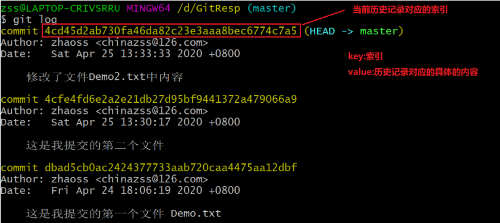
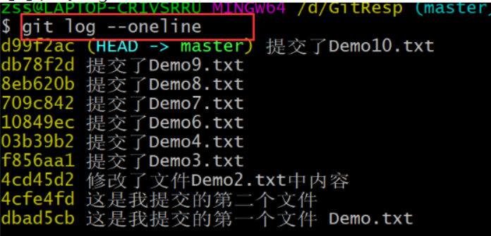
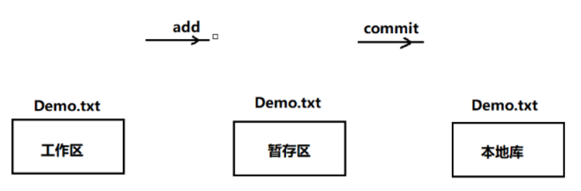
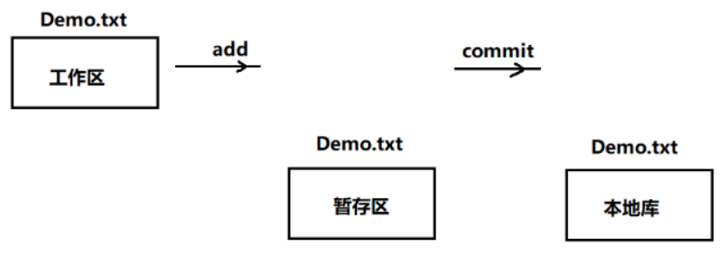

# Git


## 初始化

```shell
clear
git --version

git config --global user.name "yuty"
git config --global user.email "yuty@tell.com"

git init
```


## 基础命令

### 本地库

```shell
git add Demo.txt
git add .

git commit -m "详细说明"

git status
```

- `git status`

工作区和暂存区无文件修改


修改未进入暂存区（红色）


修改添加进暂存区（绿色）


### log

- 方式1：`git log`  分页展示




- 方式2：`git log --pretty=onelint`


- 方式3：`git --oneline`




- 方式4：`git reflog`

多了信息：HEAD@{数字} ，这个数字的含义：指针回到当前这个历史版本需要走多少步


### 版本切换

`git reset`命令：前进或者后退历史版本 

> 复制：在终端中选中就是复制了 
>
> 粘贴： 右键：paste 


```shell
git reset --hard  [索引号]
git reset --mixed [索引号]
git reset --soft  [索引号]
```


- hard参数： 

`git reset --hard [索引]`

本地库的指针移动的同时，重置暂存区，重置工作区 




- mixed参数： 

本地库的指针移动的同时，重置暂存区，但是工作区不动




- soft参数： 

本地库的指针移动的时候，暂存区，工作区都不动 


### diff
```shell
git diff [文件名]  # 将工作区中的文件和暂存区中文件进行比较

git diff 		  # 比较工作区中和暂存区中所有文件的差异 	

git diff [版本索引号][文件名]  # 比较暂存区和本地库该版本中内容 （HEAD为当前最新版本）
```


## 分支


### 操作分支

- 查看分支

  `git branch -v`

  


- 创建分支

  `git branch [分支名]`

  

  

- 切换分支

  `git checkout [分支名]`


- 合并分支

  `git merge [分支名]`


### 本地库冲突

1. 两个分支合并时发生冲突，两个分支同时修改同一文件


2. 工作区文件发生变换，修改工作区文件解决冲突


3. 将工作区中内容添加到暂存区： 

   


4. 进行commit操作： 

   


### 远程冲突

​	本地库分支与远程库分支都修改了 Text1.txt，推送过程中产生冲突

- 推送失败

  


- 解决方法：先拉取远程库分支，修改冲突，再推送到远程服务器

  

  


## 推送

```shell
git remote add [远程库别名] [远程库https地址]
git remote -v
git push [远程库别名] [本地分支名]
```


远程库地址比较长，每次复制比较麻烦

 

在Git本地将地址保存，通过别名

- 起别名：

  

- 查看别名：

  

- 将本地库推送到远程库（远程库需要先创建，两者同名）

  


## 克隆

```shell
git clone [远程库https地址]
```

克隆操作自动完成： 

（1）初始化本地库 

（2）将远程库内容完整的克隆到本地 

（3）替我们创建远程库的别名(默认origin)


别名自动生成


## 拉取`pull`

拉取操作 pull操作，相当于  fetch+merge


```shell
git fetch [] []

git checkout []/[]

git merge []/[]
```


- 抓取远程库内容

  ​		在抓取操作执行后，只是将远程库的内容下载到本地，但是工作区中的文件并没有更新。工作区中还是原先的内容


​				抓取后可以去远程库看看内容是否正确：

​				


- 合并

  将当前分支与远程库分支合并

  


- 拉取 fetch+merge

  抓取远程库分支，与当前本地分支合并


# Linux

查看文件

cat [文件名]


