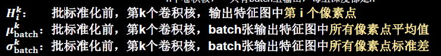
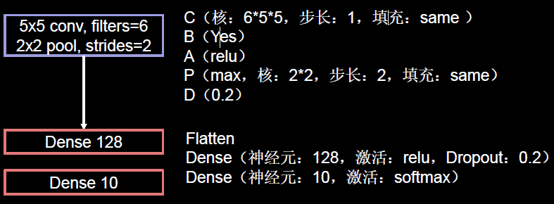
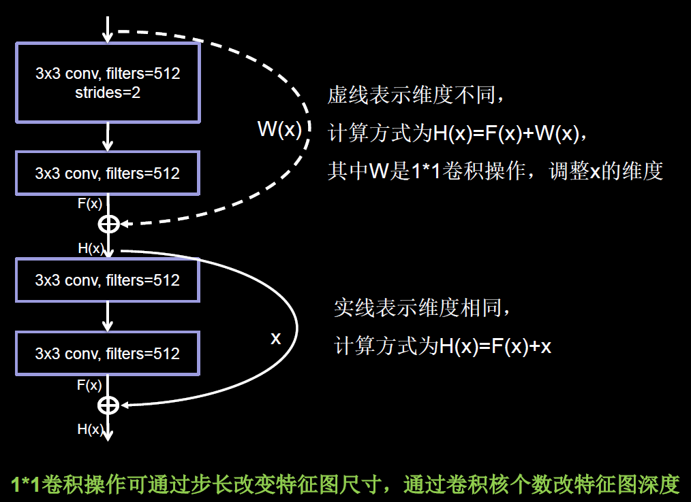

# conda

## 安装环境

```shell
conda create -n TF2.1 python=3.7

conda activate TF2.1

conda install cudatoolkit=10.1

conda install cudnn=7.6

pip install tensorflow==2.1

===验证进入python环境===
>>>import tensorflow as tf
>>>tf.__version__
```


## 查询

```shell
conda env list

# 激活env_name
conda activate [env_name]

# 进入jupyter lab
jupyter lab 
```


# 常用数据集

## IRIS


## MNIST


- 导入数据

  ```python
  import tensorflow as tf
  
  mnist = tf.keras.datasets.mnist
  (x_train, y_train), (x_test, y_test) = mnist.load_data()
  x_train, x_test = x_train / 255.0, x_test / 255.0
  ```


- 数据可视化
    ```python
    import tensorflow as tf
    from matplotlib import pyplot as plt
    
    # 导入数据集
    mnist = tf.keras.datasets.mnist
    (x_train, y_train), (x_test, y_test) = mnist.load_data()
    
    # ==================可视化======================
    # 可视化训练集输入特征的第一个图片
    plt.imshow(x_train[0], cmap='gray')  # 绘制灰度图
    plt.show()
    
    # 打印出训练集输入特征的第一个元素
    print("x_train[0]:\n", x_train[0])
    
    # 打印出训练集标签的第一个元素
    print("y_train[0]:\n", y_train[0])
    
    # 打印出整个训练集输入特征形状
    print("x_train.shape:\n", x_train.shape)
    
    # 打印出整个训练集标签的形状
    print("y_train.shape:\n", y_train.shape)
    # ===============================================
    ```


## FASHION


- 导入数据

  ```python
  import tensorflow as tf
  
  fashion = tf.keras.datasets.fashion_mnist
  (x_train, y_train),(x_test, y_test) = fashion.load_data()
  x_train, x_test = x_train / 255.0, x_test / 255.0
  ```

  

## Cifar10

Cifar10数据集：
提供5万张32*32 像素点的十分类彩色图片和标签，用于训练。
提供1万张32*32 像素点的十分类彩色图片和标签，用于测试。


- 导入数据

  ```python
  cifar10 = tf.keras.datasets.cifar10
  (x_train, y_train),(x_test, y_test) = cifar10.load_data()
  ```

  


# TensorFlow2.1


## 常用方法

### 张量


- `tf.constant(张量内容，dtype=数据类型(可选))`

  ```python
  a = tf.constant([1, 5], dtype=tf.int64)
  print(a)
  print(a.dtype)
  print(a.shape)
  ```

  

- `tf.convert_to_tensor(数据名，dtype=数据类型(可选))`

  将numpy的数据类型转换为Tensor数据类型

  ```python
  import numpy as np
  a = np.arange(0, 5)
  b = tf.convert_to_tensor(a, dtype=tf.int64)
  print(a)
  print(b)
  ```

  

- `tf.zeros(维度)`

  创建全为0的张量


- `tf.ones(维度)`

  创建全为1的张量


- `tf.fill(维度，指定值)`

  创建全为指定值的张量


- 维度：
  - 一维直接写个数
  - 二维用[行，列]
  - 多维用[n,m,j,k……]

```python
a = tf.zeros([2, 3])
b = tf.ones(4)
c = tf.fill([2, 2], 9)
print(a)
print(b)
print(c)
```


- np.random.RandomState.rand()
  返回一个[0,1)之间的随机数
  `np.random.RandomState.rand(维度)`

  ```python
  import numpy as np
  rdm=np.random.RandomState(seed=1) # seed=常数每次生成随机数相同
  a=rdm.rand()     # 返回一个随机标量
  b=rdm.rand(2, 3) # 返回维度为2行3列随机数矩阵
  print("a:", a)
  print("b:", b)
  
  # a: 0.417022004702574
  # b: [[7.20324493e-01 1.14374817e-04 3.02332573e-01]
  # 	  [1.46755891e-01 9.23385948e-02 1.86260211e-01]]
  ```

  

- `tf.random.normal(维度，mean=均值，stddev=标准差)`

  生成正态分布的随机数，默认均值为0，标准差为1


- `tf.random.truncated_normal (维度，mean=均值，stddev=标准差)`

  生成截断式正态分布的随机数，在`tf.truncated_normal`中如果随机生成数据的取值在（μ-2σ，μ+2σ）之外则重新进行生成，保证了生成值在均值附近

```python
d = tf.random.normal([2, 2], mean=5, stddev=1)
print(d)
e = tf.random.truncated_normal([2, 2], mean=0.5, stddev=10)
print(e)
```


- `tf.random.uniform(维度，minval=最小值，maxval=最大值)`

  生成均匀分布随机数[minval, maxval)

  ```python
  f = tf.random.uniform([5, 5], minval=0, maxval=1)
  print(f)
  ```


- `tf.cast(张量名，dtype=数据类型)`

  强制tensor转换为该数据类型


- `tf.reduce_min(张量名)`

  计算张量维度上元素的最小值

- `tf.reduce_max(张量名)`

  计算张量维度上元素的最大值

```python
x1 = tf.constant([1., 2., 3.],dtype=tf.float64)
print(x1)

x2 = tf.cast(x1, tf.int32)
print(x2)
print (tf.reduce_min(x2), tf.reduce_max(x2))
```


- `tf.reduce_mean(张量名，axis=操作轴)`

  计算张量沿着指定维度的平均值

- `tf.reduce_sum(张量名，axis=操作轴)`

  计算张量沿着指定维度的和

```python
x=tf.constant([[1, 2, 3],
               [3, 2, 3]])
print(x)
print(tf.reduce_mean(x)) # 所有数值的均值
print(tf.reduce_mean(x, axis=0))
print(tf.reduce_sum(x, axis=1)) # 所有数值的和 >>>14
```


- axis


#### 操作张量

- `tf.where()`
  条件语句真返回A，条件语句假返回B (张量内部元素层面)
  `tf.where(条件语句， 真返回A， 假返回B)`

  ```python
  a=tf.constant([1,2,3,1,1])
  b=tf.constant([0,1,3,4,5])
  c=tf.where(tf.greater(a, b), a, b) # 若a>b，返回a对应位置的元素，否则返回b对应位置的元素
  print("c:", c)
  
  # c：tf.Tensor([1 2 3 4 5], shape=(5,), dtype=int32)
  ```


- `np.vstack()`

  将两个数组按垂直方向叠加
  `np.vstack(数组1，数组2)`

  ```python
  import numpy as np
  a = np.array([1,2,3])
  b = np.array([4,5,6])
  c = np.vstack((a,b))
  print("c:\n",c)
  
  # c:
  # [[1 2 3]
  #  [4 5 6]]
  ```

  

- `np.mgrid[]`

  返回np.array数组，可同时返回多组，每个数组定义 [起始值 结束值 步长)

  `np.mgrid[ 起始值: 结束值: 步长，起始值: 结束值: 步长, … ]`

- `x.ravel()`

  多维数组变一维数组，将x变为一维数组，“把 **.** 前变量拉直”

- `np.c_[ 数组1，数组2，… ]`

  返回的数组各元素配对

```python
import numpyas np
x, y = np.mgrid[1:3:1, 2:4:0.5]
grid = np.c_[x.ravel(), y.ravel()]
print("x:",x)
print("y:",y)
print('grid:\n', grid)

运行结果：
x = [[1. 1. 1. 1.]
	 [2. 2. 2. 2.]]
y = [[2. 2.5 3. 3.5]
	 [2. 2.5 3. 3.5]]

grid:
    [[1. 2. ]
     [1. 2.5]
     [1. 3. ]
     [1. 3.5]
     [2. 2. ]
     [2. 2.5]
     [2. 3. ]
     [2. 3.5]]
```


### 数学运算


- 对应元素四则运算

  >只有维度相同的张量才可以做四则运算

  - 实现两个张量的对应元素相加
    `tf.add(张量1，张量2)`

  - 实现两个张量的对应元素相减
    `tf.subtract(张量1，张量2)`

  - 实现两个张量的对应元素相乘
    `tf.multiply(张量1，张量2)`

  - 实现两个张量的对应元素相除
    `tf.divide(张量1，张量2)`


```python
a = tf.ones([1, 3])
b = tf.fill([1, 3], 3.)
print(a)
print(b)
print(tf.add(a,b))
print(tf.subtract(a,b))
print(tf.multiply(a,b))
print(tf.divide(b,a))

# tf.Tensor([[1. 1. 1.]], shape=(1, 3), dtype=float32)
# tf.Tensor([[3. 3. 3.]], shape=(1, 3), dtype=float32
# tf.Tensor([[4. 4. 4.]], shape=(1, 3), dtype=float32)
# tf.Tensor([[-2. -2. -2.]], shape=(1, 3), dtype=float32)
# tf.Tensor([[3. 3. 3.]], shape=(1, 3), dtype=float32)
# tf.Tensor([[3. 3. 3.]], shape=(1, 3), dtype=float32)
```


- 平方、次方、开方
  - 计算某个张量的平方
    `tf.square(张量名)`
  - 计算某个张量的n次方
    `tf.pow(张量名，n次方数)`
  - 计算某个张量的开方
    `tf.sqrt(张量名）`

```python
a = tf.fill([1, 2], 3.)
print(a)
print(tf.pow(a, 3))
print(tf.square(a))
print(tf.sqrt(a))

# tf.Tensor([[3. 3.]], shape=(1, 2), dtype=float32)
# tf.Tensor([[27. 27.]], shape=(1, 2), dtype=float32)
# tf.Tensor([[9. 9.]], shape=(1, 2), dtype=float32)
# tf.Tensor([[1.7320508 1.7320508]], shape=(1, 2), dtype=float32)
```


- 矩阵乘
  - 实现两个矩阵的相乘
    `tf.matmul(矩阵1，矩阵2)`

```python
a = tf.ones([3, 2])
b = tf.fill([2, 3], 3.)
print(tf.matmul(a, b))

# tf.Tensor([[6. 6. 6.]
#            [6. 6. 6.]
#            [6. 6. 6.]], shape=(3, 3), dtype=float32)
```


### 方法

#### `tf.Variable`

`tf.Variable()`将变量标记为“可训练”，被标记的变量会在反向传播中记录梯度信息。神经网络训练中，常用该函数标记待训练参数。

```python
tf.Variable(初始值)

w = tf.Variable(tf.random.normal([2, 2], mean=0, stddev=1))
```


#### `tf.data.Dataset.from_tensor_slices`

切分传入张量的第一维度，生成输入特征/标签对，构建数据集（Numpy和Tensor格式都可用该语句读入数据）

```python
data = tf.data.Dataset.from_tensor_slices((输入特征, 标签))

features = tf.random.normal([4, 3], mean=5, stddev=1)
labels = tf.constant([0, 1, 1, 0])
dataset = tf.data.Dataset.from_tensor_slices((features, labels))
print(dataset)
for element in dataset:
	print(element)
    
# <TensorSliceDataset shapes: ((3,), ()), types: (tf.float32, tf.int32)>  （特征，标签）配对
# (<tf.Tensor: shape=(3,), dtype=float32, numpy=array([5.0158296, 5.0271997, 6.399684 ],dtype=float32)>, 	<tf.Tensor: shape=(), dtype=int32, numpy=0>)
# (<tf.Tensor: shape=(3,), dtype=float32, numpy=array([5.150814 , 6.5250745, 5.037866 ],dtype=float32)>, 	<tf.Tensor: shape=(), dtype=int32, numpy=1>)
# (<tf.Tensor: shape=(3,), dtype=float32, numpy=array([6.8031845, 5.809286 , 6.5262794],dtype=float32)>, 	<tf.Tensor: shape=(), dtype=int32, numpy=1>)
# (<tf.Tensor: shape=(3,), dtype=float32, numpy=array([4.4880443, 4.933515 , 5.1308255],dtype=float32)>, 	<tf.Tensor: shape=(), dtype=int32, numpy=0>)
```


#### `tf.GradientTape`

with结构记录计算过程，gradient求出张量的梯度

```python
with tf.GradientTape() as tape:
	若干个计算过程
grad=tape.gradient(函数，对谁求导)
```


```python
with tf.GradientTape() as tape:
	w = tf.Variable(tf.constant(3.0))
	loss = tf.pow(w, 2)
grad = tape.gradient(loss, w)
print(grad)

# tf.Tensor(6.0, shape=(), dtype=float32)
```


#### `enumerate`

enumerate是python的内建函数，它可遍历每个元素(如列表、元组或字符串)

组合为：<索引，元素>，常在for循环中使用。
`enumerate(列表名)`

```python
seq= ['one', 'two', 'three']
for i, element in enumerate(seq):
	print(i, element)

# 0 one
# 1 two
# 2 three
```


#### `tf.one_hot`

独热编码（one-hot encoding）：在分类问题中，常用独热码做标签，标记类别：1表示是，0表示非

`tf.one_hot(待转换数据, depth=几分类)`

```python
classes = 3
labels = tf.constant([1,0,2]) # 输入的元素值最小为0，最大为2
output = tf.one_hot(labels, depth=classes )
print(output)

# [[0. 1. 0.]
#  [1. 0. 0.]
#  [0. 0. 1.]], shape=(3, 3), dtype=float32)
```


#### `tf.nn.softmax`


```python
y = tf.constant( [1.01, 2.01, -0.66] )
y_pro= tf.nn.softmax(y)
print("After softmax, y_prois:", y_pro)

# After softmax, y_prois: tf.Tensor([0.255981740.695830460.0481878], shape=(3,), dtype=float32)
```


#### `assign_sub`

赋值操作，更新参数的值并返回

调用assign_sub前，先用tf.Variable定义变量w为可训练（可自更新）

`w.assign_sub(w要自减的内容)`

```python
w = tf.Variable(4)
w.assign_sub(1)
print(w)  # w-=1
```


#### `tf.argmax`

返回张量沿指定维度最大值的索引
`tf.argmax(张量名,axis=操作轴)`

```python
import numpyas np
test = np.array([[1, 2, 3], [2, 3, 4], [5, 4, 3], [8, 7, 2]])
print(test)
print(tf.argmax(test, axis=0)) # 返回每一列最大值的索引
print(tf.argmax(test, axis=1)) # 返回每一行最大值的索引

# [[1 2 3]
#  [2 3 4]
#  [5 4 3]
#  [8 7 2]]
# tf.Tensor([3 3 1], shape=(3,), dtype=int64)
# tf.Tensor([2 2 0 0], shape=(4,), dtype=int64)
```


### 数据集读取

- 鸢尾花数据集（Iris）

  ```python
  from sklearn.datasetsimport load_iris
  x_data= datasets.load_iris().data   # 返回iris数据集所有输入特征
  y_data= datasets.load_iris().target # 返回iris数据集所有标签
  ```


## 学习率


- 指数衰减学习率
  可以先用较大的学习率，快速得到较优解，然后逐步减小学习率，使模型在训练后期稳定。

  `指数衰减学习率= 初始学习率* 学习率衰减率（当前轮数/ 多少轮衰减一次）`


## 激活函数


- sigmoid

  

  特点
  （1）易造成梯度消失

  ​		梯度大小 (0, 0.25] ，累乘后造成梯度消失

  （2）输出非0正数，均值非0，收敛慢

  （3）幂运算复杂，训练时间长


- Tanh

  

  特点
  （1）输出是0均值

  （2）易造成梯度消失

  （3）幂运算复杂，训练时间长


- Relu

  

  

  优点：

  （1）解决了梯度消失问题(在正区间)

  （2）只需判断输入是否大于0，计算速度快

  （3）收敛速度远快于sigmoid和tanh
  缺点：
  （1）输出非0均值，收敛慢

  （2）Dead RelU问题：某些神经元可能永远不会被激活，导致相应的参数永远不能被更新。


- Leaky Relu

  


## 损失函数


### 均方误差


### 交叉熵


```python
loss_ce1=tf.losses.categorical_crossentropy([1,0],[0.6,0.4])
loss_ce2=tf.losses.categorical_crossentropy([1,0],[0.8,0.2])
print("loss_ce1:", loss_ce1)
print("loss_ce2:", loss_ce2)

运行结果：
loss_ce1: tf.Tensor(0.5108256, shape=(), dtype=float32)
loss_ce2: tf.Tensor(0.2231435, shape=(), dtype=float32)
    
```


- `softmax`与交叉熵结合

  输出先过`softmax`函数，再计算y与y_的交叉熵损失函数。

  `tf.nn.softmax_cross_entropy_with_logits(y_，y)`

  ```python
  y_ = np.array([[1, 0, 0], [0, 1, 0], [0, 0, 1], [1, 0, 0], [0, 1, 0]])
  y = np.array([[12, 3, 2], [3, 10, 1], [1, 2, 5], [4, 6.5, 1.2], [3, 6, 1]])
  y_pro = tf.nn.softmax(y)
  loss_ce1 = tf.losses.categorical_crossentropy(y_, y_pro)
  loss_ce2 = tf.nn.softmax_cross_entropy_with_logits(y_, y)
  print('分步计算的结果:\n', loss_ce1)
  print('结合计算的结果:\n', loss_ce2)
  
  分步计算的结果:
  tf.Tensor([1.68795487e-041.03475622e-036.58839038e-022.58349207e+005.49852354e-02],shape=(5,),dtype=float64)
  结合计算的结果:
  tf.Tensor([1.68795487e-041.03475622e-036.58839038e-022.58349207e+005.49852354e-02],shape=(5,),dtype=float64)
  ```

  

### 手写梯度下降过程

```python
w = tf.Variable(tf.constant(5, dtype=tf.float32))  # 初始化时候赋值为5
lr = 0.01
epoch = 400

for epoch in range(epoch):  # for epoch 定义顶层循环，表示对数据集循环 epoch 次
    with tf.GradientTape() as tape:  # with 结构到 grads 框起了梯度的计算过程
        loss = tf.square(w + 1)      # loss 通过调整 w 的值使 loss 最小
    grads = tape.gradient(loss, w)   # .gradient 函数告知谁对谁求导

    w.assign_sub(lr * grads)  # .assign_sub 对变量做自减 w -= lr*grads
    print("After %s epoch,w is %f,loss is %f" % (epoch, w.numpy(), loss))
```


## 欠拟合与过拟合


### 正则项


- L1和L2

  

  

```python
with tf.GradientTape() as tape:  # 记录梯度信息
    h1 = tf.matmul(x_train, w1) + b1  # 记录神经网络乘加运算
    h1 = tf.nn.relu(h1)
    y = tf.matmul(h1, w2) + b2

    # 采用均方误差损失函数mse = mean(sum(y-out)^2)
    loss_mse = tf.reduce_mean(tf.square(y_train - y))

    # 添加l2正则化
    loss_regularization = []
    # 内部细节 tf.nn.l2_loss(w) = sum(w ** 2) / 2
    loss_regularization.append(tf.nn.l2_loss(w1))
    loss_regularization.append(tf.nn.l2_loss(w2))
    # 求和，求解正则项
    loss_regularization = tf.reduce_sum(loss_regularization)

    loss = loss_mse + 0.03 * loss_regularization  # REGULARIZER = 0.03

# 计算loss对各个参数的梯度
variables = [w1, b1, w2, b2]
grads = tape.gradient(loss, variables)

# 实现梯度更新
# w1 = w1 - lr * w1_grad
w1.assign_sub(lr * grads[0])
b1.assign_sub(lr * grads[1])
w2.assign_sub(lr * grads[2])
b2.assign_sub(lr * grads[3])
```


## 优化器


### SGD


### SGDM


```python
m_w, m_b = 0, 0
beta = 0.9

# 计算loss对各个参数的梯度
grads = tape.gradient(loss, [w1, b1])

# sgd-momentun  
m_w = beta * m_w + (1 - beta) * grads[0]
m_b = beta * m_b + (1 - beta) * grads[1]
w1.assign_sub(lr * m_w)
b1.assign_sub(lr * m_b)
```


### Adagrad


```python
# 计算loss对各个参数的梯度
grads = tape.gradient(loss, [w1, b1])

# adagrad
v_w += tf.square(grads[0])
v_b += tf.square(grads[1])
w1.assign_sub(lr * grads[0] / tf.sqrt(v_w))
b1.assign_sub(lr * grads[1] / tf.sqrt(v_b))
```


### RMSProp


```python
v_w, v_b = 0, 0
beta = 0.9

# 计算loss对各个参数的梯度
grads = tape.gradient(loss, [w1, b1])

# rmsprop
v_w = beta * v_w + (1 - beta) * tf.square(grads[0])
v_b = beta * v_b + (1 - beta) * tf.square(grads[1])
w1.assign_sub(lr * grads[0] / tf.sqrt(v_w))
b1.assign_sub(lr * grads[1] / tf.sqrt(v_b))
```


### Adam


```python
m_w, m_b = 0, 0
v_w, v_b = 0, 0
beta1, beta2 = 0.9, 0.999
delta_w, delta_b = 0, 0
global_step = 0

# 计算loss对各个参数的梯度
grads = tape.gradient(loss, [w1, b1])

# adam
m_w = beta1 * m_w + (1 - beta1) * grads[0]
m_b = beta1 * m_b + (1 - beta1) * grads[1]
v_w = beta2 * v_w + (1 - beta2) * tf.square(grads[0])
v_b = beta2 * v_b + (1 - beta2) * tf.square(grads[1])

m_w_correction = m_w / (1 - tf.pow(beta1, int(global_step)))
m_b_correction = m_b / (1 - tf.pow(beta1, int(global_step)))
v_w_correction = v_w / (1 - tf.pow(beta2, int(global_step)))
v_b_correction = v_b / (1 - tf.pow(beta2, int(global_step)))

w1.assign_sub(lr * m_w_correction / tf.sqrt(v_w_correction))
b1.assign_sub(lr * m_b_correction / tf.sqrt(v_b_correction))
```


## 搭建网络八股

**六步法：**

1. **import**
2. **train, test**
3. **model = tf.keras.models.Sequential**
4. **model.compile**
5. **model.fit**
6. **model.summary**


### Basesline

- IRIS-Sequential

  ```python
  import tensorflow as tf
  from sklearn import datasets
  import numpy as np
  
  x_train = datasets.load_iris().data
  y_train = datasets.load_iris().target
  
  np.random.seed(116)
  np.random.shuffle(x_train)
  np.random.seed(116)
  np.random.shuffle(y_train)
  tf.random.set_seed(116)
  
  model = tf.keras.models.Sequential([
      tf.keras.layers.Dense(3, activation='softmax', kernel_regularizer=tf.keras.regularizers.l2())
  ])
  
  model.compile(optimizer=tf.keras.optimizers.SGD(lr=0.1),
                loss=tf.keras.losses.SparseCategoricalCrossentropy(from_logits=False),
                metrics=['sparse_categorical_accuracy'])
  
  model.fit(x_train, y_train, batch_size=32, epochs=500, validation_split=0.2, validation_freq=20)
  
  model.summary()
  ```

  

- MNIST-Sequential

  

  ```python
  import tensorflow as tf
  
  mnist = tf.keras.datasets.mnist
  (x_train, y_train), (x_test, y_test) = mnist.load_data()
  x_train, x_test = x_train / 255.0, x_test / 255.0
  
  model = tf.keras.models.Sequential([
      tf.keras.layers.Flatten(),  # 拉直
      tf.keras.layers.Dense(128, activation='relu'),
      tf.keras.layers.Dense(10, activation='softmax')
  ])
  
  model.compile(optimizer='adam',
                loss=tf.keras.losses.SparseCategoricalCrossentropy(from_logits=False),
                metrics=['sparse_categorical_accuracy']  # y_（真实）是数值，y（预测）是独热码(概率分布)
               )
  
  model.fit(x_train, y_train, batch_size=32, epochs=5, validation_data=(x_test, y_test), validation_freq=1)
  
  model.summary()
  ```


- FASHION-Sequential

  ```python
  import tensorflow as tf
  
  fashion = tf.keras.datasets.fashion_mnist
  (x_train, y_train),(x_test, y_test) = fashion.load_data()
  x_train, x_test = x_train / 255.0, x_test / 255.0
  
  model = tf.keras.models.Sequential([
      tf.keras.layers.Flatten(),
      tf.keras.layers.Dense(128, activation='relu'),
      tf.keras.layers.Dense(10, activation='softmax')
  ])
  
  model.compile(optimizer='adam',
                loss=tf.keras.losses.SparseCategoricalCrossentropy(from_logits=False),
                metrics=['sparse_categorical_accuracy'])
  
  model.fit(x_train, y_train, batch_size=32, epochs=5, validation_data=(x_test, y_test), validation_freq=1)
  model.summary()
  ```

  


### 第一步：`import`


### 第二步：`train、test`

- 自制数据集

  - 图片路径下存储图片

  

  - 标签文件（图片名称，标签）

    

  

  ```python
  # def generateds(图片路径, 标签文件): 
  # 加载图片 转换成矩阵
  
  def generateds(path, txt):
      f = open(txt, 'r')
      contents = f.readlines()  # 按行读取
      f.close()
      x, y_ = [], []
      for content in contents:
          value = content.split()  # 以空格分开，存入数组
          img_path = path + value[0]
          img = Image.open(img_path)
          img = np.array(img.convert('L'))
          img = img / 255.
          x.append(img)
          y_.append(value[1])
      print('loading : ' + "data")
  
      x = np.array(x)
      y_ = np.array(y_)
      y_ = y_.astype(np.int64)
      return x, y_
  ```

  

- 数据增强

  ```python
  image_gen_train = tf.keras.preprocessing.image.ImageDataGenerator(
                      rescale=所有数据将乘以该数值
                      rotation_range=随机旋转角度数范围
                      width_shift_range=随机宽度偏移量
                      height_shift_range=随机高度偏移量
                      水平翻转：horizontal_flip=是否随机水平翻转
                      随机缩放：zoom_range= 随机缩放的范围[1-n，1+n])
  
  # 例：数据增强（增大数据量）
  image_gen_train = ImageDataGenerator(
                      rescale=1. / 1.,   # 如为图像，分母为255时，可归至0～1
                      rotation_range=45, # 随机45度旋转
      				width_shift_range=.15,  # 宽度偏移
                      height_shift_range=.15, # 高度偏移
      				horizontal_flip=False,  # 水平翻转
                      zoom_range=0.5 	   # 将图像随机缩放阈量50％
  					)
  
  
  # 第一步
  # (60000, 28, 28) --> (60000, 28, 28, 1)
  x_train = x_train.reshape(x_train.shape[0], 28, 28, 1)
  
  # 第二步
  image_gen_train.fit(x_train)
  
  # 第三步
  # Baseline: model.fit(x_train, y_train, batch_size=32, ……)
  model.fit(image_gen_train.flow(x_train, y_train,batch_size=32), ……)
  ```

  

### 第三步：`Sequential`

`model = tf.keras.models.Sequential([网络结构])`  # 描述各层网络

- 网络结构举例：
  - 拉直层：`tf.keras.layers.Flatten()`

  - 全连接层：`tf.keras.layers.Dense(神经元个数, activation="激活函数", kernel_regularizer=哪种正则化)`

    - `activation`（字符串给出）可选: relu、softmax、sigmoid 、tanh

    - `kernel_regularizer`可选:`tf.keras.regularizers.l1()`、`tf.keras.regularizers.l2()`


### 第四步：`model.compile`

`model.compile(optimizer = 梯度下降优化器, loss = 损失函数, metrics = [“准确率”] )`

- `optimizer`可选:
  
  - ‘sgd’ or `tf.keras.optimizers.SGD(lr=学习率,momentum=动量参数)`
  - ‘adagrad’ or `tf.keras.optimizers.Adagrad(lr=学习率)`
  - ‘adadelta’ or `tf.keras.optimizers.Adadelta(lr=学习率)`
  - ‘adam’or `tf.keras.optimizers.Adam(lr=学习率, beta_1=0.9, beta_2=0.999)`
  
  
- `loss`可选:
  - `mse` or `tf.keras.losses.MeanSquaredError()` 
    - 回归问题---均方误差
  - `sparse_categorical_crossentropy`or `tf.keras.losses.SparseCategoricalCrossentropy(from_logits=False)`
    - 多分类---交叉熵
    - `from_logits=False` 网络最后进行了 softmax 概率归一化
    - `from_logits=True`


- `metrics`可选:
  - `accuracy`：y\_和y都是数值，如 y\_=[1]，y=[1]
  - `categorical_accuracy`：y\_和y都是独热码(概率分布)，如 y_=[0,1,0]，y=[0.256,0.695,0.048]
  - `sparse_categorical_accuracy`：y\_是数值，y是独热码(概率分布)，如 y\_=[1]，y=[0.256,0.695,0.048]


### 第五步：`model.fit`

```python
model.fit(训练集的输入特征, 训练集的标签, 
          batch_size= , epochs= ,
          validation_data=(测试集的输入特征，测试集的标签),
          validation_split=从训练集划分多少比例给测试集,
          validation_freq= 多少次epoch测试一次)
```


### 第六步：`model.summary`


## 继承`Model`

- 基础结构

```python
classMyModel(Model):
	def __init__(self):
		super(MyModel, self).__init__()
		定义网络结构块
	def call(self, x):
		调用网络结构块，实现前向传播
		return y
    
model = MyModel() # 模型实例化

# ==============================================
class IrisModel(Model):
    def __init__(self):
        super(IrisModel, self).__init__()
        self.d1 = Dense(3, activation='softmax', kernel_regularizer=tf.keras.regularizers.l2())

    def call(self, x):
        y = self.d1(x)
        return y

model = IrisModel()
```


- MNIST-Model

  ```python
  import tensorflow as tf
  from tensorflow.keras.layers import Dense, Flatten
  from tensorflow.keras import Model
  
  mnist = tf.keras.datasets.mnist
  (x_train, y_train), (x_test, y_test) = mnist.load_data()
  x_train, x_test = x_train / 255.0, x_test / 255.0
  
  
  class MnistModel(Model):
      def __init__(self):
          super(MnistModel, self).__init__()
          self.flatten = Flatten()
          self.d1 = Dense(128, activation='relu')
          self.d2 = Dense(10, activation='softmax')
  
      def call(self, x):
          x = self.flatten(x)
          x = self.d1(x)
          y = self.d2(x)
          return y
  
  
  model = MnistModel()
  
  model.compile(optimizer='adam',
                loss=tf.keras.losses.SparseCategoricalCrossentropy(from_logits=False),
                metrics=['sparse_categorical_accuracy']
               )
  
  model.fit(x_train, y_train, batch_size=32, epochs=5, validation_data=(x_test, y_test), validation_freq=1)
  
  model.summary()
  ```

  

- FASHION-Model

  ```python
  import tensorflow as tf
  from tensorflow.keras.layers import Dense, Flatten
  from tensorflow.keras import Model
  
  fashion = tf.keras.datasets.fashion_mnist
  (x_train, y_train),(x_test, y_test) = fashion.load_data()
  x_train, x_test = x_train / 255.0, x_test / 255.0
  
  
  class MnistModel(Model):
      def __init__(self):
          super(MnistModel, self).__init__()
          self.flatten = Flatten()
          self.d1 = Dense(128, activation='relu')
          self.d2 = Dense(10, activation='softmax')
  
      def call(self, x):
          x = self.flatten(x)
          x = self.d1(x)
          y = self.d2(x)
          return y
  
  
  model = MnistModel()
  
  model.compile(optimizer='adam',
                loss=tf.keras.losses.SparseCategoricalCrossentropy(from_logits=False),
                metrics=['sparse_categorical_accuracy'])
  
  model.fit(x_train, y_train, batch_size=32, epochs=5, validation_data=(x_test, y_test), validation_freq=1)
  model.summary()
  
  ```


## 读取保存模型

### 读取模型

```python
# 读取模型
checkpoint_save_path = "./checkpoint/model_name.ckpt"
if os.path.exists(checkpoint_save_path + '.index'):
    print('-------------load the model-----------------')
    # checkpoint_save_path 地址不加 '.index'
    model.load_weights(checkpoint_save_path) 
```


### 保存模型

```python
my_callback = tf.keras.callbacks.ModelCheckpoint(
                    filepath=路径文件名, 
                    save_weights_only=True/False, 
                    save_best_only=True/False)

history = model.fit(callbacks=[my_callback])


# 例 =====================================
my_callback = tf.keras.callbacks.ModelCheckpoint(filepath=checkpoint_save_path,
                                                 save_weights_only=True,
                                                 save_best_only=True)
history = model.fit(x_train, y_train, batch_size=32, epochs=5, validation_data=(x_test, y_test), validation_freq=1, callbacks=[my_callback])
```


### 参数提取

- 返回模型中可训练的参数:

  `model.trainable_variables`

- 设置print输出格式

  `np.set_printoptions(threshold=超过多少省略显示)`

```python
np.set_printoptions(threshold=np.inf) # np.inf表示无限大
print(model.trainable_variables)

file = open('./weights.txt', 'w')
for v in model.trainable_variables:
    file.write(str(v.name) + '\n')
    file.write(str(v.shape) + '\n')
    file.write(str(v.numpy()) + '\n')
file.close()
```


## 绘制`acc/loss`曲线

```python
history=model.fit(训练集数据, 
                  训练集标签, 
                  batch_size=, 
                  epochs=,
                  validation_split=用作测试数据的比例,
                  validation_data=测试集,
                  validation_freq=测试频率)
```


- history：

  - 训练集loss：`loss`
  - 测试集loss：`val_loss`
  - 训练集准确率：`sparse_categorical_accuracy`
  - 测试集准确率：`val_sparse_categorical_accuracy`

  ```python
  acc = history.history['sparse_categorical_accuracy']
  val_acc = history.history['val_sparse_categorical_accuracy']
  loss = history.history['loss']
  val_loss = history.history['val_loss']
  ```


- 绘图

```python
from matplotlib import pyplot as plt

# 显示训练集和验证集的acc和loss曲线
plt.subplot(1, 2, 1)
plt.plot(acc, label='Training Accuracy')
plt.plot(val_acc, label='Validation Accuracy')
plt.title('Training and Validation Accuracy')
plt.legend()

plt.subplot(1, 2, 2)
plt.plot(loss, label='Training Loss')
plt.plot(val_loss, label='Validation Loss')
plt.title('Training and Validation Loss')
plt.legend()

plt.show()
```


## 模型预测

- 返回前向传播计算结果

  `predict(输入特征, batch_size=整数)`

```python
# 数据预处理
result = model.predict(x_predict)
pred = tf.argmax(result, axis=1) # 取概率最大值

acc = tf.keras.metrics.Accuracy()
acc.update_state(y_test, pred) # y_test=真实标签, pred=预测值
print(acc.result().numpy())    # 0.9 小数值
```


# 手写神经网络Iris分类

```python
# 导入所需模块
import tensorflow as tf
from sklearn import datasets
from matplotlib import pyplot as plt
import numpy as np

# ====================================================================

# 导入数据，分别为输入特征和标签
x_data = datasets.load_iris().data
y_data = datasets.load_iris().target
print(x_data.shape, y_data.shape)

# 随机打乱数据（因为原始数据是顺序的，顺序不打乱会影响准确率）
# seed: 随机数种子，是一个整数，当设置之后，每次生成的随机数都一样
np.random.seed(116)  # 使用相同的seed，保证输入特征和标签一一对应
np.random.shuffle(x_data)
np.random.seed(116)
np.random.shuffle(y_data)
tf.random.set_seed(116)

# 将打乱后的数据集分割为训练集和测试集，训练集为前120行，测试集为后30行
x_train = x_data[:-30]
y_train = y_data[:-30]
x_test = x_data[-30:]
y_test = y_data[-30:]

# 转换x的数据类型，否则后面矩阵相乘时会因数据类型不一致报错
x_train = tf.cast(x_train, tf.float32)
x_test = tf.cast(x_test, tf.float32)

# from_tensor_slices函数使输入特征和标签值一一对应。（把数据集分批次，每个批次batch组数据）
train_db = tf.data.Dataset.from_tensor_slices((x_train, y_train)).batch(32)
test_db = tf.data.Dataset.from_tensor_slices((x_test, y_test)).batch(32)

# ====================================================================

# 生成神经网络的参数，4个输入特征故，输入层为4个输入节点；因为3分类，故输出层为3个神经元
# 用tf.Variable()标记参数可训练
# 使用seed使每次生成的随机数相同
w1 = tf.Variable(tf.random.truncated_normal([4, 3], stddev=0.1, seed=1))
b1 = tf.Variable(tf.random.truncated_normal([3], stddev=0.1, seed=1))

lr = 0.1  # 学习率为0.1
train_loss_results = []  # 将每次迭代的loss记录在此列表中，为后续画loss曲线提供数据
test_acc = []  # 将每次迭代的acc记录在此列表中，为后续画acc曲线提供数据
epoch = 500  # 迭代500次
loss_all = 0  # 每次迭代分多个batch，loss_all记录所有batch生成的loss和

# ====================================================================

# 训练部分
for epoch in range(epoch):  # 数据集级别的循环，每个epoch循环一次完整数据集
    for step, (x_train, y_train) in enumerate(train_db):  # batch级别的循环 ，每个step循环一个batch
        with tf.GradientTape() as tape:  # with结构记录梯度信息
            y = tf.matmul(x_train, w1) + b1  # 神经网络乘加运算
            y = tf.nn.softmax(y)  # 使输出y符合概率分布（此操作后与独热码同量级，可相减求loss）
            y_ = tf.one_hot(y_train, depth=3)  # 将标签值转换为独热码格式，方便计算loss和accuracy
            loss = tf.reduce_mean(tf.square(y_ - y))  # 采用均方误差损失函数mse = mean(sum(y-out)^2)
            loss_all += loss.numpy()  # 将每个step计算出的loss累加，为后续求loss平均值提供数据，这样计算的loss更准确
        # 计算loss对各个参数的梯度
        grads = tape.gradient(loss, [w1, b1])

        # 实现梯度更新
        w1.assign_sub(lr * grads[0])  # 参数w1自更新 w1 = w1 - lr * w1_grad
        b1.assign_sub(lr * grads[1])  # 参数b自更新  b = b - lr * b_grad

    # 每个epoch，打印loss信息
    if epoch % 50 == 0:
        print("Epoch {}, loss: {}".format(epoch, loss_all / 4))
    train_loss_results.append(loss_all / 4)  # 将4个step的loss求平均记录在此变量中
    loss_all = 0  # loss_all归零，为记录下一个epoch的loss做准备

    # 测试部分
    # total_correct为预测对的样本个数, total_number为测试的总样本数，将这两个变量都初始化为0
    total_correct, total_number = 0, 0
    for x_test, y_test in test_db:
        # 使用更新后的参数进行预测
        y = tf.matmul(x_test, w1) + b1
        y = tf.nn.softmax(y)
        # 返回y中最大值的索引，即预测的分类
        pred = tf.argmax(y, axis=1)
        # 将pred转换为y_test的数据类型
        pred = tf.cast(pred, dtype=y_test.dtype)
        
        # 若分类正确，则correct=1，否则为0，将bool型的结果转换为int型
        correct = tf.cast(tf.equal(pred, y_test), dtype=tf.int32)
        # 将每个batch的correct数加起来
        correct = tf.reduce_sum(correct)
        
        # 将所有batch中的correct数加起来
        total_correct += int(correct)
        # total_number为测试的总样本数，也就是x_test的行数，shape[0]返回变量的行数
        total_number += x_test.shape[0]
        
    # 总的准确率等于total_correct/total_number
    acc = total_correct / total_number
    test_acc.append(acc)
    if epoch % 50 == 0:
        print("Test_acc:", acc)
        print("--------------------------")
        
# ====================================================================  

# 绘制 loss 曲线
plt.title('Loss Function Curve')  # 图片标题
plt.xlabel('Epoch')  # x轴变量名称
plt.ylabel('Loss')   # y轴变量名称
plt.plot(train_loss_results, label="$Loss$")  # 逐点画出trian_loss_results值并连线，连线图标是Loss
plt.legend()  # 画出曲线图标
plt.show()    # 画出图像

# 绘制 Accuracy 曲线
plt.title('Acc Curve')  # 图片标题
plt.xlabel('Epoch')     # x轴变量名称
plt.ylabel('Acc')       # y轴变量名称
plt.plot(test_acc, label="$Accuracy$")  # 逐点画出test_acc值并连线，连线图标是Accuracy
plt.legend()
plt.show()
```


# 卷积神经网络

> 卷积神经网络：借助卷积核提取特征后，送入全连接网络


CBAPD

- C: 卷积
  - 一张原图（32，32，3）**－－＞**经过k个卷积核生成ｋ张二维特征图（32，32）
- B: 批标准化
  - 数据格式不会发生改变
- A: 激活函数
  - 所有元素经过激活函数映射（无可训练参数）
- P: 池化
- D: 舍弃
  - 随机丢弃元素


## 卷积计算

> 卷积计算可认为是一种有效提取图像特征的方法

- 基本流程

  先对原始图像进行特征提取再把提取到的特征送给全连接网络

  

  - 上图RBG输入特征是三通道
  - 输入特征图的深度（channel数），决定了当前层卷积核的深度
  - 当前层卷积核的个数，决定了当前层输出特征图的深度


- 卷积核

  


- 卷积计算

  - 深度为 1 的卷积核

  

  `(-1)*1+0*0+1*2+(-1)*5+0*4+1*2+(-1)*3+0*4+1*5+1=1`

  

  - 深度为 3 的卷积核


## 感受野

感受野（Receptive Field）：卷积神经网络各输出特征图中的每个像素点，在原始输入图片上映射区域的大小。


特征图较大时，优先采用两层 3 * 3 卷积核


## 全零填充（Padding）

边缘补0


- TensorFlow关键字


## 卷积层

```python
tf.keras.layers.Conv2D (
    filters = 卷积核个数, 
    kernel_size = 卷积核尺寸,  # 正方形写核长整数，或（核高h，核宽w）
    strides = 滑动步长,        # 横纵向相同写步长整数，或(纵向步长h，横向步长w)，默认1
    padding = “same” or “valid”,  # 使用全零填充是“same”，不使用是“valid”（默认）
    activation = “ relu” or “ sigmoid ” or “ tanh ” or “ softmax”等,  # 如有BN此处不写
    input_shape = (高, 宽, 通道数)  # 输入特征图维度，可省略
)

# 例:
model = tf.keras.models.Sequential([
    Conv2D(6, 5, padding='valid', activation='sigmoid'),
    MaxPool2D(2, 2),
    Conv2D(6, (5, 5), padding='valid', activation='sigmoid'),
    MaxPool2D(2, (2, 2)),
	Conv2D(filters=6, kernel_size=(5, 5),padding='valid', activation='sigmoid'),
    MaxPool2D(pool_size=(2, 2), strides=2),
    Flatten(),
    Dense(10, activation='softmax')
])
```


## 批标准化

> Batch Normalization (BN)　前后的**数据格式不会发生变化**，仅仅是数值的标准化处理

- 标准化：使数据符合0均值，1为标准差的分布
- 批标准化：对一小批数据（batch），做标准化处理


- 均值标准差：求解(**一个batch内，第k个卷积核下，输出特征图中**) 所有元素的均值，标准差





- 归一化

  - 一个batch中, 共有**batch组图**, 每组图由 **K个子图**（ｆｅａｔｕｒｅ　ｍａｐ）构成，共（Ｂａｔｃｈ＊Ｋ）张图
  
  - 一个卷积核生成一张子图（ｆｅａｔｕｒｅ　ｍａｐ）
  
  - 对同一卷积核生成的ｂａｔｃｈ张子图（ｆｅａｔｕｒｅ　ｍａｐ）中的所有元素做归一化
  
    
  


- 作用

  


### 缩放因子和偏移因子

>  为每个卷积核引入可训练参数𝜸和𝜷，调整批归一化的力度


### 代码实现


`tf.keras.layers.BatchNormalization()`

```python
model = tf.keras.models.Sequential([
    Conv2D(filters=6, kernel_size=(5, 5), padding='same'), # 卷积层
    BatchNormalization(), # BN层
    Activation('relu'), # 激活层
    MaxPool2D(pool_size=(2, 2), strides=2, padding='same'), # 池化层
    Dropout(0.2), # dropout层
])
```


## 池化

> 池化用于减少特征数据量

- 最大值池化可提取图片纹理

- 均值池化可保留背景特征


```python
# 最大池化
tf.keras.layers.MaxPool2D(
    pool_size=池化核尺寸，#正方形写核长整数，或（核高h，核宽w）
    strides=池化步长，#步长整数，或(纵向步长h，横向步长w)，默认为pool_size
    padding=‘valid’or‘same’#使用全零填充是“same”，不使用是“valid”（默认）
)

# 均值池化
tf.keras.layers.AveragePooling2D(
    pool_size=池化核尺寸，#正方形写核长整数，或（核高h，核宽w）
    strides=池化步长，#步长整数，或(纵向步长h，横向步长w)，默认为pool_size
    padding=‘valid’or‘same’#使用全零填充是“same”，不使用是“valid”（默认）
)

# 例
model = tf.keras.models.Sequential([
    Conv2D(filters=6, kernel_size=(5, 5), padding='same'), # 卷积层
    BatchNormalization(), # BN层
    Activation('relu'), # 激活层
    MaxPool2D(pool_size=(2, 2), strides=2, padding='same'), # 池化层
    Dropout(0.2), # dropout层
])
```


## 舍弃

> 在神经网络训练时，将一部分神经元按照一定概率从神经网络中暂时舍弃。神经网络使用时，被舍弃的神经元也将恢复。


`tf.keras.layers.Dropout(舍弃的概率)`

```python
model = tf.keras.models.Sequential([
    Conv2D(filters=6, kernel_size=(5, 5), padding='same'), # 卷积层
    BatchNormalization(), # BN层
    Activation('relu'), # 激活层
    MaxPool2D(pool_size=(2, 2), strides=2, padding='same'), # 池化层
    Dropout(0.2), # dropout层
])
```


## 卷积网络搭建示例





- 卷积网络结构

  ```python
  class Baseline(Model):
      def __init__(self):
          super(Baseline, self).__init__()
          self.c1 = Conv2D(filters=6, kernel_size=(5, 5), padding='same')   # C: 卷积层
          self.b1 = BatchNormalization()  								  # B: BN层
          self.a1 = Activation('relu')  									  # A: 激活层
          self.p1 = MaxPool2D(pool_size=(2, 2), strides=2, padding='same')  # P: 池化层
          self.d1 = Dropout(0.2)  										  # D: dropout层
  
          self.flatten = Flatten() # 拉直
          
          self.f1 = Dense(128, activation='relu')
          self.d2 = Dropout(0.2)
          self.f2 = Dense(10, activation='softmax')
  
      def call(self, x):
          x = self.c1(x)
          x = self.b1(x)
          x = self.a1(x)
          x = self.p1(x)
          x = self.d1(x)
  
          x = self.flatten(x)
          x = self.f1(x)
          x = self.d2(x)
          y = self.f2(x)
          return y
  ```

  

- Baseline

  ```python
  import tensorflow as tf
  import os
  import numpy as np
  from matplotlib import pyplot as plt
  from tensorflow.keras.layers import Conv2D, BatchNormalization, Activation, MaxPool2D, Dropout, Flatten, Dense
  from tensorflow.keras import Model
  
  np.set_printoptions(threshold=np.inf)
  
  cifar10 = tf.keras.datasets.cifar10
  (x_train, y_train), (x_test, y_test) = cifar10.load_data()
  x_train, x_test = x_train / 255.0, x_test / 255.0
  
  
  class Baseline(Model):
      def __init__(self):
          super(Baseline, self).__init__()
          self.c1 = Conv2D(filters=6, kernel_size=(5, 5), padding='same')  # 卷积层
          self.b1 = BatchNormalization()  # BN层
          self.a1 = Activation('relu')  # 激活层
          self.p1 = MaxPool2D(pool_size=(2, 2), strides=2, padding='same')  # 池化层
          self.d1 = Dropout(0.2)  # dropout层
  
          self.flatten = Flatten()
          self.f1 = Dense(128, activation='relu')
          self.d2 = Dropout(0.2)
          self.f2 = Dense(10, activation='softmax')
  
      def call(self, x):
          x = self.c1(x)
          x = self.b1(x)
          x = self.a1(x)
          x = self.p1(x)
          x = self.d1(x)
  
          x = self.flatten(x)
          x = self.f1(x)
          x = self.d2(x)
          y = self.f2(x)
          return y
  
  
  model = Baseline()
  
  model.compile(optimizer='adam',loss=tf.keras.losses.SparseCategoricalCrossentropy(from_logits=False),metrics=['sparse_categorical_accuracy'])
  
  checkpoint_save_path = "./checkpoint/Baseline.ckpt"
  if os.path.exists(checkpoint_save_path + '.index'):
      print('-------------load the model-----------------')
      model.load_weights(checkpoint_save_path)
  
  cp_callback = tf.keras.callbacks.ModelCheckpoint(filepath=checkpoint_save_path,
                                                   save_weights_only=True,
                                                   save_best_only=True)
  
  history = model.fit(x_train, y_train, batch_size=32, epochs=5, validation_data=(x_test, y_test), validation_freq=1, callbacks=[cp_callback])
  model.summary()
  
  # print(model.trainable_variables)
  file = open('./weights.txt', 'w')
  for v in model.trainable_variables:
      file.write(str(v.name) + '\n')
      file.write(str(v.shape) + '\n')
      file.write(str(v.numpy()) + '\n')
  file.close()
  
  ############################    show   ################################
  
  # 显示训练集和验证集的acc和loss曲线
  acc = history.history['sparse_categorical_accuracy']
  val_acc = history.history['val_sparse_categorical_accuracy']
  loss = history.history['loss']
  val_loss = history.history['val_loss']
  
  plt.subplot(1, 2, 1)
  plt.plot(acc, label='Training Accuracy')
  plt.plot(val_acc, label='Validation Accuracy')
  plt.title('Training and Validation Accuracy')
  plt.legend()
  
  plt.subplot(1, 2, 2)
  plt.plot(loss, label='Training Loss')
  plt.plot(val_loss, label='Validation Loss')
  plt.title('Training and Validation Loss')
  plt.legend()
  plt.show()
  ```


## LeNet

> LeNet由Yann LeCun于1998年提出，卷积网络开篇之作。
> Yann Lecun, Leon Bottou, Y. Bengio, Patrick Haffner. Gradient-Based Learning Applied to Document Recognition. Proceedings of the IEEE, 1998.


- 卷积网络结构

  


- 代码

  

  ```python
  class LeNet5(Model):
      def __init__(self):
          super(LeNet5, self).__init__()
          self.c1 = Conv2D(filters=6, kernel_size=(5, 5), activation='sigmoid')
          self.p1 = MaxPool2D(pool_size=(2, 2), strides=2)
  
          self.c2 = Conv2D(filters=16, kernel_size=(5, 5), activation='sigmoid')
          self.p2 = MaxPool2D(pool_size=(2, 2), strides=2)
  
          self.flatten = Flatten()
          self.f1 = Dense(120, activation='sigmoid')
          self.f2 = Dense(84, activation='sigmoid')
          self.f3 = Dense(10, activation='softmax')
  
      def call(self, x):
          x = self.c1(x)
          x = self.p1(x)
  
          x = self.c2(x)
          x = self.p2(x)
  
          x = self.flatten(x)
          x = self.f1(x)
          x = self.f2(x)
          y = self.f3(x)
          return y
  ```

  

## AlexNet

> AlexNet网络诞生于2012年，当年ImageNet竞赛的冠军，Top5错误率为16.4%
> Alex Krizhevsky, Ilya Sutskever, Geoffrey E. Hinton. ImageNet Classification with Deep Convolutional Neural Networks. In NIPS, 2012.


- 卷积网络结构

  


- 代码

  
  
  ```python
  class AlexNet8(Model):
      def __init__(self):
          super(AlexNet8, self).__init__()
          self.c1 = Conv2D(filters=96, kernel_size=(3, 3))
          self.b1 = BatchNormalization()
          self.a1 = Activation('relu')
          self.p1 = MaxPool2D(pool_size=(3, 3), strides=2)
  
          self.c2 = Conv2D(filters=256, kernel_size=(3, 3))
          self.b2 = BatchNormalization()
          self.a2 = Activation('relu')
          self.p2 = MaxPool2D(pool_size=(3, 3), strides=2)
  
          self.c3 = Conv2D(filters=384, kernel_size=(3, 3), padding='same', activation='relu')
                           
          self.c4 = Conv2D(filters=384, kernel_size=(3, 3), padding='same', activation='relu')
                           
          self.c5 = Conv2D(filters=256, kernel_size=(3, 3), padding='same', activation='relu')
          self.p3 = MaxPool2D(pool_size=(3, 3), strides=2)
  
          self.flatten = Flatten()
          self.f1 = Dense(2048, activation='relu')
          self.d1 = Dropout(0.5)
          self.f2 = Dense(2048, activation='relu')
          self.d2 = Dropout(0.5)
          self.f3 = Dense(10, activation='softmax')
  
      def call(self, x):
          x = self.c1(x)
          x = self.b1(x)
          x = self.a1(x)
          x = self.p1(x)
  
          x = self.c2(x)
          x = self.b2(x)
          x = self.a2(x)
          x = self.p2(x)
  
          x = self.c3(x)
  
          x = self.c4(x)
  
          x = self.c5(x)
          x = self.p3(x)
  
          x = self.flatten(x)
          x = self.f1(x)
          x = self.d1(x)
          x = self.f2(x)
          x = self.d2(x)
          y = self.f3(x)
          return y
  ```
  
  

## VGGNet

> VGGNet诞生于2014年，当年ImageNet竞赛的亚军，Top5错误率减小到7.3%
> K. Simonyan, A. Zisserman. Very Deep Convolutional Networks for Large-Scale Image Recognition.In ICLR,
> 2015.


- 代码

  

  ```python
  class VGG16(Model):
      def __init__(self):
          super(VGG16, self).__init__()
          self.c1 = Conv2D(filters=64, kernel_size=(3, 3), padding='same')  # 卷积层1
          self.b1 = BatchNormalization()  # BN层1
          self.a1 = Activation('relu')  # 激活层1
          self.c2 = Conv2D(filters=64, kernel_size=(3, 3), padding='same', )
          self.b2 = BatchNormalization()  # BN层1
          self.a2 = Activation('relu')  # 激活层1
          self.p1 = MaxPool2D(pool_size=(2, 2), strides=2, padding='same')
          self.d1 = Dropout(0.2)  # dropout层
  
          self.c3 = Conv2D(filters=128, kernel_size=(3, 3), padding='same')
          self.b3 = BatchNormalization()  # BN层1
          self.a3 = Activation('relu')  # 激活层1
          self.c4 = Conv2D(filters=128, kernel_size=(3, 3), padding='same')
          self.b4 = BatchNormalization()  # BN层1
          self.a4 = Activation('relu')  # 激活层1
          self.p2 = MaxPool2D(pool_size=(2, 2), strides=2, padding='same')
          self.d2 = Dropout(0.2)  # dropout层
  
          self.c5 = Conv2D(filters=256, kernel_size=(3, 3), padding='same')
          self.b5 = BatchNormalization()  # BN层1
          self.a5 = Activation('relu')  # 激活层1
          self.c6 = Conv2D(filters=256, kernel_size=(3, 3), padding='same')
          self.b6 = BatchNormalization()  # BN层1
          self.a6 = Activation('relu')  # 激活层1
          self.c7 = Conv2D(filters=256, kernel_size=(3, 3), padding='same')
          self.b7 = BatchNormalization()
          self.a7 = Activation('relu')
          self.p3 = MaxPool2D(pool_size=(2, 2), strides=2, padding='same')
          self.d3 = Dropout(0.2)
  
          self.c8 = Conv2D(filters=512, kernel_size=(3, 3), padding='same')
          self.b8 = BatchNormalization()  # BN层1
          self.a8 = Activation('relu')  # 激活层1
          self.c9 = Conv2D(filters=512, kernel_size=(3, 3), padding='same')
          self.b9 = BatchNormalization()  # BN层1
          self.a9 = Activation('relu')  # 激活层1
          self.c10 = Conv2D(filters=512, kernel_size=(3, 3), padding='same')
          self.b10 = BatchNormalization()
          self.a10 = Activation('relu')
          self.p4 = MaxPool2D(pool_size=(2, 2), strides=2, padding='same')
          self.d4 = Dropout(0.2)
  
          self.c11 = Conv2D(filters=512, kernel_size=(3, 3), padding='same')
          self.b11 = BatchNormalization()  # BN层1
          self.a11 = Activation('relu')  # 激活层1
          self.c12 = Conv2D(filters=512, kernel_size=(3, 3), padding='same')
          self.b12 = BatchNormalization()  # BN层1
          self.a12 = Activation('relu')  # 激活层1
          self.c13 = Conv2D(filters=512, kernel_size=(3, 3), padding='same')
          self.b13 = BatchNormalization()
          self.a13 = Activation('relu')
          self.p5 = MaxPool2D(pool_size=(2, 2), strides=2, padding='same')
          self.d5 = Dropout(0.2)
  
          self.flatten = Flatten()
          self.f1 = Dense(512, activation='relu')
          self.d6 = Dropout(0.2)
          self.f2 = Dense(512, activation='relu')
          self.d7 = Dropout(0.2)
          self.f3 = Dense(10, activation='softmax')
  
      def call(self, x):
          x = self.c1(x)
          x = self.b1(x)
          x = self.a1(x)
          x = self.c2(x)
          x = self.b2(x)
          x = self.a2(x)
          x = self.p1(x)
          x = self.d1(x)
  
          x = self.c3(x)
          x = self.b3(x)
          x = self.a3(x)
          x = self.c4(x)
          x = self.b4(x)
          x = self.a4(x)
          x = self.p2(x)
          x = self.d2(x)
  
          x = self.c5(x)
          x = self.b5(x)
          x = self.a5(x)
          x = self.c6(x)
          x = self.b6(x)
          x = self.a6(x)
          x = self.c7(x)
          x = self.b7(x)
          x = self.a7(x)
          x = self.p3(x)
          x = self.d3(x)
  
          x = self.c8(x)
          x = self.b8(x)
          x = self.a8(x)
          x = self.c9(x)
          x = self.b9(x)
          x = self.a9(x)
          x = self.c10(x)
          x = self.b10(x)
          x = self.a10(x)
          x = self.p4(x)
          x = self.d4(x)
  
          x = self.c11(x)
          x = self.b11(x)
          x = self.a11(x)
          x = self.c12(x)
          x = self.b12(x)
          x = self.a12(x)
          x = self.c13(x)
          x = self.b13(x)
          x = self.a13(x)
          x = self.p5(x)
          x = self.d5(x)
  
          x = self.flatten(x)
          x = self.f1(x)
          x = self.d6(x)
          x = self.f2(x)
          x = self.d7(x)
          y = self.f3(x)
          return y
  ```

  

## InceptionNet

> InceptionNet诞生于2014年，当年ImageNet竞赛冠军，Top5错误率为6.67%
> Szegedy C, Liu W, Jia Y, et al. Going Deeper with Convolutions. In CVPR, 2015.


- 卷积网络结构

  - 单个block

  

  

  - 完整结构
    - 黄色框图由4个block组成

​	


- 代码

  - 最小单元

      ```python
      class ConvBNRelu(Model):
          def __init__(self, ch, kernelsz=3, strides=1, padding='same'):
              super(ConvBNRelu, self).__init__()
              self.model = tf.keras.models.Sequential([
                  Conv2D(ch, kernelsz, strides=strides, padding=padding),
                  BatchNormalization(),
                  Activation('relu')
              ])

          def call(self, x):
              x = self.model(x, training=False) 
              # training=False时，BN通过整个训练集计算均值、方差去做批归一化，
              # training=True时，通过当前batch的均值、方差去做批归一化。推理时 training=False效果好
              return x
      ```

  - block

    ```python
    class InceptionBlk(Model):
        def __init__(self, ch, strides=1):
            super(InceptionBlk, self).__init__()
            self.ch = ch
            self.strides = strides
            self.c1 = ConvBNRelu(ch, kernelsz=1, strides=strides)
            self.c2_1 = ConvBNRelu(ch, kernelsz=1, strides=strides)
            self.c2_2 = ConvBNRelu(ch, kernelsz=3, strides=1)
            self.c3_1 = ConvBNRelu(ch, kernelsz=1, strides=strides)
            self.c3_2 = ConvBNRelu(ch, kernelsz=5, strides=1)
            self.p4_1 = MaxPool2D(3, strides=1, padding='same')
            self.c4_2 = ConvBNRelu(ch, kernelsz=1, strides=strides)
    
        def call(self, x):
            x1 = self.c1(x)
            x2_1 = self.c2_1(x)
            x2_2 = self.c2_2(x2_1)
            x3_1 = self.c3_1(x)
            x3_2 = self.c3_2(x3_1)
            x4_1 = self.p4_1(x)
            x4_2 = self.c4_2(x4_1)
    
            x = tf.concat([x1, x2_2, x3_2, x4_2], axis=3) # concat along axis=channel
            return x
    ```

  - 完整结构

      ```python
      class Inception10(Model):
          def __init__(self, num_blocks, num_classes, init_ch=16, **kwargs):
              super(Inception10, self).__init__(**kwargs)
              self.in_channels = init_ch
              self.out_channels = init_ch
              self.num_blocks = num_blocks
              self.init_ch = init_ch
              self.c1 = ConvBNRelu(init_ch)
              self.blocks = tf.keras.models.Sequential()
              for block_id in range(num_blocks):
                  for layer_id in range(2):
                      if layer_id == 0:
                          block = InceptionBlk(self.out_channels, strides=2)
                      else:
                          block = InceptionBlk(self.out_channels, strides=1)
                      self.blocks.add(block)
                  # enlarger out_channels per block
                  self.out_channels *= 2
              self.p1 = GlobalAveragePooling2D()
              self.f1 = Dense(num_classes, activation='softmax')
      
          def call(self, x):
              x = self.c1(x)
              x = self.blocks(x)
              x = self.p1(x)
              y = self.f1(x)
              return y
      
      model = Inception10(num_blocks=2, num_classes=10)
      ```

      


## ResNet

> ResNet诞生于2015年，当年ImageNet竞赛冠军，Top5错误率为3.57%
> Kaiming He, Xiangyu Zhang, Shaoqing Ren. Deep Residual Learning for Image Recognition. In CPVR,
> 2016.


- 卷积网络结构

  


​	


- 代码结构

  


​	


- ResNet块

```python
class ResnetBlock(Model):

    def __init__(self, filters, strides=1, residual_path=False):
        super(ResnetBlock, self).__init__()
        self.filters = filters
        self.strides = strides
        self.residual_path = residual_path

        self.c1 = Conv2D(filters, (3, 3), strides=strides, padding='same', use_bias=False)
        self.b1 = BatchNormalization()
        self.a1 = Activation('relu')

        self.c2 = Conv2D(filters, (3, 3), strides=1, padding='same', use_bias=False)
        self.b2 = BatchNormalization()

        # residual_path为True时，对输入进行下采样，即用1x1的卷积核做卷积操作，保证x能和F(x)维度相同，顺利相加
        if residual_path:
            self.down_c1 = Conv2D(filters, (1, 1), strides=strides, padding='same', use_bias=False)
            self.down_b1 = BatchNormalization()
        
        self.a2 = Activation('relu')

    def call(self, inputs):
        residual = inputs  # residual等于输入值本身，即residual=x
        # 将输入通过卷积、BN层、激活层，计算F(x)
        x = self.c1(inputs)
        x = self.b1(x)
        x = self.a1(x)

        x = self.c2(x)
        y = self.b2(x)

        if self.residual_path:
            residual = self.down_c1(inputs)
            residual = self.down_b1(residual)

        out = self.a2(y + residual)  # 最后输出的是两部分的和，即F(x)+x或F(x)+Wx,再过激活函数
        return out
```


- 整体结构

```python
class ResNet18(Model):

    def __init__(self, block_list, initial_filters=64):  # block_list表示每个block有几个卷积层
        super(ResNet18, self).__init__()
        self.num_blocks = len(block_list)  # 共有几个block
        self.block_list = block_list
        self.out_filters = initial_filters
        self.c1 = Conv2D(self.out_filters, (3, 3), strides=1, padding='same', use_bias=False)
        self.b1 = BatchNormalization()
        self.a1 = Activation('relu')
        self.blocks = tf.keras.models.Sequential()
        # 构建ResNet网络结构
        for block_id in range(len(block_list)):  # 第几个resnet block
            for layer_id in range(block_list[block_id]):  # 第几个卷积层
                
                if block_id != 0 and layer_id == 0:  # 对除第一个block以外的每个block的输入进行下采样
                    block = ResnetBlock(self.out_filters, strides=2, residual_path=True)
                else:
                    block = ResnetBlock(self.out_filters, residual_path=False)
                self.blocks.add(block)  # 将构建好的block加入resnet
                
            self.out_filters *= 2  # 下一个block的卷积核数是上一个block的2倍
            
        self.p1 = tf.keras.layers.GlobalAveragePooling2D()
        self.f1 = tf.keras.layers.Dense(10, activation='softmax', 			 							kernel_regularizer=tf.keras.regularizers.l2())

    def call(self, inputs):
        x = self.c1(inputs)
        x = self.b1(x)
        x = self.a1(x)
        x = self.blocks(x)
        x = self.p1(x)
        y = self.f1(x)
        return y
```


## 经典卷积网络


# 循环神经网络


## 循环核

- 前向传播时：
  - 记忆体内存储的**状态信息ht，在每个时刻都被刷新**
  - 三个参数矩阵**wxh，whh，why自始至终都是固定不变**
- 反向传播时：
  - 三个参数矩阵**wxh，whh，why被梯度下降法更新**


## 循环计算层

> 向输出方向生长, 不断叠加


### `SimpleRNN`

一个循环核可以有多个记忆体

建立一个`SimpleRNN`对应建立一个循环计算层, `SimpleRNN`可叠加, 生成多层循环计算层

```python
tf.keras.layers.SimpleRNN(记忆体个数，activation=‘激活函数’，return_sequences=是否每个时刻输出ht到下一层)

# 记忆体个数：即循环核中记忆体的个数
# activation=‘激活函数’   不写，默认使用tanh
# return_sequences=True  各时间步输出ht
# return_sequences=False 仅最后时间步输出ht（默认）

例：SimpleRNN(3, return_sequences=True)

```


- return_sequences

  当下一层依然是RNN层，通常为True; 反之如果后面是Dense层，通常为Fasle

  - `return_sequences=True`

  

  - `return_sequences=False`

    


## 输入格式

- x_train维度：
  **[样本数量(有几句话)，时间步数(有几个时间步)，每个时间步输入特征个数(一个单词由几维向量表示)]**

  

  

## 单字母预测

- 以字母预测为例：输入a预测出b，输入b预测出c，输入c预测出d，输入d预测出e，输入e预测出a

- 字母编码(向量表示)


- 前向传播计算方式


- 代码

  - 数据准备

    ```python
    import numpy as np
    import tensorflow as tf
    from tensorflow.keras.layers import Dense, SimpleRNN
    import matplotlib.pyplot as plt
    import os
    
    input_word = "abcde"
    w_to_id = {'a': 0, 'b': 1, 'c': 2, 'd': 3, 'e': 4}  # 单词映射到数值id的词典
    id_to_onehot = {0: [1., 0., 0., 0., 0.], 
                    1: [0., 1., 0., 0., 0.], 
                    2: [0., 0., 1., 0., 0.], 
                    3: [0., 0., 0., 1., 0.], 
                    4: [0., 0., 0., 0., 1.]}  # id编码为one-hot
    
    # 将字母转换为向量表示
    x_train = [id_to_onehot[w_to_id['a']], 
               id_to_onehot[w_to_id['b']], 
               id_to_onehot[w_to_id['c']],
               id_to_onehot[w_to_id['d']], 
               id_to_onehot[w_to_id['e']]]
    y_train = [w_to_id['b'], w_to_id['c'], w_to_id['d'], w_to_id['e'], w_to_id['a']]
    
    # 打乱数据集顺序
    np.random.seed(7)
    np.random.shuffle(x_train)
    np.random.seed(7)
    np.random.shuffle(y_train)
    tf.random.set_seed(7)
    
    # 使x_train符合SimpleRNN输入要求：[送入样本数， 循环核时间展开步数， 每个时间步输入特征个数]。
    # 此处整个数据集送入，送入样本数为len(x_train)
    # 输入1个字母出结果，循环核时间展开步数为1
    # 表示为独热码有5个输入特征，每个时间步输入特征个数为5
    x_train = np.reshape(x_train, (len(x_train), 1, 5))
    y_train = np.array(y_train)
    ```

    

  - 模型训练

    ```python
    model = tf.keras.Sequential([
        SimpleRNN(3),
        Dense(5, activation='softmax')
    ])
    
    model.compile(optimizer=tf.keras.optimizers.Adam(0.01),
                  loss=tf.keras.losses.SparseCategoricalCrossentropy(from_logits=False),
                  metrics=['sparse_categorical_accuracy'])
    
    checkpoint_save_path = "./checkpoint/rnn_onehot_1pre1.ckpt"
    
    if os.path.exists(checkpoint_save_path + '.index'):
        print('-------------load the model-----------------')
        model.load_weights(checkpoint_save_path)
    
    cp_callback = tf.keras.callbacks.ModelCheckpoint(
        				filepath=checkpoint_save_path,
                        save_weights_only=True,
                        save_best_only=True,
                        monitor='loss')  # 由于fit没有给出测试集，不计算测试集准确率，根据loss，保存最优模型
    
    history = model.fit(x_train, y_train, batch_size=32, epochs=100, callbacks=[cp_callback])
    
    model.summary()
    
    # print(model.trainable_variables)
    file = open('./weights.txt', 'w')  # 参数提取
    for v in model.trainable_variables:
        file.write(str(v.name) + '\n')
        file.write(str(v.shape) + '\n')
        file.write(str(v.numpy()) + '\n')
    file.close()
    ```

    

  - df

    


## 多字母预测


## Embedding


## 股票预测


### RNN


### LSTM


### GRU


