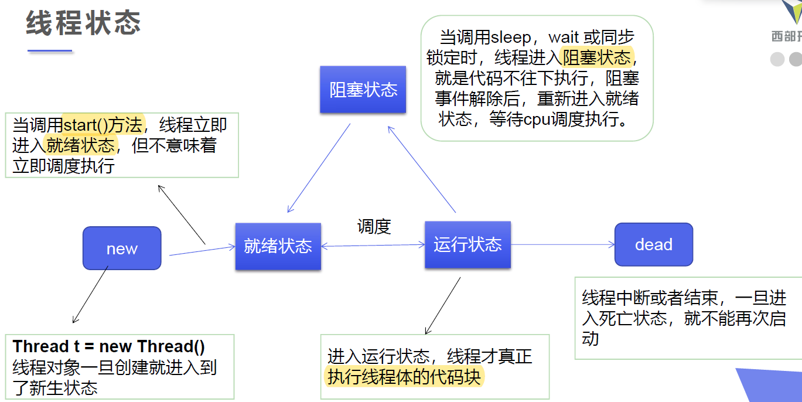
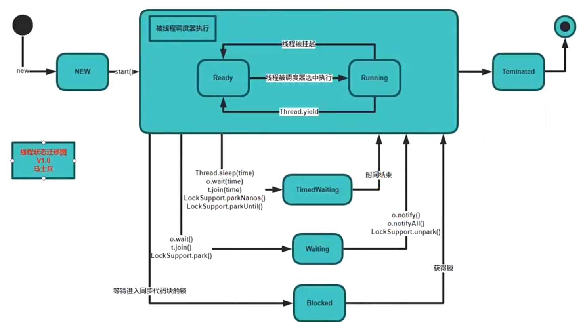

# 多线程


## 创建线程

### 1. 继承`Thread`类

`run()`方法中写线程需要完成的任务

```java
static class MyThread extends Thread {
    @Override
    public void run() {
        for (int i = 0; i < 3000; i++) {
            System.out.println("Hello Thread!");
        }
    }
}

public static void main(String[] args) {
	new MyThread().start();
}
```


### 2. 实现`Runnable`接口

```java
static class MyRun implements Runnable {
    @Override
    public void run() {
        for (int i = 0; i < 300; i++) {
            System.out.println("Hello Runnable!");
        }
    }
}

public static void main(String[] args) {
	new Thread(new MyRun()).start();
}
```


### 3. `Lambda`表达式

间接实现`Runnable`接口

```java
public static void main(String[] args) {
	new Thread(()->{
        for (int i = 0; i < 300; i++) {
            System.out.println("Hello Runnable-Lambda!");
        }
	}).start();
}
```


## 线程状态




- 查看线程状态

  ```java
  static class MyThread extends Thread {
      @Override
      public void run() {
          System.out.println(this.getState());
          for(int i = 0; i < 10; i++) {
              try {
                  Thread.sleep(500);
              } catch (InterruptedException e) {
                  e.printStackTrace();
              }
              System.out.println("--t--" + i);
          }
      }
  }
  
  public static void main(String[] args) {
      Thread t = new MyThread();
      System.out.println(t.getState());
      t.start();
      try {
          t.join(); // 先不向下执行, t线程执行完再向下执行
      } catch (InterruptedException e) {
          e.printStackTrace();
      }
      System.out.println(t.getState());
  }
  ```

  


## 常用方法




### `Thread.sleep`

- sleep (时间) 指定当前线程阻塞的毫秒数
- sleep存在异常InterruptedException
- sleep时间达到后, 线程进入就绪状态
- 每一个对象都有一个锁，sleep不会释放锁


```java
public void testSleep() {
    new Thread(()->{
        for(int i = 0; i < 5; i++) {
            System.out.println("A--Sleep" + i);
            try {
                Thread.sleep(500);
            } catch (InterruptedException e) {
                e.printStackTrace();
            }
        }
    }).start();
}
```


### `Thread.yield()`

- 暂停当前正在执行的线程对象，并执行其他线程
- yield()应该做的是让当前运行线程回到可运行状态，以允许具有相同优先级的其他线程获得运行机会
- 在实际中有时无法保证yield()达到让步目的，因为**让步的线程还有可能被线程调度程序再次选中**


```java
public void testYield() {
    new Thread(()->{
        for(int i = 0; i < 100; i++) {
            System.out.println("--A" + i);
            if(i % 10 == 0) {
                Thread.yield();
            }
        }
    }).start();

    new Thread(()->{
        for(int i = 0; i < 100; i++) {
            System.out.println("-----B" + i);
            if(i % 10 == 0) {
                Thread.yield();
            }
        }
    }).start();
}
```


### `Thread.join()`

- 合并线程，待此线程执行完成后，再执行其他线程，其他线程阻塞, **可以想象成插队**


```java
public void testJoin() {
    Thread t1 = new Thread(()->{
        for(int i = 0; i < 10; i++) {
            System.out.println("t1-" + i);
            try {
                Thread.sleep(500);
                //TimeUnit.Milliseconds.sleep(500)
            } catch (InterruptedException e) {
                e.printStackTrace();
            }
        }
    });

    Thread t2 = new Thread(()->{
        for(int i = 0; i < 10; i++) {
            System.out.println("t2-" + i);
            try {
                Thread.sleep(500);
            } catch (InterruptedException e) {
                e.printStackTrace();
            }
            if (i > 2) {
                try {
                    t1.join();
                } catch (InterruptedException e) {
                    e.printStackTrace();
                }
            }
        }
    });
    t1.start();
    t2.start();
}
```


## synchronized

重入 同一线程


# 异常处理

interrupted


# 定时任务

## Quartz

Scheduler：调度容器

Job：Job接口类，即被调度的任务

JobDetail ：Job的描述类，job执行时的依据此对象的信息反射实例化出Job的具体执行对象。

Trigger：触发器，存放Job执行的时间策略。用于定义任务调度时间规则。

JobStore： 存储作业和调度期间的状态

Calendar：指定排除的时间点（如排除法定节假日）


# 容器

## Hash

​	


# 注解

## 元注解

> 注解到注解上的注解


### `@Retention`

> 保留期

- RetentionPolicy.SOURCE 注解只在源码阶段保留，在编译器进行编译时它将被丢弃忽视
- RetentionPolicy.CLASS 注解只被保留到编译进行的时候，它并不会被加载到 JVM 中
- RetentionPolicy.RUNTIME 注解可以保留到程序运行的时候，它会被加载进入到 JVM 中，所以在程序运行时可以获取到它们

```java
@Retention(RetentionPolicy.RUNTIME)
public @interface TestAnnotation {
    
}

```


### `@Documented`

> 将注解中的元素包含到 Javadoc 中去


### `@Target`

> Target 是目标的意思，@Target 限定了注解运用的场景

- ElementType.ANNOTATION_TYPE 可以给一个注解进行注解
- ElementType.CONSTRUCTOR 可以给构造方法进行注解
- ElementType.FIELD 可以给属性进行注解
- ElementType.LOCAL_VARIABLE 可以给局部变量进行注解
- ElementType.METHOD 可以给方法进行注解
- ElementType.PACKAGE 可以给一个包进行注解
- ElementType.PARAMETER 可以给一个方法内的参数进行注解
- ElementType.TYPE 可以给一个类型进行注解，比如类、接口、枚举


### `@Inherited`

Inherited 是继承的意思，但是它并不是说注解本身可以继承，而是说如果一个超类被 @Inherited 注解过的注解进行注解的话，那么如果它的子类没有被任何注解应用的话，那么这个子类就继承了超类的注解。
说的比较抽象。代码来解释。

```
@Inherited
@Retention(RetentionPolicy.RUNTIME)
@interface Test {}
@Test
public class A {}
public class B extends A {}
1
```

注解 Test 被 @Inherited 修饰，之后类 A 被 Test 注解，类 B 继承 A,类 B 也拥有 Test 这个注解。

可以这样理解：

老子非常有钱，所以人们给他贴了一张标签叫做富豪。

老子的儿子长大后，只要没有和老子断绝父子关系，虽然别人没有给他贴标签，但是他自然也是富豪。

老子的孙子长大了，自然也是富豪。

这就是人们口中戏称的富一代，富二代，富三代。虽然叫法不同，好像好多个标签，但其实事情的本质也就是他们有一张共同的标签，也就是老子身上的那张富豪的标签。


### `@Repeatable`


