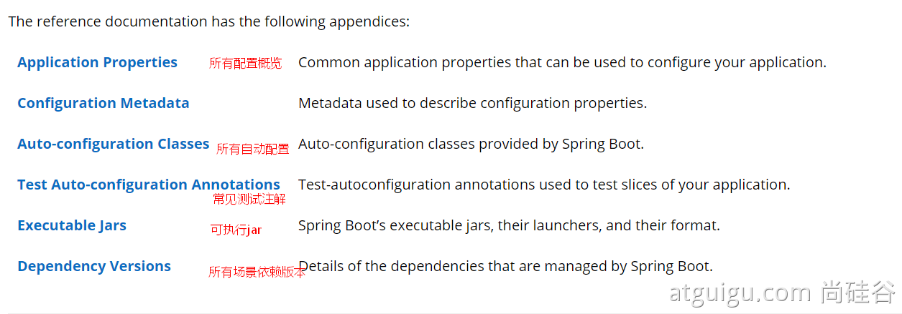

# maven

## 父项目子项目

https://blog.csdn.net/k_young1997/article/details/100053910


# 注解


- @ConfigurationProperties

  默认从全局配置文件中获取值

  将配置文件中配置的每一个属性的值，映射到这个组件中；

  ```java
  
  ```

  

- @PropertySource

  加载指定的配置文件

  ```java
  // 指定加载person.properties文件
  @PropertySource(value = "classpath:person.properties")
  @Component //注册bean
  public class Person {
      @Value("${name}")
      private String name;
  }
  ```

  

- @SpringBootApplication

  标注一个主程序类 ， 说明这是一个Spring Boot应用

  ```java
  //@SpringBootApplication 来标注一个主程序类 ， 说明这是一个Spring Boot应用
  @SpringBootApplication
  public class SpringbootApplication {
      public static void main(String[] args) {
          //启动一个服务
          SpringApplication.run(SpringbootApplication.class, args);
      }
  }
  ```

  


# Servlet


# Spring

- 为了降低Java开发的复杂性，Spring采用了以下4种关键策略：
  1. 基于POJO的轻量级和最小侵入性编程，所有东西都是bean
  2. 通过IOC，依赖注入（DI）和面向接口实现松耦合
  3. 基于切面（AOP）和惯例进行声明式编程
  4. 通过切面和模版减少样式代码，RedisTemplate，xxxTemplate


## 配置文件

src/main/resources/ApplicationContext.xml

```xml
xmlns=http://www.springframework.org/schema/beans 
xmlns=xml NameSpace 类似于java中的package

xmlns:xsi=http://www.w3.org/2001/XMLSchema-instance 
xsi是指xml文件遵守xml规范，xsi全名：xml schema instance 

xsi:schemaLocation="http://www.springframework.org/schema/beans           http://www.springframework.org/schema/beans/spring-beans.xsd"> 
是指具体用到的schema资源

```


### 多配置文件

- 导入文件

  ApplicationContext.xml中导入`<import resource="application-service.xml"/>`

- `ApplicationContext`加载多文件

  `new ClassPathXmlApplicationContext("applicationContext.xml","application-service.xml");`


## 依赖注入

| Class                    | 类         |
| ------------------------ | ---------- |
| Name,id                  | 标识       |
| Scope                    | 作用域     |
| Constructor arguments    | 构造器注入 |
| Properties               | 属性注入   |
| autowiring mode          | 自动装配   |
| lazy-initialization mode | 懒加载     |
| initialization method    | 初始化     |
| destruction method       | 销毁       |

### 注册bean

```xml
<!--一个bean只能有一个id，但是可以有多个name作为别名-->
<bean id="yuty" name="yuty1,yuty2" class="com.yuty"/>
<alias name="yuty" alias="yuty3"/>
```


### 构造器-属性注入

```xml
<!--构造器注入-->
<bean id="person" class="com.msb.Person">
    <constructor-arg name="age" value="18"></constructor-arg>
    <constructor-arg name="name" value="zhangsan"></constructor-arg>
</bean>

<!--属性注入-->
<bean id="person" class="com.msb.Person">
    <property name="age" value="19"></property>
    <property name="name" value="zhangsan"></property>
    <!--对其他bean引用-->
    <property name="food" ref="food"></property>
    
    <!--private String[] myArray;-->
    <property name="myArray">
        <array>
            <value>北京</value>
            <value>上海</value>
        </array>
	</property>

    <!--private List someList;-->
    <property name="someList">
        <list>
            <value>apple</value>
            <value>orange</value>
        </list>
	</property>
    
	<!--private Map someMap;-->
	<property name="someMap">
        <map>
            <entry key="an entry" value="just some string"/>
            <entry key ="a ref" value-ref="food"/>
        </map>
	</property>    
</bean>

<bean id="food" class="com.msb.Food"></bean>
```


- 空值注入

  ```xml
  Value标签
  等于空字符串""
  <property name="name"><value></value></property>
  
  Null标签
  等于Null
  <property name="name"><null></null></property>
  ```

  

### 作用域

spring为bean提供了6种作用域，其中4种只有在web-aware的ApplicationContext才有用。

`singleton 、prototype 、websocket、request、session、application`


- singleton scope 单例作用域

  每一个类，在一个容器内只能产生一个实例

- prototype scope 原型作用域

  该bean每次被注入，或者使用getBean()方法获取时，都返回一个新的实例


### 循环依赖


> 当Spring容器在创建A时，会发现其引用了B，从而会先去创建B。同样的，创建B时，会先去创建C，而创建C时，又先去创建A。最后A、B、C之间互相等待，谁都没法创建成功


- 循环依赖的bean都是singleton 成功

- 循环依赖的bean都是prototype 失败

- 同时有singleton和prototype 当先获取的那个bean是singleton时，就会成功，否则失败


### 工厂方式注入

- 动态工厂
  - 抽象接口 Car

    ```java
    public interface Car {
       public String getName();
       public String getPrice();
    }

  - 实现类BMW

    ```java
    public class Bmw implements Car{
    	public String getName() {
    		return "bmw";
    	}
    
       public String getPrice() {
    		return "500000RMB";
       }
    }
    ```

  - 工厂类 CarFactory

    ```java
    public class CarFactory {
        
    	public Car getCar(String name) throws Exception{
            
            if (name.endsWith("bmw")) {
                return new Bmw();
             } else {
             	throw new Exception("car not fond");
             }
       }
        
    }
    ```

  - Bean配置

    ```xml
    <bean id="carFactory" class="com.msb.CarFactory"></bean>
    
    <bean id="car" factory-bean="carFactory" factory-method="getCar">
       <constructor-arg value="bmw"></constructor-arg>
    </bean>
    ```

  - 测试

    ```java
    public class CarTest {
        public static void main(String[] args) {
            ApplicationContext ctx = new ClassPathXmlApplicationContext("ApplicationContext.xml");
            Car car = ctx.getBean("car", Car.class);
            System.out.println(car.getName());
        }
    }
    ```

    

- 静态工厂
  - 工厂类

    ```java
    public class CarFactory {
        
    	public static Car getCar(String name) throws Exception{
            
            if (name.endsWith("bmw")) {
                return new Bmw();
             } else {
             	throw new Exception("car not fond");
             }
       }
        
    }
    ```

  - Bean配置

    ```xml
    <bean id="carStatic" class="com.msb.CarFactoryStatic" factory-method="getCar">
    	<constructor-arg value="bmw"></constructor-arg>
    </bean>
    ```


### 自动注入autowire

- 原始配置文件

  ```xml
  <beans xmlns="http://www.springframework.org/schema/beans"
  	xmlns:xsi="http://www.w3.org/2001/XMLSchema-instance"
  	xmlns:p="http://www.springframework.org/schema/p"
  	xsi:schemaLocation="http://www.springframework.org/schema/beans          http://www.springframework.org/schema/beans/spring-beans.xsd">
      
      <bean id="dog" class="com.kuang.pojo.Dog"/>
      <bean id="cat" class="com.kuang.pojo.Cat"/>
      <bean id="user" class="com.kuang.pojo.User">
          <property name="cat" ref="cat"/>
          <property name="dog" ref="dog"/>
          <property name="str" value="qinjiang"/>
      </bean>
      
  </beans>
  ```

  

- 全局自动注入

  ```xml
  <beans xmlns="http://www.springframework.org/schema/beans"
  	xmlns:xsi="http://www.w3.org/2001/XMLSchema-instance"
  	xmlns:p="http://www.springframework.org/schema/p"
  	xsi:schemaLocation="http://www.springframework.org/schema/beans          http://www.springframework.org/schema/beans/spring-beans.xsd"
  	
  	default-autowire="byType"> <!--全局自动注入-->
      
      <bean id="dog" class="com.kuang.pojo.Dog"/>
      <bean id="cat" class="com.kuang.pojo.Cat"/>
      <bean id="user" class="com.kuang.pojo.User"/>
  
  </beans>
  ```

  

- byName

  > 要求注入的bean的id必须和被注入的bean对象的属性名一致

  ```xml
  <bean id="person" class="org.example.pojo.Person" autowire="byName"/>
  ```

  

- byType

  > 默认选项
  >
  > 要求注入的bean的对象类型与被注入的bean对象类型一致，并且在配置文件中的Bean相同类型必须唯一

  ```xml
  <bean id="person" class="org.example.pojo.Person" autowire="byType"/>
  ```

  

###  注解注入annotation

#### @Component

> 在需要注册到容器的**类上添加@Component**，标识这个类由Spring容器接管

- @Component默认使用**首字母小写的类名**作为ID注册到Spring容器, 需要手动指定Bean Id可以使用**@Component("new_name")**

```java
@Component("user_new") // 默认id=user
// 相当于配置文件中 <bean id="user_new" class="当前注解的类"/>
public class User {
    @Value("秦疆")
    // 相当于配置文件中 <property name="name" value="秦疆"/>
    public String name;
}
```


#### @Controller,@Service,@Repository

> 同属@Component的三个注解

这三个注意在MVC开发中会用到，功能和@Component一样

Spring额外提供这三个注解的目的主要是为了区分MVC中每个类的区别

- @Controller：web层
- @Service：service层
- @Repository：dao层


#### @Scope

> 注解注册Bean 默认的作用域是singleton，可以使用@Scope("prototype")改变对象作用域

```java
@Controller("user")
@Scope("prototype")
public class User {
    @Value("秦疆")
    public String name;
}
```


#### @Value

> 使用注解给对象注入值

```java
	@Value("小明")
	private String name;
```


#### @Autowired()

> @Autowired是按类型自动转配的，不支持id匹配

```java
@Data
@Component
public class Person {
    @Autowired
    private Dog dog;

    @Autowired
    private Cat cat;
}
```


- @Autowired(required=false) 

  - 说明： false，对象可以为null；true，对象必须存对象，不能为null

  ```java
  //如果允许对象为null，设置required = false,默认为true
  @Autowired(required = false)
  private Cat cat;
  ```

  

- @Qualifier("p2")

  - @Autowired是根据类型自动装配的，加上@Qualifier则可以根据byName的方式自动装配, @Qualifier**不能单独使用**

  ```java
  @Component("dog1")
  public class Dog {
      public void say(){
          System.out.println("dog say");
      }
  }
  
  @Data
  @Component
  public class Person {
      @Autowired
      @Qualifier("dog1")
      private Dog dog;
  
      @Autowired
      private Cat cat;
  }
  ```

  

#### @Resource

- @Resource如有指定的name属性，先按该属性进行byName方式查找装配

- 其次再进行默认的byName方式进行装配

- 如果以上都不成功，则按byType的方式自动装配

- 都不成功，报异常

  

```java
public class User {
    //如果允许对象为null，设置required = false,默认为true
    @Resource(name = "cat2")
    private Cat cat;
    
    @Resource
    private Dog dog;

}
```


## AOP

> AOP（Aspect Oriented Programming）意为：面向切面编程

### 静态代理

> 使用硬编码的方式增强原有方法


- 接口Human

  ```java
  interface Human {
      public void eat();
  }
  ```

  

- 实现类Girl

  ```java
  public class Girl implements Human {
      public void eat() {
          System.out.println("girl eat ...");
      }
  }
  ```


- 实现类ProxyGirl

  > 代理对象，包含对原对象方法的增强，**通过构造方法传入原对象**，并实现和原对象相同的接口，实现接口方法，便可以利用Java多态的特性，通过访问代理方法同时能够调起原对象的实现，并对其增强。

  ```java
  public class ProxyGirl implements Human {
  
      private Human human;
  
      public ProxyGirl() {
          super();
      }
  
      public ProxyGirl(Human human) {
          super();
          this.human = human;
      }
  
      public void eat() {
          System.out.println("before eat");
          human.eat();
          System.out.println("after eat");
      }
  }
  ```

  

### 动态代理

> 动态代理是指动态的在内存中构建代理对象（需要我们制定要代理的目标对象实现的接口类型），即利用JDK的API生成指定接口的对象，也称之为JDK代理或者接口代理。

- org.springframework.cglib

  - 工厂类

  ```java
  import org.springframework.cglib.proxy.Enhancer;
  import org.springframework.cglib.proxy.MethodInterceptor;
  import org.springframework.cglib.proxy.MethodProxy;
  
  import java.lang.reflect.Method;
  
  public class CGLibFactory implements MethodInterceptor {
  
      private Object target;
  
      public CGLibFactory () {
          super();
      }
      public CGLibFactory(Object taObject) {
          super();
          this.target = taObject;
      }
  
      public Object createPrxy() {
          //增强器
          Enhancer enhancer = new Enhancer();
          // 创建子类，作为代理类
          enhancer.setSuperclass(Girl.class);
          // 设置回调类
          enhancer.setCallback(this);
          return enhancer.create();
      }
  
      @Override
      public Object intercept(Object o, Method method, Object[] objects, MethodProxy methodProxy) throws Throwable {
          System.out.println("before");
          method.invoke(target, objects);
          System.out.println("after");
          return null;
      }
  }
  ```

  - 测试

  ```java
  public class DynamicTest {
      public static void main(String[] args) {
          final Girl girl = new Girl();
          Girl prxyGirl = (Girl)new CGLibFactory(girl).createPrxy();
          prxyGirl.eat();
      }
  }
  ```

  

# SpringBoot

官方文档: https://docs.spring.io/spring-boot/docs/current/reference/html/




- 自动生成基本文件：
  1. 程序的主启动类
  2. 一个 application.properties 配置文件
  3. 一个 测试类
  4. 一个 pom.xml


## 注解

### controller层

#### @ResponseBody

> @ResponseBody注解, 用在类上，**会将返回值转成json格式, 直接打印再页面上**


#### @RequestMapping

> @RequestMapping注解用于映射url到控制器类或一个特定的处理程序方法。**可用于类或方法上**。用于类上，表示类中的所有响应请求的方法都是以该地址作为父路径。


- 用于方法上 

  - 访问路径：http://localhost:8080/项目名/h1

  ```java
  @Controller
  public class TestController {
      @RequestMapping("/h1")
      public String test(){
      	return "test";
      }
  }
  ```

  

- 用于类上

  - 访问路径：http://localhost:8080/项目名/admin/h1
  - `@RequestMapping(value="/User",method=RequestMethod.GET)`
  - `@RequestMapping(value="User",method=RequestMethod.POST)`
  
  ```java
  @Controller
  @RequestMapping("/admin")
  public class TestController {
      @RequestMapping("/h1")
      public String test(){
      	return "test";
      }
  }
  ```
  
  

#### @RestController

> @RestController = @Controller+@ResponseBody

```java
@RestController
public class MyAppController {

	@RequestMapping("/h")
	public Map<String, String>  index() {
		Map<String, String> map = new HashMap<>();
		
		map.put("aaa", "bbb");

		return map;
	}
}
```


## 配置文件

### 启动入口

- 默认的包结构

- - 主程序所在包及其下面的所有子包里面的组件都会被默认扫描进来

- - 想要改变扫描路径，`@SpringBootApplication(scanBasePackages="com.atguigu")`

    ```java
    @SpringBootApplication
    // 等同于
    @SpringBootConfiguration
    @EnableAutoConfiguration
    @ComponentScan("com.atguigu.boot")
    ```

    

### application.properties

- application.properties (默认配置文件)
  - 语法结构 ： key=value

```properties
# 修改tomcat端口
server.port=8081
# 修改项目路径
server.servlet.context-path=/demo 

# =======jsp===========
spring.mvc.view.prefix=/WEB-INF/jsp/
spring.mvc.view.suffix=.jsp

```


### 使用配置文件注入

1. 新建一个实体类User

```java
@Component //注册bean
public class User {
    private String name;
    private int age;
    private String sex;
}
```

2. 编辑配置文件 user.properties

```java
user1.name=kuangshen
user1.age=18
user1.sex=男
```

3. 在User类上使用@Value来进行注入！

```java
@Component //注册bean
@PropertySource(value = "classpath:user.properties")
public class User {
    //直接使用@value
    @Value("${user.name}") //从配置文件中取值
    private String name;
    @Value("#{9*2}") // #{SPEL} Spring表达式
    private int age;
    @Value("男") // 字面量
    private String sex;
}
```

4. 测试

```java
@SpringBootTest
class DemoApplicationTests {
    @Autowired
    User user;
    
    @Test
    public void contextLoads() {
    	System.out.println(user);
    }
}
```


```java

```


- application.yml

  - 语法结构 ：key：空格 value

  

- pom.xml

```xml
<!-- 父依赖 -->
<parent>
<groupId>org.springframework.boot</groupId>
<artifactId>spring-boot-starter-parent</artifactId>
<version>2.2.5.RELEASE</version>
<relativePath/>
</parent>
<dependencies>
<!-- web场景启动器 -->
<dependency>
<groupId>org.springframework.boot</groupId>
<artifactId>spring-boot-starter-web</artifactId>
</dependency>
<!-- springboot单元测试 -->
<dependency>
<groupId>org.springframework.boot</groupId>
<artifactId>spring-boot-starter-test</artifactId>
<scope>test</scope>
<!-- 剔除依赖 -->
<exclusions>
<exclusion>
<groupId>org.junit.vintage</groupId>
<artifactId>junit-vintage-engine</artifactId>
</exclusion>
</exclusions>
</dependency>
</dependencies>
<build>
<plugins>
<!-- 打包插件 -->
<plugin>
<groupId>org.springframework.boot</groupId>	
<artifactId>spring-boot-maven-plugin</artifactId>
</plugin>
</plugins>
</build>
```


## 环境切换

### 多配置文件

文件名: application-{name}.properties/yml , 用来指定多个环境版本

- application-test.properties 代表测试环境配置

- application-dev.properties 代表开发环境配置

在application.properties主配置文件中切换环境:

```properties
# 启动SpringBoot，就可以看到已经切换到dev下的配置了；
spring.profiles.active=dev
```


### yaml多文档块

和properties配置文件中一样，但是使用yaml去实现不需要创建多个配置文件

```yaml
server:
	port: 8081
#选择要激活那个环境块
spring:
	profiles:
		active: prod
---
server:
	port: 8083
spring:
	profiles: dev #配置环境的名称
---
server:
	port: 8084
spring:
	profiles: prod #配置环境的名称
```

- 如果yaml和properties同时都配置了端口，并且没有激活其他环境 ， 默认会使用properties配置文件！


## yaml注入

```java
/*
    @ConfigurationProperties作用： 将配置文件中配置的每一个属性的值，映射到这个组件中；
    告诉SpringBoot将本类中的所有属性和配置文件中相关的配置进行绑定
    参数prefix=“person”: 将配置文件中的person下面的所有属性一一对应
*/

@Data //实体类需添加get,set等方法,否则注入失败
@Component //注册bean到容器中
@ConfigurationProperties(prefix="person")
public class Person {
    private String name;
    private Integer age;
    private Boolean happy;
    private Date birth;
    private Map<String,Object> maps;
    private List<Object> lists;
    private Dog dog;
}
```


- yaml文件

  ```yaml
  person:
      name: yuty
      age: 3
      happy: false
      birth: 2000/01/01
      maps: {k1: v1,k2: v2}
      lists:
          - code
          - girl
          - music
      dog:
          name: 旺财
          age: 1
  ```

  

## JSR303数据校验


```java
@Component //注册bean
@ConfigurationProperties(prefix = "person")
@Validated //数据校验
public class Person {
    @NotNull(message="名字不能为空")
    private String userName;
    
    @Max(value=120,message="年龄最大不能查过120")
    private int age;
    
    @Email(message="邮箱格式错误") //name必须是邮箱格式
    private String email;
}
```


```java
# 空检查
@Null 验证对象是否为null
@NotNull 验证对象是否不为null, 无法查检长度为0的字符串
@NotBlank 检查约束字符串是不是Null还有被Trim的长度是否大于0,只对字符串,且会去掉前后空格.
@NotEmpty 检查约束元素是否为NULL或者是EMPTY.
    
# Booelan检查
@AssertTrue 验证 Boolean 对象是否为 true
@AssertFalse 验证 Boolean 对象是否为 false
    
# 长度检查
@Size(min=, max=) 验证对象（Array,Collection,Map,String）长度是否在给定的范围之内
@Length(min=, max=) string is between min and max included.
    
# 日期检查
@Past 验证 Date 和 Calendar 对象是否在当前时间之前
@Future 验证 Date 和 Calendar 对象是否在当前时间之后
@Pattern 验证 String 对象是否符合正则表达式的规则
```


## MVC


### 编写HTTP接口

1. 在启动程序的同级目录下，新建一个controller包，一定要在同级目录下，否则识别不到
2. 在包中新建一个HelloController类

```java
@RestController
public class HelloController {
    @RequestMapping("/hello")
    public String hello() {
        return "Hello World";
    }
}
```


## `thymeleaf`模板引擎

### 引入依赖

```xml
<dependency>
    <groupId>org.springframework.boot</groupId>
    <artifactId>spring-boot-starter-thymeleaf</artifactId>
</dependency>

```


### 后端Controller

```java
@Controller
public class IndexController {
	@RequestMapping("/")
	public String index(ModelMap modelMap) {
		// 加入一个属性，用来在模板中读取
		modelMap.addAttribute("msg", "nihao~");
		// return 模板文件的名称
        // 对应 src/main/resources/templates/index.html
		return "index";
    }
}
```


### 前端模板

```html
<!--变量名为 msg-->
<h1 th:text="${msg}">hi!</h1> 

<table border="1">
    <tr>
        <th>ID</th>
        <th>Name</th>
    </tr>

    <tr th:each = "city : ${cityList}">
        <td th:text = "${city.id}"></td>
        <td th:text = "${city.name}"></td>
    </tr>
</table>

```


## Jsp

### 导入依赖

```xml
<!-- jstl -->
<dependency>
    <groupId>javax.servlet</groupId>
    <artifactId>jstl</artifactId>
</dependency>

<!-- jasper -->
<dependency>
    <groupId>org.apache.tomcat.embed</groupId>
    <artifactId>tomcat-embed-jasper</artifactId>
    <scope>provided</scope>
</dependency>
```


## 打包

- 将项目打成jar包，点击 maven的 package

```xml
<!--在工作中,很多情况下打包是不想执行测试用例的,跳过测试用例-->
<plugin>
    <groupId>org.apache.maven.plugins</groupId>
    <artifactId>maven-surefire-plugin</artifactId>
    <configuration>
        <!--跳过项目运行测试用例-->
        <skipTests>true</skipTests>
    </configuration>
</plugin>
```


- 如果打包成功，则会在target目录下生成一个 jar 包

- `cmd：java -jar [包名].jar`


## 启动图案

如何更改启动时显示的字符拼成的字母:

- resources 目录下新建一个banner.txt 即可。
  图案可以到：https://www.bootschool.net/ascii 这个网站生成，然后拷贝到文件中即可！


# Junit测试


# yaml语法

1、空格不能省略
2、以缩进来控制层级关系，只要是左边对齐的一列数据都是同一个层级的。
3、属性和值的大小写都是十分敏感的。

```yaml
server：
	prot: 8080
```


## 字面量

> 普通的值 [ 数字，布尔值，字符串 ]

```yaml
k: v
```

- “ ”  双引号，不会转义字符串里面的特殊字符， 特殊字符会作为本身想表示的意思；
  比如 ： `name: "kuang \n shen"` 输出 ： `kuang 换行 shen`
- '' 单引号，会转义特殊字符 ， 特殊字符最终会变成和普通字符一样输出
  比如 ： `name: ‘kuang \n shen’`  输出 ： `kuang \n shen`


## 对象、Map（键值对）

```yaml
# 对象、Map格式
k:
	v1:
	v2:
	
student:
	name: qinjiang
	age: 3

# 行内写法
student: {name: qinjiang,age: 3}
```


## 数组（ List、set ）

```yaml
pets:
	- cat
	- dog
	- pig

# 行内写法
pets: [cat,dog,pig]
```


## 占位符

```yaml
person:
    name: qinjiang${random.uuid} # 随机uuid
    age: ${random.int} # 随机int
    happy: false
    birth: 2000/01/01
    maps: {k1: v1,k2: v2}
    lists:
        - code
        - girl
        - music
    dog:
    # 引用person.hello 的值，如果不存在就用 ：后面的值，即 other，然后拼接上_旺财
    name: ${person.hello:other}_旺财
    age: 1
```


# 插件

lombok


devtools

ctrl+F9


slf4j


