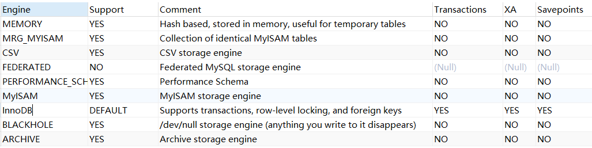
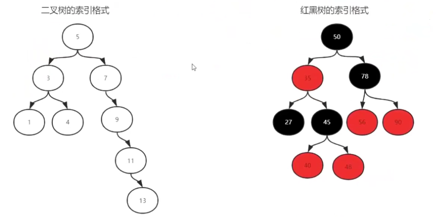
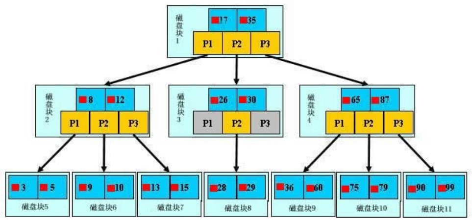

# 开启服务

1. win+r打开【运行】
2. 在文本框输入“services.msc”
3. 在服务中打开MySQL80


# 查看基本信息


`show engines;`




`show index from actor;`


# 操作数据库


```sql

```


# 操作表


```sql

```


# 增

```sql
```


# 删


```sql

```


# 改


```sql

```


# 查


```sql

```


# 索引

- 二叉树和红黑树为什么不行?

  

  - 树每次查询子节点都需要查找磁盘中的数据, 树的深度太深导致 IO 次数过多


## 建索引的几大原则

1. **最左前缀匹配原则**，非常重要的原则，mysql会一直**向右匹配直到遇到范围查询(>、<、between、like)就停止匹配**

   比如`a = 1 and b = 2 and c > 3 and d = 4` 如果建立(a,b,c,d)顺序的索引，d是用不到索引的，如果建立(a,b,d,c)的索引则都可以用到，a,b,d的顺序可以任意调整

2. **= 和 in 可以乱序**，比如`a = 1 and b = 2 and c = 3 `建立(a,b,c)索引可以任意顺序，mysql的查询优化器会帮你优化成索引可以识别的形式。
3. **索引列不能参与计算**，保持列“干净”，比如`from_unixtime(create_time) = ’2014-05-29’`就不能使用到索引，原因很简单，b+树中存的都是数据表中的字段值，但进行检索时，需要把所有元素都应用函数才能比较，显然成本太大。所以语句应该写成`create_time = unix_timestamp(’2014-05-29’)`


## B+树索引

### B+树

> **B+ 树**是一种[树数据结构](https://zh.wikipedia.org/wiki/树_(数据结构))，通常用于[数据库](https://zh.wikipedia.org/wiki/数据库)和[操作系统](https://zh.wikipedia.org/wiki/操作系统)的[文件系统](https://zh.wikipedia.org/wiki/文件系统)中。B+ 树的特点是能够保持数据稳定有序，其插入与修改拥有较稳定的对数时间复杂度。B+ 树元素自底向上插入，这与[二叉树](https://zh.wikipedia.org/wiki/二叉树)恰好相反。





**浅蓝色的块称之为一个磁盘块**，可以看到每个磁盘块包含几个**数据项（深蓝色所示）**和**指针（黄色所示）**，如磁盘块1包含数据项17和35，包含指针P1、P2、P3 ； P1表示小于17的磁盘块，P2表示在17和35之间的磁盘块，P3表示大于35的磁盘块。真实的数据存在于叶子节点即3、5、9、10、13、15、28、29、36、60、75、79、90、99。**非叶子节点不存储真实的数据，只存储指引搜索方向的数据项，如17、35并不真实存在于数据表中。**


#### b+树的查找过程

- 如图所示，如果要查找数据项29，那么首先会**把磁盘块1由磁盘加载到内存**，**此时发生一次IO**，在内存中用二分查找确定29在17和35之间，锁定磁盘块1的P2指针，访问内存时间因为非常短（相比磁盘的IO）可以忽略不计

- 通过磁盘块1的P2指针的磁盘地址**把磁盘块3由磁盘加载到内存**，**发生第二次IO**，29在26和30之间，锁定磁盘块3的P2指针

- 通过指针**加载磁盘块8到内存，发生第三次IO**，同时内存中做二分查找找到29，结束查询，总计三次IO

  ​		如果没有索引，每个数据项的查找都要发生一次IO，那么总共需要百万次的IO，显然成本非常非常高

  

#### 最左匹配特性

​		当b+树的数据项是复合的数据结构，比如(name,age,sex)的时候，b+数是按照**从左到右的顺序来建立搜索树**的，比如当(张三,20,F)这样的数据来检索的时候，b+树会优先比较name来确定下一步的所搜方向，如果name相同再依次比较age和sex，最后得到检索的数据；

​		当(20,F)这样的没有name的数据来的时候，b+树就不知道下一步该查哪个节点，**因为建立搜索树的时候name就是第一个比较因子，必须要先根据name来搜索才能知道下一步去哪里查询**。比如，当(张三,F)这样的数据来检索时，b+树可以用name来指定搜索方向，但下一个字段age的缺失，所以只能把名字等于张三的数据都找到，然后再匹配性别是F的数据了， 这个是非常重要的性质，即索引的最左匹配特性。


## hash


## 查询优化

绝大部分rows小的语句执行一定很快（有例外，下面会讲到）。所以优化语句基本上都是在优化rows。

### 慢查询优化基本步骤

1. 先运行看看是否真的很慢，注意设置SQL_NO_CACHE
2. where条件单表查，锁定最小返回记录表。这句话的意思是把查询语句的where都应用到表中返回的记录数最小的表开始查起，单表每个字段分别查询，看哪个字段的区分度最高
3. explain查看执行计划，是否与 2 预期一致（从锁定记录较少的表开始查询）
4. order by limit 形式的sql语句让排序的表优先查


### 几个慢查询案例


```sql
select
   distinct cert.emp_id 
from
   cm_log cl 
inner join
   (
      select
         emp.id as emp_id,
         emp_cert.id as cert_id 
      from
         employee emp 
      left join
         emp_certificate emp_cert 
            on emp.id = emp_cert.emp_id 
      where
         emp.is_deleted=0
   ) cert 
      on (
         cl.ref_table='Employee' 
         and cl.ref_oid= cert.emp_id
      ) 
      or (
         cl.ref_table='EmpCertificate' 
         and cl.ref_oid= cert.cert_id
      ) 
where
   cl.last_upd_date >='2013-11-07 15:03:00' 
   and cl.last_upd_date<='2013-11-08 16:00:00';

```


# 性能分析

## EXPLAIN

`explain sql语句;`


id:选择标识符

如果是子查询，id的序号会递增，id值越大优先级越高，越先被执行

id如果相同，可以认为是一组，从上往下顺序执行；在所有组中，id值越大，优先级越高，越先执行


select_type:表示查询的类型。

查询中每个select子句的类型

(1) SIMPLE(简单SELECT，不使用UNION或子查询等)

(2) PRIMARY(子查询中最外层查询，查询中若包含任何复杂的子部分，最外层的select被标记为PRIMARY)

(3) UNION(UNION中的第二个或后面的SELECT语句)

(4) DEPENDENT UNION(UNION中的第二个或后面的SELECT语句，取决于外面的查询)

(5) UNION RESULT(UNION的结果，union语句中第二个select开始后面所有select)

(6) SUBQUERY(子查询中的第一个SELECT，结果不依赖于外部查询)

(7) DEPENDENT SUBQUERY(子查询中的第一个SELECT，依赖于外部查询)

(8) DERIVED(派生表的SELECT, FROM子句的子查询)

(9) UNCACHEABLE SUBQUERY(一个子查询的结果不能被缓存，必须重新评估外链接的第一行)


table:输出结果集的表

显示这一步所访问数据库中表名称（显示这一行的数据是关于哪张表的），有时不是真实的表名字，可能是简称，例如上面的e，d，也可能是第几步执行的结果的简称


partitions:匹配的分区


- type

对表访问方式，表示MySQL在表中找到所需行的方式，又称“访问类型”。

常用的类型有： **ALL、index、range、 ref、eq_ref、const、system、NULL（从左到右，性能从差到好）**

ALL：Full Table Scan， MySQL将遍历全表以找到匹配的行

index: Full Index Scan，index与ALL区别为index类型只遍历索引树

range:只检索给定范围的行，使用一个索引来选择行

ref: 表示上述表的连接匹配条件，即哪些列或常量被用于查找索引列上的值

eq_ref: 类似ref，区别就在使用的索引是唯一索引，对于每个索引键值，表中只有一条记录匹配，简单来说，就是多表连接中使用primary key或者 unique key作为关联条件

const、system: 当MySQL对查询某部分进行优化，并转换为一个常量时，使用这些类型访问。如将主键置于where列表中，MySQL就能将该查询转换为一个常量，system是const类型的特例，当查询的表只有一行的情况下，使用system

NULL: MySQL在优化过程中分解语句，执行时甚至不用访问表或索引，例如从一个索引列里选取最小值可以通过单独索引查找完成。


possible_keys:表示查询时，可能使用的索引

**指出MySQL能使用哪个索引在表中找到记录，查询涉及到的字段上若存在索引，则该索引将被列出，但不一定被查询使用（该查询可以利用的索引，如果没有任何索引显示 null）**

该列完全独立于EXPLAIN输出所示的表的次序。这意味着在possible_keys中的某些键实际上不能按生成的表次序使用。
如果该列是NULL，则没有相关的索引。在这种情况下，可以通过检查WHERE子句看是否它引用某些列或适合索引的列来提高你的查询性能。如果是这样，创造一个适当的索引并且再次用EXPLAIN检查查询

 


key:表示实际使用的索引

**key列显示MySQL实际决定使用的键（索引），必然包含在possible_keys中**

如果没有选择索引，键是NULL。要想强制MySQL使用或忽视possible_keys列中的索引，在查询中使用FORCE INDEX、USE INDEX或者IGNORE INDEX。


key_len:索引字段的长度

**表示索引中使用的字节数，可通过该列计算查询中使用的索引的长度（key_len显示的值为索引字段的最大可能长度，并非实际使用长度，即key_len是根据表定义计算而得，不是通过表内检索出的）**

不损失精确性的情况下，长度越短越好 


ref:列与索引的比较

**列与索引的比较，表示上述表的连接匹配条件，即哪些列或常量被用于查找索引列上的值**


rows:扫描出的行数(估算的行数)

**估算出结果集行数，表示MySQL根据表统计信息及索引选用情况，估算的找到所需的记录所需要读取的行数**


filtered:按表条件过滤的行百分比


Extra:执行情况的描述和说明

**该列包含MySQL解决查询的详细信息,有以下几种情况：**

Using where:不用读取表中所有信息，仅通过索引就可以获取所需数据，这发生在对表的全部的请求列都是同一个索引的部分的时候，表示mysql服务器将在存储引擎检索行后再进行过滤

Using temporary：表示MySQL需要使用临时表来存储结果集，常见于排序和分组查询，常见 group by ; order by

Using filesort：当Query中包含 order by 操作，而且无法利用索引完成的排序操作称为“文件排序”

```
-- 测试Extra的filesort
explain select * from emp order by name;
```

Using join buffer：改值强调了在获取连接条件时没有使用索引，并且需要连接缓冲区来存储中间结果。如果出现了这个值，那应该注意，根据查询的具体情况可能需要添加索引来改进能。

Impossible where：这个值强调了where语句会导致没有符合条件的行（通过收集统计信息不可能存在结果）。

Select tables optimized away：这个值意味着仅通过使用索引，优化器可能仅从聚合函数结果中返回一行

No tables used：Query语句中使用from dual 或不含任何from子句

```
-- explain select now() from dual;
```

 

**总结：****
• EXPLAIN不会告诉你关于触发器、存储过程的信息或用户自定义函数对查询的影响情况
• EXPLAIN不考虑各种Cache
• EXPLAIN不能显示MySQL在执行查询时所作的优化工作
• 部分统计信息是估算的，并非精确值
• EXPALIN只能解释SELECT操作，其他操作要重写为SELECT后查看执行计划。**

通过收集统计信息不可能存在结果


