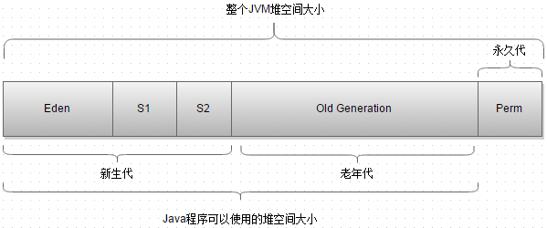

# 数据类型

## 常量

1. 整数类型

- 十进制表示方式：正常数字，如 13、25等
- 二进制表示方式：以0b(0B)开头，如0b1011 、0B1001
- 十六进制表示方式以0x 或0X 开头表示，数字以0-9及A-F组成  如0x23A2、0xa、0x10，此处的A-F 不区分大小写
- 八进制表示方式：以0开头，如01、07、0721


2. 小数类型，如1.0、-3.15、3.168
3. 布尔类型， true、false
4. 字符类型，字符必须使用单引号 ’ ’ 包裹，并且其中只能且仅能包含一个字符。如'a'，'A', '0', '家'
5. 字符串类型，一种引用类型，字符串必须使用 " " 包裹，其中可以包含0~N个字符。如"我爱Java"，"0123"，""，
6. 空常量，"null"

## 基本类型

> 基本数据类型：包括 整数、浮点数、字符、布尔
> 引用数据类型：包括 类、数组、接口
>
> Java中的默认类型：整数类型是int 、浮点类型是double


- 整数(byte、short、int、long)，默认的整数类型是int类型，long类型需添加"L"后缀。
- 小数(float、double)
  - 默认的浮点类型是double类型，在Java中所有没有后缀以及使用“D”后缀（小写也可以，但建议使用大写）的小数都是double类型；float类型常量必须添加“ F ”或“ f ”后缀
- 字符类型（char）
- 布尔类型(boolean)

**byte：**

- byte 数据类型是8位、一个字节,有符号的，以二进制补码表示的整数
- 最小值是 **-128（-2^7）**
- 最大值是  **127（ 2^7-1）**
- 默认值是 **0**
- byte 类型用在大型数组中节约空间，主要代替整数，因为 byte 变量占用的空间是 int 类型的四分之一
- 例子：`byte a = 100; byte b = -50;`

**short：**

- short 数据类型是 16 位、两个字节,有符号的以二进制补码表示的整数
- 最小值是 **-32768（-2^15）**
- 最大值是  **32767（ 2^15 - 1）**
- Short 数据类型也可以像 byte 那样节省空间。一个short变量是int型变量所占空间的二分之一
- 默认值是 **0**
- 例子：`short s = 1000; short r = -20000`

**int：**

- int 数据类型是32位、四个字节, 有符号的以二进制补码表示的整数
- 最小值是 **-2,147,483,648（-2^31）**
- 最大值是  **2,147,483,647（ 2^31 - 1）**
- 一般地整型变量默认为 int 类型
- 默认值是 **0** 
- 例子：`int a = 100000; int b = -200000`

**long：**

- long 数据类型是 64 位、八个字节, 有符号的以二进制补码表示的整数
- 最小值是 **-9,223,372,036,854,775,808（-2^63）**
- 最大值是  **9,223,372,036,854,775,807（ 2^63 -1）**
- 这种类型主要使用在需要比较大整数的系统上
- 默认值是 **0L**
- 例子： `long a = 100000L; Long b = -200000L`
  "L"理论上不分大小写，但是若写成"l"容易与数字"1"混淆，不容易分辩。所以最好大写

**float：**

- float 数据类型是单精度、32位、四个字节,符合IEEE 754标准的浮点数
- float 在储存大型浮点数组的时候可节省内存空间
- 默认值是 **0.0f**
- 浮点数不能用来表示精确的值，如货币
- 例子：float f1 = 234.5f

**double：**

- double 数据类型是双精度、64 位、八个字节, 符合IEEE 754标准的浮点数
- 浮点数的默认类型为double类型
- double类型同样不能表示精确的值，如货币
- 默认值是 **0.0d**
- 例子：`double d1 = 123.4;`

**boolean：**

- boolean数据类型表示一位的信息
- 只有两个取值：true 和 false
- 这种类型只作为一种标志来记录 true/false 情况
- 默认值是 **false**
- 例子：`boolean one = true;`

**char：**

- char类型是一个单一的 16 位 Unicode 字符, 两个字节
- 最小值是 **\u0000**（即为 0）
- 最大值是 **\uffff**（即为65、535）
- char 数据类型可以储存任何字符
- 例子：`char letter = 'A';`

```java
/**
	@author: yuty
*/

/*

*/

// 默认值
// 基本类型占用字节数和范围
```

### 数据类型转换

> 数据范围从小到大依次列出：byte -> short -> int -> long -> float -> double

* **自动转换**

自动转换：将**取值范围小**的类型自动提升为**取值范围大**的类型

`byte、short、char‐‐>int‐‐>long‐‐>float‐‐>double`

* **强制转换**

强制类型转换：将**取值范围大的类型**强制转换成**取值范围小的类型**

`数据类型 变量名 = （数据类型）被转数据值；`

1. 浮点转成整数，直接取消小数点，造成数据损失精度
2. int 强制转成short 砍掉2个字节，造成数据丢失

```java
float f = 1.1f;
// float f = 1.1; error!
short s1 = (short) (1);
```


### ASCII编码表

| 字符 | 数值 |
| ---- | ---- |
| '0'  | 48   |
| '9'  | 57   |
| 'A'  | 65   |
| 'Z'  | 90   |
| 'a'  | 97   |
| 'z'  | 122  |

## String

1. **存储字符串的形式：**

- Java8中，使⽤ final 修饰的**字符数组来保存字符串**。private final char value[] ，所以 String 对象是不可变的。

```java
public final class String
    //String 被声明为 final，因此它不可被继承
    implements java.io.Serializable, Comparable<String>, CharSequence {
    private final char value[];
    // final 修饰的字符数组来保存字符串,所以 String 对象是不可变的
}
```

- Java 9 之后，String 类的实现**改用 byte 数组存储字符串**，同时使用 `coder` 来标识使用了哪种编码。

```java
public final class String
    implements java.io.Serializable, Comparable<String>, CharSequence {
    private final byte[] value;

    /** The identifier of the encoding used to encode the bytes in {@code value}. */
    private final byte coder;
}
```


2. **String Pool**

   如果一个 String 对象已经被创建过了，那么就会从 String Pool 中取得引用。只有 String 是不可变的，才可能使用 String Pool。

<div align="center">  </div><br>

字符串常量池（String Pool）保存着所有字符串字面量（literal strings），这些字面量在编译时期就确定。不仅如此，还可以使用 String 的 intern() 方法在运行过程将字符串添加到 String Pool 中。

下面示例中，s1 和 s2 采用 new String() 的方式新建了两个不同字符串， s3 和 s4 是通过 s1.intern() 和 s2.intern() 方法取得同一个字符串引用。

intern() 首先把 "aaa" 放到 String Pool 中，然后返回这个字符串引用，因此 s3 和 s4 引用的是同一个字符串。

```java
String s1 = new String("aaa");
String s2 = new String("aaa");
System.out.println(s1 == s2);           // false
String s3 = s1.intern();
String s4 = s2.intern();
System.out.println(s3 == s4);           // true

String s5 = "bbb";
String s6 = "bbb";
System.out.println(s5 == s6);  // true
//如果是采用 "bbb" 这种字面量的形式创建字符串，会自动地将字符串放入 String Pool 中
```

在 Java 7 之前，String Pool 被放在运行时常量池中，它属于永久代。而在 Java 7，String Pool 被移到堆中。这是因为永久代的空间有限，在大量使用字符串的场景下会导致 OutOfMemoryError 错误。


3. **new String("abc")**(不懂)

使用这种方式一共会创建两个字符串对象（前提是 String Pool 中还没有 "abc" 字符串对象）。

- "abc" 属于字符串字面量，因此编译时期会在 String Pool 中创建一个字符串对象，指向这个 "abc" 字符串字面量；
- 而使用 new 的方式会在堆中创建一个字符串对象。

创建一个测试类，其 main 方法中使用这种方式来创建字符串对象。

```java
public class NewStringTest {
    public static void main(String[] args) {
        String s = new String("abc");
    }
}
```

使用 javap -verbose 进行反编译，得到以下内容：

```java
// ...
Constant pool:
// ...
   #2 = Class              #18            // java/lang/String
   #3 = String             #19            // abc
// ...
  #18 = Utf8               java/lang/String
  #19 = Utf8               abc
// ...

  public static void main(java.lang.String[]);
    descriptor: ([Ljava/lang/String;)V
    flags: ACC_PUBLIC, ACC_STATIC
    Code:
      stack=3, locals=2, args_size=1
         0: new           #2                  // class java/lang/String
         3: dup
         4: ldc           #3                  // String abc
         6: invokespecial #4                  // Method java/lang/String."<init>":(Ljava/lang/String;)V
         9: astore_1
// ...
```

在 Constant Pool 中，#19 存储这字符串字面量 "abc"，#3 是 String Pool 的字符串对象，它指向 #19 这个字符串字面量。在 main 方法中，0: 行使用 new #2 在堆中创建一个字符串对象，并且使用 ldc #3 将 String Pool 中的字符串对象作为 String 构造函数的参数。

以下是 String 构造函数的源码，可以看到，在将一个字符串对象作为另一个字符串对象的构造函数参数时，并不会完全复制 value 数组内容，而是都会指向同一个 value 数组。

```java
public String(String original) {
    this.value = original.value;
    this.hash = original.hash;
}
```


### StringBuffer and StringBuilder

1. **可变性**  

- String 不可变
- StringBuffer 和 StringBuilder 可变

2. **线程安全**  

- **String 不可变**，因此是线程安全的
- StringBuilder 不是线程安全的
- StringBuffer 是线程安全的，内部使用 synchronized 进行同步


## 转移字符

```java
//\t ：一个制表位，实现对齐的功能
System.out.println("北京\t 天津\t 上海");
// \n ：换行符
System.out.println("jack\nsmith\nmary");
// \\ ：一个\ \\
System.out.println("C:\\Windows\\System32\\cmd.exe"); 
// \" :一个"
System.out.println("老韩说:\"要好好学习java,有前途\""); 
// \' ：一个'
System.out.println("老韩说:\'要好好学习java,有前途\'");

// \r :一个回车 System.out.println("韩顺平教育\r 北京"); 
// 解读
// 1. 输出 韩顺平教育
// 2. \r 表示回车
System.out.println("韩顺平教育\r 北京"); // 北京平教育
```


## 包装类型

| 基本类型 | 对应的包装类（位于java.lang包中） |
| -------- | --------------------------------- |
| byte     | Byte                              |
| short    | Short                             |
| int      | **Integer**                       |
| long     | Long                              |
| float    | Float                             |
| double   | Double                            |
| char     | **Character**                     |
| boolean  | Boolean                           |

* **装箱**：从**基本类型**转换为对应的**包装类对象**。

* **拆箱**：从**包装类对象**转换为对应的**基本类型**。

基本数值---->包装对象

~~~java
Integer i = new Integer(4);        //使用构造函数函数
Integer j = Integer.valueOf(4);    //使用包装类中的valueOf方法
~~~

包装对象---->基本数值

~~~java
int num = i.intValue();
~~~

* **自动装箱与自动拆箱**

> 从Java 5（JDK 1.5）开始，装箱、拆箱动作自动完成

```java
Integer i = 4; //自动装箱。相当于Integer i = Integer.valueOf(4);
i = i + 5;     //等号右边：将i对象转成基本数值(自动拆箱) i.intValue() + 5
//加法运算完成后，再次装箱，把基本数值转成对象。
```

## 缓存池

- new Integer(123) 每次都会新建一个对象
- Integer.valueOf(123) 会使用缓存池中的对象，多次调用会取得同一个对象的引用

```java
Integer x = new Integer(123);
Integer y = new Integer(123);
System.out.println(x == y);    // false
Integer z = Integer.valueOf(123);
Integer k = Integer.valueOf(123);
System.out.println(z == k);   // true
```

valueOf() 先**判断值是否在缓存池**，如果在就直接返回指向缓存池的内容的引用

```java
public static Integer valueOf(int i) {
    if (i >= IntegerCache.low && i <= IntegerCache.high)
        return IntegerCache.cache[i + (-IntegerCache.low)];
    return new Integer(i);
}
```

在 Java 8 中，Integer 缓存池的大小默认为 -128\~127，**编译器会在自动装箱过程调用 valueOf() 方法**，因此多个值相同且值在缓存池范围内的 Integer 实例使用自动装箱来创建，那么就会引用相同的对象。

```java
Integer m = 123;
Integer n = 123;
System.out.println(m == n); // true
```

基本类型对应的缓冲池如下：

- boolean values true and false
- all byte values
- short values between -128 and 127
- int values between -128 and 127
- char in the range \u0000 to \u007F

在使用这些基本类型对应的包装类型时，**如果该数值范围在缓冲池范围内**，就可以直接使用缓冲池中的对象

# 容器

## 数组

```java
int[] nums = {1, 2, 3};
int[] nums = new int[100];

int nums[][] = {{1, 2}, {2, 3}};
int nums[][] = new int[5][6];

public static int[] sum(int[] nums){
    // 数组作为方法的返回类型
}
```


## Collection

<div align="center">  </div><br>

**声明方法:**

* `public boolean add(E e)`：       把给定的对象添加到当前集合中 。
* `public void clear()`:                 清空集合中所有的元素。
* `public boolean remove(E e)`:     把给定的对象在当前集合中删除。
* `public boolean contains(E e)`:  判断当前集合中是否包含给定的对象。
* `public boolean isEmpty()`:         判断当前集合是否为空。
* `public int size()`:                     返回集合中元素的个数。
* `public Object[] toArray()`:       把集合中的元素，存储到数组中。

### Set

> `Set`的特点是元素无序，而且不可重复

注意要实现类：

#### TreeSet

基于红黑树实现，支持有序性操作，例如根据一个范围查找元素的操作。查找的时间复杂度 O(logN)。

#### HashSet

基于哈希表实现，支持快速查找，但不支持有序性操作。查找的时间复杂度为 O(1)

#### LinkedHashSet

具有 HashSet 的查找效率，并且内部使用双向链表维护元素的插入顺序。

##### HashSet


###### 哈希表

> **在JDK1.8之前**，哈希表底层采用**数组+链表**实现，即使用链表处理冲突，同一hash值的链表都存储在一个链表里。但是当位于一个桶中的元素较多(即hash值相等的元素较多时)，通过key值依次查找的效率就比较低。
>
> **在JDK1.8中**，哈希表存储采用**数组+链表+红黑树**实现，当**链表长度超过阈值（8）时**，**将链表转换为红黑树**，这样大大减少了查找时间。


**HashSet存储流程图:**


###### HashSet存储自定义类型元素

```java
public class Student {
    private String name;
    private int age;
//================================
    public Student() {
    }
    public Student(String name, int age) {
        this.name = name;
        this.age = age;
    }
//================================
    @Override
    public boolean equals(Object o) {
        if (this == o)
            return true;
        if (o == null || getClass() != o.getClass())
            return false;
        Student student = (Student) o;
        return age == student.age && Objects.equals(name, student.name);
    }
    @Override
    public int hashCode() {
        return Objects.hash(name, age);
    }
}
//================================
public class HashSetDemo2 {
    public static void main(String[] args) {
        //创建集合对象   该集合中存储 Student类型对象
        HashSet<Student> stuSet = new HashSet<Student>();
        //存储 
        Student stu = new Student("于谦", 43);
        stuSet.add(stu);
        stuSet.add(new Student("郭德纲", 44));
        stuSet.add(new Student("于谦", 43));
        stuSet.add(new Student("郭麒麟", 23));
        stuSet.add(stu);

        for (Student stu2 : stuSet) {
            System.out.println(stu2);
        }
    }
}
//================================
执行结果：
Student [name=郭德纲, age=44]
Student [name=于谦, age=43]
Student [name=郭麒麟, age=23]
```


##### LinkedHashSet

### List

> `List`的特点是元素有序、元素可重复, 是一种线性方式进行存储的，可以通过索引访问

**List接口的常用方法:**

- `public void add(E element)`
- `public E get(int index)`:返回集合中指定位置的元素。
- `public E remove(int index)`: 移除列表中指定位置的元素, 返回的是被移除的元素。
- `public E set(int index, E element)`:用指定元素替换集合中指定位置的元素,返回值的更新前的元素。


#### ArrayList

> 基于底层使⽤的是Object数组
> 动态数组实现，支持随机访问
>
> **当数组大小不足时，就要将已经有数组的数据复制到新的存储空间中**。


```java
public class ArrayList<E> extends AbstractList<E>
	implements List<E>, RandomAccess, Cloneable, java.io.Serializable
// RandomAccess 接口标识着该类支持快速随机访问
    
private static final int DEFAULT_CAPACITY = 10;
// 数组的默认大小为 10
```

##### 扩容

添加元素时使用 ensureCapacityInternal() 方法来保证容量足够，如果不够时，需要使用 grow() 方法进行扩容，新容量的大小为 oldCapacity+oldCapacity/2。**新容量大约是旧容量的 1.5 倍左右**。

扩容操作需要调用 `Arrays.copyOf()` 把原数组整个复制到新数组中，这个操作代价很高，因此最好在创建 ArrayList 对象时就指定大概的容量大小，减少扩容操作的次数。


##### 序列化


##### 编码

```java
import java.util.ArrayList;

ArrayList<String> array = new ArrayList<>();

// 添加
array.add("b");

// 获取
array.get(0)

// 更改
array.set(0, "set 0");

// 移除 时间复杂度为 O(N)
array.remove(0);

// 容量
array.size()
```


#### Vector

> - Vector与ArrayList类似，不同的是**Vector线程安全**，使用了 synchronized 进行同步，**某一时刻只有一个线程能够写Vector**
>
> - **扩容时Vector增长率为目前数组长度的100%**,**ArrayList增长率为目前数组长度的50%**
> - Vector访问更慢


##### Stack

> java工具包中的Stack是继承于[Vector](http://www.cnblogs.com/skywang12345/p/3308833.html)(矢量队列)的，由于Vector是通过数组实现的，这就意味着，**Stack也是通过数组实现的**，**而非链表**


##### 编码


#### LinkedList

> LinkedList是一个双向链表, 方便元素添加、删除的集合
>
> 

<div align="center">  </div><br>

* `public void addFirst(E e)`:   将指定元素插入此列表的开头。
* `public void addLast(E e)`:     将指定元素添加到此列表的结尾。
* `public E getFirst()`:              返回此列表的第一个元素。
* `public E getLast()`:                返回此列表的最后一个元素。
* `public E removeFirst()`:         移除并返回此列表的第一个元素。
* `public E removeLast()`:           移除并返回此列表的最后一个元素。
* `public E pop()`:                       从此列表所表示的堆栈处弹出一个元素。
* `public void push(E e)`:           将元素推入此列表所表示的堆栈。
* `public boolean isEmpty()`：   如果列表不包含元素，则返回true。


##### 编码

```java

```


### Queue

#### LinkedList

可以用它来实现双向队列。


#### PriorityQueue

> **Java中PriorityQueue通过二叉小顶堆实现**
>
> 普通的队列是一种先进先出的数据结构，元素在队列尾追加，而从队列头删除。**在优先队列中，元素被赋予优先级**。当访问元素时，具有**最高优先级的元素最先删除**。优先队列具有最高级先出 （first in, largest out）的行为特征。采用堆数据结构来实现。
>
> **优先队列的作用是能保证每次取出的元素都是队列中权值最小的**（Java的优先队列每次取最小元素，C++的优先队列每次取最大元素）。这里牵涉到了大小关系，**元素大小的评判可以通过元素本身的自然顺序，也可以通过构造时传入的比较器**（*Comparator*，类似于C++的仿函数）。
>
> Java中*PriorityQueue*实现了*Queue*接口，不允许放入`null`元素；其通过堆实现，具体说是通过完全二叉树（*complete binary tree*）实现的**小顶堆**（任意一个非叶子节点的权值，都不大于其左右子节点的权值），也就意味着可以通过数组来作为*PriorityQueue*的底层实现。


## Map 

> `java.util.Map`
>
> * `Map`中的集合，每个元素由键与值两部分组成，通过键可以找对所对应的值。
> * `Map`中的集合不能包含重复的键

<div align="center">  </div><br>

**Map接口常用方法:**

* `public V put(K key, V value)`:  把指定的键与指定的值添加到Map集合中。
* `public V remove(Object key)`:    把指定的键 所对应的键值对元素 在Map集合中删除，返回被删除元素的值。
* `public V get(Object key):`              根据指定的键，在Map集合中获取对应的值。
* `boolean containsKey(Object key):`  判断集合中是否包含指定的键。
* `public Set<K> keySet()`:                      获取Map集合中所有的键，存储到Set集合中。
* `public Set<Map.Entry<K,V>> entrySet()`: 获取到Map集合中所有的键值对对象的集合(Set集合)。


### **TreeMap**

基于红黑树实现


### **HashMap**

> 基于哈希表+链表实现
>
> JDK 1.8 后，当一个桶内链表长度大于等于8 时会将链表转换为**红黑树**
>
> **基于哈希表+红黑树**


内部包含了一个 Entry 类型的数组 table。Entry 存储着键值对，从 next 字段我们可以看出 Entry 是一个链表。数组中的每个位置被当成一个桶，一个桶存放一个链表。

```java
static class Entry<K,V> implements Map.Entry<K,V> {
    final K key;
    V value;
    Entry<K,V> next;
    int hash;

    Entry(int h, K k, V v, Entry<K,V> n) {
        value = v;
        next = n;
        key = k;
        hash = h;
    }
}
```


#### 拉链法的工作原理

- 计算键值对所在的桶
- 在链表上顺序查找

<div align="center">  </div><br>


#### 确定桶下标

- 确定键值所在的桶下标

```java
int h = hash(key);
int i = indexFor(h, table.length);
```

- 取模

  将 key 的 hash 值对桶个数取模：hash%capacity。如果能**保证 capacity 为 2 的 n 次方**，那么就可以将这个操作转换为**位运算**


#### 扩容

 HashMap 的 table 长度为 M，需要存储的键值对数量为 N

和扩容相关的参数主要有：capacity、size、threshold 和 load_factor

|    参数    | 含义                                                         |
| :--------: | :----------------------------------------------------------- |
|  capacity  | table 的容量大小，默认为 16。需要注意的是 capacity 必须保证为 2 的 n 次方 |
|    size    | 键值对数量                                                   |
| threshold  | size 的临界值，当 size 大于等于 threshold 就必须进行扩容操作 |
| loadFactor | 装载因子，table 能够使用的比例，threshold = (int)(capacity* loadFactor) |

1. 当需要扩容时，**令 capacity 为原来的两倍**
2. 把 oldTable 的所有键值对**重新插入** newTable 中，费时。


#### 编码

```java
HashMap<String, String> map = new HashMap<>();
map.put("K", "V");


```


### **LinkedHashMap**

> 继承自 HashMap，使用双向链表来维护元素的顺序，顺序为插入顺序

```java
public class LinkedHashMap<K,V> extends HashMap<K,V> implements Map<K,V>
```


#### 编码


### **HashTable**

和 HashMap 类似，但它是**线程安全**的

意味着同一时刻多个线程同时写入 HashTable 不会导致数据不一致。HashTable是遗留类，不应该去使用它，而是使用 **ConcurrentHashMap** 来支持线程安全，其效率更高，因为它引入了**分段锁**


### Iterator迭代器

<div align="center">  </div><br>

* `public E next()`:                    返回迭代的下一个元素
* `public boolean hasNext()`:    如果仍有元素可以迭代，则返回 true


## Collections

`java.utils.Collections`是集合工具类，用来对集合进行操作。部分方法如下：

- `public static <T> boolean addAll(Collection<T> c, T... elements)  `:    往集合中添加一些元素。
- `public static void shuffle(List<?> list)`:                                              打乱集合顺序。
- `public static <T> void sort(List<T> list)`:                                            将集合中元素按照默认规则排序。
- `public static <T> void sort(List<T> list，Comparator<? super T> )`:   将集合中元素按照指定规则排序。

```java
public class CollectionsDemo {
    public static void main(String[] args) {
        ArrayList<Integer> list = new ArrayList<Integer>();
        //采用工具类 完成 往集合中添加元素  
        Collections.addAll(list, 5, 222, 1，2);
        System.out.println(list);
        //排序方法 
        Collections.sort(list);
        System.out.println(list);
    }
}
结果：
[5, 222, 1, 2]
[1, 2, 5, 222]
```


### Sort

##### Comparator比较器

```java
public class CollectionsDemo3 {
    public static void main(String[] args) {
        ArrayList<String> list = new ArrayList<String>();
        list.add("cba");
        list.add("aba");
        list.add("sba");
        list.add("nba");
        //=================================
        //排序方法  按照第一个单词的降序
        Collections.sort(list, new Comparator<String>() {
            @Override
            public int compare(String o1, String o2) {
                return o2.charAt(0) - o1.charAt(0);
            }
        });
        //=================================
        System.out.println(list);
    }
}
```

##### Comparable和Comparator两个接口的区别

```java
// ==================Comparable接口
public class Student implements Comparable<Student>{
    ....
    @Override
    public int compareTo(Student o) {
        return this.age-o.age;//升序
    }
}
//====================多规则
Collections.sort(list, new Comparator<Student>() {
            @Override
            public int compare(Student o1, Student o2) {
                // 年龄降序
                int result = o2.getAge()-o1.getAge();//年龄降序

                if(result==0){//第一个规则判断完了 下一个规则 姓名的首字母 升序
                    result = o1.getName().charAt(0)-o2.getName().charAt(0);
                }

                return result;
            }
        });
```

# 运算

## 运算符

* **算数运算符**

`加号（ + ）、减号（ - ）、乘号（ * ）、除号（ / ）、取模（ % ）、自增（ ++ ）、自减（ -- ）`

* **赋值运算符**

`赋值（=）、加后赋值（+=）、减后赋值（-=）、乘后赋值（*=）、整除后赋值（/=）`

`取模后赋值（%=）`

* **关系运算符**

`等于（==）  不等于（!=） 小于（<） 大于（>）  小于等于（<=） 大于等于（>=）`

* **逻辑运算符**

`与（&&）、或（||）、非（!）`

* **三元运算符**

`(条件表达式)？表达式1：表达式2;`

## 选择结构

### `if else`

```java
if (grade > 80) {
	System.out.println("该成绩的等级为优");
} else if (grade > 70) {
    System.out.println("该成绩的等级为良");
} else {
    System.out.println("该成绩的等级为差");
}
```

### `switch`

switch 不支持 long、float、double，因为 switch 的设计初衷是对那些只有少数几个值的类型进行等值判断，如果值过于复杂，用 if 比较合适

```java
char grade = 'C';
switch(grade) // byte、short、int 或者 char。从 Java7 开始，switch 支持字符串 String 类型
{
    case 'A' :
        System.out.println("优秀"); 
        break;
    case 'B' :
        System.out.println("良好");
        break;
    default :
        System.out.println("未知等级");
}
```


## 循环

### `while`

```java
while (x <= 4) { // 循环条件
    System.out.println("x = " + x);
    x++;
}

do { // 先执行后判断
    System.out.println("x = " + x);
    x++;
} while (x <= 4); // 循环条件
```

### `for`

```java
for (int i = 0; i <= 9; i++){ 
	System.out.println(i);
}

for(1;2;3)
// 先判断1 ，再进行2判断，执行内容；
// 执行3，判断2；
// 执行3，判断2；
// 执行3，判断2；
// 若2不满足，退出循环；
    
int[] a = [1, 2, 3, 4, 5];
for(int x: a){
    System.out.println(x);
}
```


# 面向对象

> Object-Oriented Programming，OOP
>
> 每个java文件里只能有一个public类，但编译后每个类都会生成单独的字节码文件

## 关键字

### final

**1. 数据**  

声明数据为常量，可以是编译时常量，也可以是在运行时被初始化后不能被改变的常量。

- 对于基本类型，final 使数值不变；
- 对于引用类型，final 使引用不变，也就不能引用其它对象，但是被引用的对象本身是可以修改的。

```java
final int x = 1;
// x = 2;  // cannot assign value to final variable 'x'
final A y = new A();
y.a = 1;
```

**2. 方法**  

声明方法不能被子类重写。

private 方法隐式地被指定为 final，如果在子类中定义的方法和基类中的一个 private 方法签名相同，此时子类的方法不是重写基类方法，而是在子类中定义了一个新的方法。

**3. 类**  

声明类不允许被继承。

### static

**1. 静态变量**  

- 静态变量：又称为类变量，也就是说这个变量属于类的，类所有的实例都共享静态变量，可以直接通过类名来访问它。静态变量在内存中只存在一份。
- 实例变量：每创建一个实例就会产生一个实例变量，它与该实例同生共死。

```java
public class A {

    private int x;         // 实例变量
    private static int y;  // 静态变量

    public static void main(String[] args) {
        // int x = A.x;  // Non-static field 'x' cannot be referenced from a static context
        A a = new A();
        int x = a.x;
        int y = A.y;
    }
}
```

**2. 静态方法**  

静态方法在类加载的时候就存在了，它不依赖于任何实例。所以静态方法必须有实现，也就是说它不能是抽象方法。

```java
public abstract class A {
    public static void func1(){
    }
    // public abstract static void func2();  // Illegal combination of modifiers: 'abstract' and 'static'
}
```

只能访问所属类的静态字段和静态方法，方法中不能有 this 和 super 关键字，因此这两个关键字与具体对象关联。

```java
public class A {

    private static int x;
    private int y;

    public static void func1(){
        int a = x;
        // int b = y;  // Non-static field 'y' cannot be referenced from a static context
        // int b = this.y;     // 'A.this' cannot be referenced from a static context
    }
}
```

**3. 静态语句块**  

静态语句块在类初始化时运行一次。

```java
public class A {
    static {
        System.out.println("123");
    }

    public static void main(String[] args) {
        A a1 = new A();
        A a2 = new A();
    }
}
```

```html
123
```

**4. 静态内部类**  

非静态内部类依赖于外部类的实例，也就是说需要先创建外部类实例，才能用这个实例去创建非静态内部类。而静态内部类不需要。

```java
public class OuterClass {

    class InnerClass {
    }

    static class StaticInnerClass {
    }

    public static void main(String[] args) {
        // InnerClass innerClass = new InnerClass(); // 'OuterClass.this' cannot be referenced from a static context
        OuterClass outerClass = new OuterClass();
        InnerClass innerClass = outerClass.new InnerClass();
        StaticInnerClass staticInnerClass = new StaticInnerClass();
    }
}
```

静态内部类不能访问外部类的非静态的变量和方法。

**5. 静态导包**  

在使用静态变量和方法时不用再指明 ClassName，从而简化代码，但可读性大大降低。

```java
import static com.xxx.ClassName.*
```

**6. 初始化顺序**  

静态变量和静态语句块优先于实例变量和普通语句块，静态变量和静态语句块的初始化顺序取决于它们在代码中的顺序。

```java
public static String staticField = "静态变量";
```

```java
static {
    System.out.println("静态语句块");
}
```

```java
public String field = "实例变量";
```

```java
{
    System.out.println("普通语句块");
}
```

最后才是构造函数的初始化。

```java
public InitialOrderTest() {
    System.out.println("构造函数");
}
```

存在继承的情况下，初始化顺序为：

- 父类（静态变量、静态语句块）
- 子类（静态变量、静态语句块）
- 父类（实例变量、普通语句块）
- 父类（构造函数）
- 子类（实例变量、普通语句块）
- 子类（构造函数）


* `protected`

https://www.cnblogs.com/jfl-xx/p/10676386.html

## 访问权限

Java 中有三个访问权限修饰符：private、protected 以及 public，如果不加访问修饰符，表示**包级可见**。

可以对**类**或**类中的成员（字段和方法）**加上访问修饰符。

- **类可见**表示**其它类可以用这个类创建实例对象**。
- **成员可见**表示**其它类可以用这个类的实例对象访问到该成员**；

protected 用于修饰成员，表示**在继承体系中成员对于子类可见**，这个访问修饰符对于类没有意义。

访问权限应当尽可能地使每个类或者成员不被外界访问。

如果子类的方法重写了父类的方法，**那么子类中该方法的访问级别不允许低于父类的访问级别**。这是为了确保可以使用父类实例的地方都可以使用子类实例去代替。


## Object类通用方法

```java
public native int hashCode()

public boolean equals(Object obj)

protected native Object clone() throws CloneNotSupportedException

public String toString()

public final native Class<?> getClass()

protected void finalize() throws Throwable {}

public final native void notify()

public final native void notifyAll()

public final native void wait(long timeout) throws InterruptedException

public final void wait(long timeout, int nanos) throws InterruptedException

public final void wait() throws InterruptedException
```


### equals()

**1. 等价关系**  

Ⅰ 自反性

```java
x.equals(x); // true
```

Ⅱ 对称性

```java
x.equals(y) == y.equals(x); // true
```

Ⅲ 传递性

```java
if (x.equals(y) && y.equals(z))
    x.equals(z); // true;
```

**2. 等价与相等**  

- 对于基本类型，== 判断两个值是否相等，**基本类型没有 equals()** 方法。
- 对于引用类型，== 判断**两个变量是否引用同一个对象**，而 equals() 判断引用的对象是否等价。

```java
Integer x = new Integer(1);
Integer y = new Integer(1);
System.out.println(x.equals(y)); // true
System.out.println(x == y);      // false
```


### hashCode()

hashCode() 返回哈希值，而 equals() 是用来判断两个对象是否等价。等价的两个对象散列值一定相同，但是散列值相同的两个对象不一定等价，这是因为计算哈希值具有随机性，两个值不同的对象可能计算出相同的哈希值。

在覆盖 equals() 方法时应当总是覆盖 hashCode() 方法，保证等价的两个对象哈希值也相等。


### toString()

默认返回 `类名@4554617c` 这种形式，其中 @ 后面的数值为散列码的无符号十六进制表示。


### clone()

#### Cloneable 接口

clone() 是 Object 的 protected 方法，它不是 public，一个类不显式去重写 clone()，其它类就不能直接去调用该类实例的 clone() 方法。

```java
public class CloneExample {
    private int a;
    private int b;
}
CloneExample e1 = new CloneExample();
// CloneExample e2 = e1.clone(); error!
// 'clone()' has protected access in 'java.lang.Object'
```

**重写 clone()** 得到以下实现：

```java
public class CloneExample {
    private int a;
    private int b;

    @Override
    public CloneExample clone() throws CloneNotSupportedException {
        return (CloneExample)super.clone();
    }
}

CloneExample e1 = new CloneExample();
try {
    CloneExample e2 = e1.clone();
} catch (CloneNotSupportedException e) {
    e.printStackTrace();
}
//java.lang.CloneNotSupportedException: CloneExample
```
以上抛出了 CloneNotSupportedException，这是因为 CloneExample 没有实现 Cloneable 接口。

应该注意的是，clone() 方法并不是 Cloneable 接口的方法，而是 Object 的一个 protected 方法。Cloneable 接口只是规定，**如果一个类没有实现 Cloneable 接口又调用了 clone() 方法，就会抛出 CloneNotSupportedException。**

使用clone()方法：重写clone()方法+实现Cloneable接口

```java
public class CloneExample implements Cloneable {
    private int a;
    private int b;

    @Override
    public Object clone() throws CloneNotSupportedException {
        return super.clone();
    }
}
```

#### 浅拷贝&深拷贝


#### 拷贝构造函数

Effective Java 书上讲到，最好不要去使用 clone()，可以使用拷贝构造函数或者拷贝工厂来拷贝一个对象。

``` java
public class CloneConstructorExample {

    private int[] arr;

    public CloneConstructorExample() {
        arr = new int[10];
        for (int i = 0; i < arr.length; i++) {
            arr[i] = i;
        }
    }

    public CloneConstructorExample(CloneConstructorExample original) {
        arr = new int[original.arr.length];
        for (int i = 0; i < original.arr.length; i++) {
            arr[i] = original.arr[i];
        }
    }

    public void set(int index, int value) {
        arr[index] = value;
    }

    public int get(int index) {
        return arr[index];
    }
}

CloneConstructorExample e1 = new CloneConstructorExample();
CloneConstructorExample e2 = new CloneConstructorExample(e1);
e1.set(2, 222);
System.out.println(e2.get(2)); // 2
```


## 方法

### 可变参数

```java
public void max(double... numbers){
    double result = -1;
    for (int i = 1; i <  numbers.length; i++){
        if (numbers[i] >  result) {
            result = numbers[i];
        }
    }
    System.out.println("可变参数："+result);
}
```


## 封装

```java
private String school; // 属性私有

//get，set（public）
public String getSchool() {
	return school;
}

public void setSchool(String school) {
	this.school = school;
}
```


## 接口

接口是抽象类的延伸，在 Java 8 之前，它可以看成是一个完全抽象的类，是抽象方法的集合，也就是说它不能有任何的方法实现。

从 Java 8 开始，接口也可以拥有默认的方法实现，这是因为不支持默认方法的接口的维护成本太高了。在 Java 8 之前，如果一个接口想要添加新的方法，那么要修改所有实现了该接口的类，让它们都实现新增的方法。

接口的成员（字段 + 方法）默认都是 public ，且**不允许定义为 private 或者 protected**。从 Java 9 开始，允许将方法定义为 private，这样就能定义某些复用的代码又不会把方法暴露出去。

接口的字段默认都是 static 和 final 的。

**除非实现接口的类是抽象类，否则该类要定义接口中的所有方法。**

```java
public interface InterfaceExample {

    void func1();

    default void func2(){
        System.out.println("func2");
    }

    int x = 123;

    public int z = 0;       
    // private int k = 0;   // Modifier 'private' not allowed here
    // protected int l = 0; // Modifier 'protected' not allowed here
}

public class InterfaceImplementExample implements InterfaceExample {
    @Override
    public void func1() {
        System.out.println("func1");
    }
}

// InterfaceExample ie1 = new InterfaceExample(); 
// 'InterfaceExample' is abstract; cannot be instantiated;//接口无法被实例化
InterfaceExample ie2 = new InterfaceImplementExample();
ie2.func1();
System.out.println(InterfaceExample.x);
```


### 抽象类与接口

- **抽象类**

**抽象类和抽象方法**都使用 abstract 关键字进行声明。如果一个类中包含抽象方法，那么这个类必须声明为抽象类。

抽象类和普通类最大的区别是，**抽象类不能被实例化，只能被继承**。

```java
public abstract class AbstractClassExample { // 抽象类

    protected int x;
    private int y;

    public abstract void func1();

    public void func2() {
        System.out.println("func2");
    }
}

public class AbstractExtendClassExample extends AbstractClassExample {
    // 继承抽象类
    @Override
    public void func1() {
        System.out.println("func1");
    }
}

// AbstractClassExample ac1 = new AbstractClassExample(); error！
// 'AbstractClassExample' is abstract; cannot be instantiated
AbstractClassExample ac2 = new AbstractExtendClassExample();
ac2.func1();
```

- **接口与抽象类的比较**
  - 从使用上来看，一个类可以实现多个接口，但是不能继承多个抽象类。
  - 接口的字段只能是 static 和 final 类型的，而抽象类的字段没有这种限制。
  - 接口的成员只能是 public 的，而抽象类的成员可以有多种访问权限。
- 使用接口
  - 需要让不相关的类都实现一个方法，例如不相关的类都可以实现 Comparable 接口中的 compareTo() 方法。
  - 需要使用多重继承。

- 使用抽象类

  - 需要在几个相关的类中共享代码。
  - 需要能控制继承来的成员的访问权限，而不是都为 public。
  - 需要继承非静态和非常量字段。

  在很多情况下，接口优先于抽象类。因为接口没有抽象类严格的类层次结构要求，可以灵活地为一个类添加行为。并且从 Java 8 开始，接口也可以有默认的方法实现，使得修改接口的成本也变的很低。


## 继承

> 子类（派生类）是父类（基类）的拓展v
>
> idea: `ctrl + h` 查看继承关系 

**private属性或方法无法被继承**

```java
public class Student extends Person{
    
}

//super this
public Student(String name, int age, String school, int grade) {
    super(name, age);
    this.school = school;
    this.grade = grade;
}
```

### super

- 访问**父类的构造函数**：可以使用 super() 函数访问父类的构造函数，从而委托父类完成一些初始化的工作。应该注意到，子类一定会调用父类的构造函数来完成初始化工作，一般是调用父类的默认构造函数。如果子类需要调用父类其它构造函数，可以使用 `super(……) `。

- 访问父类的成员：如果子类重写了父类的某个方法，可以通过使用 super 关键字来引用父类的方法实现。

```java
public class SuperExample {
    protected int x;
    protected int y;

    public SuperExample(int x, int y) {
        this.x = x;
        this.y = y;
    }

    public void func() {
        System.out.println("SuperExample.func()");
    }
}

public class SuperExtendExample extends SuperExample {
    private int z;

    public SuperExtendExample(int x, int y, int z) {
        super(x, y);
        this.z = z;
    }

    @Override
    public void func() {
        super.func();
        System.out.println("SuperExtendExample.func()");
    }
}

SuperExample e = new SuperExtendExample(1, 2, 3);
e.func();

//SuperExample.func()
//SuperExtendExample.func()
```


### 重写与重载

#### **重写（Override）**  

存在于继承体系中，指子类**重新实现**了一个与父类在方法声明上完全相同的一个方法。

重写有以下三个限制：

- 子类方法的**访问权限**必须大于等于父类方法；
- 子类方法的**返回类型**必须是父类方法返回类型或为其子类型。
- 子类方法**抛出的异常类型**必须是父类抛出异常类型或为其子类型。

使用 @Override 注解，可以让编译器帮忙检查是否满足上面的三个限制条件。


下面的示例中，SubClass 为 SuperClass 的子类，SubClass 重写了 SuperClass 的 func() 方法。其中：

- 子类方法**访问权限**为public，大于父类的 protected。
- 子类的**返回类型**为 ArrayList\<Integer\>，是父类返回类型 List\<Integer\> 的子类。
- 子类抛出的**异常类型**为 Exception，是父类抛出异常 Throwable 的子类。
- 子类重写方法使用 @Override 注解，从而让编译器自动检查是否满足限制条件。

```java
class SuperClass {
    protected List<Integer> func() throws Throwable {
        return new ArrayList<>();
    }
}

class SubClass extends SuperClass {
    @Override
    public ArrayList<Integer> func() throws Exception {
        return new ArrayList<>();
    }
}
```

在调用一个方法时，先从**本类**中查找看是否有对应的方法，如果没有再到**父类**中查看，看是否从父类继承来。否则就要对**参数转型**，转成父类之后看是否有对应的方法。

总的来说，方法调用的优先级为：

- this.func(this)
- super.func(this)
- this.func(super)
- super.func(super)


```java
/*
    A
    |
    B
    |
    C
    |
    D
 */


class A {
    public void show(A obj) {
        System.out.println("A.show(A)");
    }

    public void show(C obj) {
        System.out.println("A.show(C)");
    }
}

class B extends A {
    @Override
    public void show(A obj) {
        System.out.println("B.show(A)");
    }
}

class C extends B {
}
class D extends C {
}
```

```java
public static void main(String[] args) {
    A a = new A();
    B b = new B();
    C c = new C();
    D d = new D();

    // 在 A 中存在 show(A obj)，直接调用
    a.show(a); // A.show(A)
    // 在 A 中不存在 show(B obj)，将 B 转型成其父类 A
    a.show(b); // A.show(A)
    // 在 B 中存在从 A 继承来的 show(C obj)，直接调用
    b.show(c); // A.show(C)
    // 在 B 中不存在 show(D obj)，但是存在从 A 继承来的 show(C obj)，将 D 转型成其父类 C
    b.show(d); // A.show(C)

    // 引用的还是 B 对象，所以 ba 和 b 的调用结果一样
    A ba = new B();
    ba.show(c); // A.show(C)
    ba.show(d); // A.show(C)
}
```

#### **重载（Overload）**  

在同一个类中，一个方法与已经存在的方法名称上相同，但是**参数类型、个数、顺序**至少有一个不同。

**只有返回值不同不算重载**

```java
class OverloadingExample {
    public void show(int x) {
        System.out.println(x);
    }

    public void show(int x, String y) {
        System.out.println(x + " " + y);
    }
}
```

```java
public static void main(String[] args) {
    OverloadingExample example = new OverloadingExample();
    example.show(1);
    example.show(1, "2");
}
```


## 多态

```java

```

方法重写

A a= ne

动态编译

父类引用指向子类

instanceof

指向子类的父类引用由于向上转型了，它只能访问父类中拥有的方法和属性，而对于子类中存在而父类中不存在的方法，该引用是不能使用的，尽管是重载该方法。若子类重写了父类中的某些方法，在调用该些方法的时候，必定是使用子类中定义的这些方法（动态连接、动态调用）。

# IO

## 流的概念

> 内存与存储设备之间传输数据的通道

Java 的 I / O 大概可以分成以下几类：

- 磁盘操作：File

- 字节操作：InputStream 和 OutputStream

- 字符操作：Reader 和 Writer

- 对象操作：Serializable

- 网络操作：Socket

- 新的输入/输出：NIO

  

1. **按方向**

- 输入流：将<**存储设备**>中的内容读到<**内存**>中
- 输出流：将<**内存**>中的内容写到<**存储设备**>中

2. **按单位**

- 字节流：以**字节**为单位，可以读写所有数据
- 字符流：以**字符**为单位，只能读写文本数据

3. **按功能**

- 节点流：具有实际传输数据的读写功能
- 过滤流：在节点流的基础之上增强功能

# 注解

Java 注解是附加在代码中的一些元信息，用于一些工具在编译、运行时进行解析和使用，起到说明、配置的功能。注解不会也不能影响代码的实际逻辑，仅仅起到辅助性的作用。

[注解 Annotation 实现原理与自定义注解例子](https://www.cnblogs.com/acm-bingzi/p/javaAnnotation.html)


# 异常

Throwable 可以用来表示任何可以作为异常抛出的类，分为两种：  **Error**   和 **Exception**。其中 Error 用来表示 JVM 无法处理的错误，Exception 分为两种：

-   **受检异常**  ：需要用 try...catch... 语句捕获并进行处理，并且可以从异常中恢复；
-   **非受检异常**  ：是程序运行时错误，例如除 0 会引发 Arithmetic Exception，此时程序崩溃并且无法恢复。

<div align="center">  </div><br>

# 反射

每个类都有一个   **Class**   对象，包含了与类有关的信息。当编译一个新类时，会产生一个同名的 .class 文件，该文件内容保存着 Class 对象。

类加载相当于 Class 对象的加载，类在第一次使用时才动态加载到 JVM 中。也可以使用 `Class.forName("com.mysql.jdbc.Driver")` 这种方式来控制类的加载，该方法会返回一个 Class 对象。

反射可以提供运行时的类信息，并且这个类可以在运行时才加载进来，甚至在编译时期该类的 .class 不存在也可以加载进来。

Class 和 java.lang.reflect 一起对反射提供了支持，java.lang.reflect 类库主要包含了以下三个类：

-  **Field**  ：可以使用 get() 和 set() 方法读取和修改 Field 对象关联的字段；
-  **Method**  ：可以使用 invoke() 方法调用与 Method 对象关联的方法；
-  **Constructor**  ：可以用 Constructor 的 newInstance() 创建新的对象。

**反射的优点：**  

-  **可扩展性**   ：应用程序可以利用全限定名创建可扩展对象的实例，来使用来自外部的用户自定义类。
-  **类浏览器和可视化开发环境**   ：一个类浏览器需要可以枚举类的成员。可视化开发环境（如 IDE）可以从利用反射中可用的类型信息中受益，以帮助程序员编写正确的代码。
-  **调试器和测试工具**   ： 调试器需要能够检查一个类里的私有成员。测试工具可以利用反射来自动地调用类里定义的可被发现的 API 定义，以确保一组测试中有较高的代码覆盖率。

**反射的缺点：**  

尽管反射非常强大，但也不能滥用。如果一个功能可以不用反射完成，那么最好就不用。在我们使用反射技术时，下面几条内容应该牢记于心。

-  **性能开销**   ：反射涉及了动态类型的解析，所以 JVM 无法对这些代码进行优化。因此，反射操作的效率要比那些非反射操作低得多。我们应该避免在经常被执行的代码或对性能要求很高的程序中使用反射。

-  **安全限制**   ：使用反射技术要求程序必须在一个没有安全限制的环境中运行。如果一个程序必须在有安全限制的环境中运行，如 Applet，那么这就是个问题了。

-  **内部暴露**   ：由于反射允许代码执行一些在正常情况下不被允许的操作（比如访问私有的属性和方法），所以使用反射可能会导致意料之外的副作用，这可能导致代码功能失调并破坏可移植性。反射代码破坏了抽象性，因此当平台发生改变的时候，代码的行为就有可能也随着变化。

- [Trail: The Reflection API](https://docs.oracle.com/javase/tutorial/reflect/index.html)
- [深入解析 Java 反射（1）- 基础](http://www.sczyh30.com/posts/Java/java-reflection-1/)

# 泛型

```java
public class Box<T> {
    // T stands for "Type"
    private T t;
    public void set(T t) { this.t = t; }
    public T get() { return t; }
}
```

- [Java 泛型详解](https://www.cnblogs.com/Blue-Keroro/p/8875898.html)
- [10 道 Java 泛型面试题](https://cloud.tencent.com/developer/article/1033693)

### 类与方法

```java
修饰符 class 类名<代表泛型的变量> {  }
修饰符 <代表泛型的变量> 返回值类型 方法名(参数){  }

class ArrayList<E>{ 
    public boolean add(E e){ }

    public E get(int index){ }
   	....
}

ArrayList<String> list = new ArrayList<String>();
```

### 接口

```java
修饰符 interface接口名<代表泛型的变量> {  }

public interface MyGenericInterface<E>{
	public abstract void add(E e);
	
	public abstract E getE();  
}
```

### 泛型的通配符

```java
public static void main(String[] args) {
    Collection<Intger> list1 = new ArrayList<Integer>();
    getElement(list1);
    Collection<String> list2 = new ArrayList<String>();
    getElement(list2);
}
public static void getElement(Collection<?> coll){}
//？代表可以接收任意类型
```

#### 受限泛型

在JAVA的泛型中可以指定一个泛型的**上限**和**下限**。

**泛型的上限**：

* **格式**： `类型名称 <? extends 类 > 对象名称`
* **意义**： `只能接收该类型及其子类`

**泛型的下限**：

- **格式**： `类型名称 <? super 类 > 对象名称`
- **意义**： `只能接收该类型及其父类型`

比如：现已知Object类，String 类，Number类，Integer类，其中Number是Integer的父类

```java
public static void main(String[] args) {
    Collection<Integer> list1 = new ArrayList<Integer>();
    Collection<String> list2 = new ArrayList<String>();
    Collection<Number> list3 = new ArrayList<Number>();
    Collection<Object> list4 = new ArrayList<Object>();
    
    getElement(list1);
    getElement(list2);//报错
    getElement(list3);
    getElement(list4);//报错
  
    getElement2(list1);//报错
    getElement2(list2);//报错
    getElement2(list3);
    getElement2(list4);
  
}
// 泛型的上限：此时的泛型?，必须是Number类型或者Number类型的子类
public static void getElement1(Collection<? extends Number> coll){}
// 泛型的下限：此时的泛型?，必须是Number类型或者Number类型的父类
public static void getElement2(Collection<? super Number> coll){}
```


# 并发

> **并发：** 同⼀时间段，多个任务都在执⾏（CPU调度）
>
> **并行：** 多个任务同时执⾏

并发导致的问题：内存泄漏、上下⽂切换、死锁


## 创建线程

> 继承 Thread 类
>
> 实现 Runnable 接口
>
> 实现 Callable 接口
>
> **实现接口更好**，因为：
>
> - Java 不支持多重继承，继承了 Thread 类就无法继承其它类，但可以实现多个接口
> - 继承整个 Thread 类开销过大

### 继承 Thread 类

1. Thread 类实现了 Runable 接口，只需要实现 run() 方法

2. 调用 start() 方法启动一个线程时，一个线程被CPU调度时就会执行 run() 方法

```java
public class MyThread extends Thread {
    public void run() {
        // ...
    }
}

public static void main(String[] args) {
    MyThread mt = new MyThread();
    mt.start();
}
```


### 实现 Runnable 接口

1. 重写run() 方法

2. 调用 Thread 实例的 start() 方法来启动线程

```java
public class MyRunnable implements Runnable {
    @Override
    public void run() {
        // ...
    }
}

public static void main(String[] args) {
    MyRunnable instance = new MyRunnable();
    new Thread(instance).start(); //Thread 实例的 start() 方法
}
```

### 实现 Callable 接口

```java
public class MyCallable implements Callable<Integer> {
    // 两个Integer返回值需一致
    public Integer call() {
        return 123;
    }
}

public static void main(String[] args) throws ExecutionException, InterruptedException {
    MyCallable mc = new MyCallable();
    // 创建执行任务
    // 提交执行
    // 获取结果
    // 关闭服务

}
```

Runnable 和 Callable 接口的实现类只是可以在线程中运行的任务，不是真正意义上的线程，还需要通过 Thread 来调用。任务是通过线程驱动从而执行的。


## 线程状态

### 新建（NEW）

创建后尚未启动

### 运行（RUNABLE）

在 Java 虚拟机中运行。在操作系统层面，它可能处于运行状态，也可能等待资源调度（例如处理器资源），资源调度完成就进入运行状态。所以该状态的可运行是指可以被运行，具体有没有运行要看底层操作系统的资源调度。

### 阻塞（BLOCKED）

请求获取 monitor lock 从而进入 synchronized 函数或者代码块，但是其它线程已经占用了该 monitor lock，所以出于阻塞状态。要结束该状态进入从而 RUNABLE 需要其他线程释放 monitor lock。

### 无限期等待（WAITING）

等待其它线程显式地唤醒

阻塞和等待的区别在于，阻塞是被动的，它是在等待获取 monitor lock。而等待是主动的，通过调用  Object.wait() 等方法进入

| 进入方法                                   | 退出方法                             |
| ------------------------------------------ | ------------------------------------ |
| 没有设置 Timeout 参数的 Object.wait() 方法 | Object.notify() / Object.notifyAll() |
| 没有设置 Timeout 参数的 Thread.join() 方法 | 被调用的线程执行完毕                 |
| LockSupport.park() 方法                    | LockSupport.unpark(Thread)           |

### 限期等待（TIMED_WAITING）

无需等待其它线程显式地唤醒，在一定时间之后会被系统自动唤醒

| 进入方法                                 | 退出方法                                        |
| ---------------------------------------- | ----------------------------------------------- |
| Thread.sleep() 方法                      | 时间结束                                        |
| 设置了 Timeout 参数的 Object.wait() 方法 | 时间结束 / Object.notify() / Object.notifyAll() |
| 设置了 Timeout 参数的 Thread.join() 方法 | 时间结束 / 被调用的线程执行完毕                 |
| LockSupport.parkNanos() 方法             | LockSupport.unpark(Thread)                      |
| LockSupport.parkUntil() 方法             | LockSupport.unpark(Thread)                      |

调用 Thread.sleep() 方法使线程进入限期等待状态时，常常用“使一个线程睡眠”进行描述。调用 Object.wait() 方法使线程进入限期等待或者无限期等待时，常常用“挂起一个线程”进行描述。睡眠和挂起是用来描述行为，而阻塞和等待用来描述状态

### 死亡（TERMINATED）

线程自己结束，或产生异常而结束


## 线程机制

### sleep()

Thread.sleep(millisec) 方法会休眠当前正在执行的线程，millisec 单位为毫秒。

sleep() 可能会抛出 InterruptedException，因为异常不能跨线程传播回 main() 中，因此必须在本地进行处理。线程中抛出的其它异常也同样需要在本地进行处理。

```java
public void run() {
    try {
        Thread.sleep(3000);
    } catch (InterruptedException e) {
        e.printStackTrace();
    }
}
```


### yield()

对静态方法 Thread.yield() 的调用声明了当前线程已经完成了生命周期中最重要的部分，可以切换给其它线程来执行。该方法只是对线程调度器的一个建议，而且也只是建议具有相同优先级的其它线程可以运行。

```java
public void run() {
    Thread.yield();
}
```


### join()

在当前线程中调用另一个线程的 join() 方法，会将当前线程挂起，直到目标线程结束。

 b 线程先启动，但在 b 线程中调用了 a 线程的 join() 方法，b 会等待 a 结束才继续执行，因此 a 线程的输出先于 b 线程的输出。

```java
public class JoinExample {
    private class A extends Thread {
        @Override
        public void run() {
            System.out.println("A");
        }
    }
    
    private class B extends Thread {
        private A a;
        B(A a) {
            this.a = a;
        }

        @Override
        public void run() {
            try {
                a.join();//此时正在运行B线程，A线程开始插队
            } catch (InterruptedException e) {
                e.printStackTrace();
            }
            System.out.println("B");
        }
    }
    public void test() {
        A a = new A();
        B b = new B(a);
        b.start();
        a.start();
    }
}
public static void main(String[] args) {
    JoinExample example = new JoinExample();
    example.test();
}

//A
//B
```


## 中断


## 同步


# 网络编程


# 进程间通讯


# JVM

> JRE and JDK
>
> * JRE：Java Runtime Environment，Java 运行环境的简称，为 Java 的运行提供了所需的环境。它是一个 JVM 程序，主要包括了 JVM 的标准实现和一些 Java 基本类库。
>* JDK：Java Development Kit，Java 开发工具包，提供了 Java 的开发及运行环境。JDK 是 Java 开发的核心，集成了 JRE 以及一些其它的工具，比如编译 Java 源码的编译器 javac 等。

## 运行时数据区域


### 程序计数器

程序计数器是当前线程所执行的字节码指令的行号指示器。**字节码解释器工作时通过改变这个计数器的值来选取下一条需要执行的字节码指令。分支、循环、跳转、异常处理、线程恢复等功能都需要依赖这个计数器来完成。**

另外，**为了线程切换后能恢复到正确的执行位置，每条线程都需要有一个独立的程序计数器，各线程之间计数器互不影响，独立存储，我们称这类内存区域为“线程私有”的内存。**


### Java 虚拟机栈

> 用于非本地方法

每个 Java **方法**在执行的同时会创建一个栈帧用于存储**局部变量表、操作数栈、常量池引用**等信息。从方法调用直至执行完成的过程，对应着一个栈帧在 Java 虚拟机栈中入栈和出栈的过程。

<div align="center">  </div><br>

通过 -Xss 这个虚拟机参数来指定每个线程的 Java 虚拟机栈内存大小，在 JDK 1.4 中默认为 256K，而在 JDK 1.5+ 默认为 1M：

```java
java -Xss2M HackTheJava
```

该区域可能抛出以下异常：

- 当线程请求的栈深度超过最大值，会抛出 StackOverflowError 异常；
- 栈进行动态扩展时如果无法申请到足够内存，会抛出 OutOfMemoryError 异常。


### 本地方法栈

本地方法栈与 Java 虚拟机栈类似，它们之间的区别只不过是本地方法栈**为本地方法服务**。

本地方法一般是用其它语言（C、C++ 或汇编语言等）编写。

<div align="center">  </div><br>


### 堆

堆是所有线程共享的一块内存区域，在虚拟机启动时创建。此内存区域的唯一目的就是**存放对象实例**，几乎所有的对象实例以及数组都在这里分配内存。

Java 堆是垃圾收集器管理的主要区域，因此也被称作**GC堆（Garbage Collected Heap）**.从垃圾回收的角度，由于现在收集器基本都采用分代垃圾收集算法，所以Java堆还可以细分为：新生代和老年代：再细致一点有：Eden空间、From Survivor、To Survivor空间等。**进一步划分的目的是更好地回收内存，或者更快地分配内存。**



**在 JDK 1.8中移除整个永久代，取而代之的是一个叫元空间（Metaspace）的区域。（永久代使用的是JVM的堆内存空间，而元空间使用的是物理内存，直接受到本机的物理内存限制）。**

堆不需要连续内存，并且可以动态增加其内存，增加失败会抛出 OutOfMemoryError 异常。

可以通过 -Xms 和 -Xmx 这两个虚拟机参数来指定一个程序的堆内存大小，第一个参数设置初始值，第二个参数设置最大值。

```java
java -Xms1M -Xmx2M HackTheJava
```


### 方法区

**是各个线程共享的内存区域，它用于存储已被虚拟机加载的类信息、常量、静态变量、即时编译器编译后的代码等数据。虽然Java虚拟机规范把方法区描述为堆的一个逻辑部分，但是它却有一个别名叫做 Non-Heap（非堆），目的应该是与 Java 堆区分开来。**

HotSpot 虚拟机中方法区也常被称为 **“永久代”**，本质上两者并不等价。仅仅是因为 HotSpot 虚拟机设计团队用永久代来实现方法区而已，这样 HotSpot 虚拟机的垃圾收集器就可以像管理 Java 堆一样管理这部分内存了。但是这并不是一个好主意，因为这样更容易遇到内存溢出问题。

**相对而言，垃圾收集行为在这个区域是比较少出现的，但并非数据进入方法区后就“永久存在”了。**


用于存放已**被加载的类信息、常量、静态变量、即时编译器编译后的代码**等数据。

和堆一样不需要连续的内存，并且可以动态扩展，动态扩展失败一样会抛出 OutOfMemoryError 异常。

对这块区域进行垃圾回收的主要目标是对常量池的回收和对类的卸载，但是一般比较难实现。

HotSpot 虚拟机把它当成永久代来进行垃圾回收。但很难确定永久代的大小，因为它受到很多因素影响，并且每次 Full GC 之后永久代的大小都会改变，所以经常会抛出 OutOfMemoryError 异常。为了更容易管理方法区，从 JDK 1.8 开始，移除永久代，并把方法区移至元空间，它位于本地内存中，而不是虚拟机内存中。

方法区是一个 JVM 规范，永久代与元空间都是其一种实现方式。在 JDK 1.8 之后，原来永久代的数据被分到了堆和元空间中。元空间存储类的元信息，静态变量和常量池等放入堆中。

### 运行时常量池

运行时常量池是方法区的一部分。

Class 文件中的常量池（编译器生成的字面量和符号引用）会在类加载后被放入这个区域。

除了在编译期生成的常量，还允许动态生成，例如 String 类的 intern()。

### 直接内存

在 JDK 1.4 中新引入了 NIO 类，它可以使用 Native 函数库直接分配堆外内存，然后通过 Java 堆里的 DirectByteBuffer 对象作为这块内存的引用进行操作。这样能在一些场景中显著提高性能，因为避免了在堆内存和堆外内存来回拷贝数据。


## 栈和堆


```java
1. 定义类
public class Student{
    // 属性
    String name;
    //无参构造器
    public Student(){
        
    }
    //有参构造器 alt+insert
    public Student(String name){
        
    }
}

2. 实例化

    
```


## 类加载机制

> 类是在运行期间第一次使用时动态加载的，而不是一次性加载所有类

### 类的生命周期

<div align="center">  </div><br>

包括以下 7 个阶段：

-   **加载（Loading）**  
-   **验证（Verification）**  
-   **准备（Preparation）**  
-   **解析（Resolution）**  
-   **初始化（Initialization）**  
-   使用（Using）
-   卸载（Unloading）

### 类加载过程

包含了加载、验证、准备、解析和初始化这 5 个阶段。

#### 1. 加载

加载过程完成以下三件事：

- 通过类的完全限定名称获取定义该类的二进制字节流。
- 将该字节流表示的静态存储结构转换为方法区的运行时存储结构。
- 在内存中生成一个代表该类的 Class 对象，作为方法区中该类各种数据的访问入口。


其中二进制字节流可以从以下方式中获取：

- 从 ZIP 包读取，成为 JAR、EAR、WAR 格式的基础。
- 从网络中获取，最典型的应用是 Applet。
- 运行时计算生成，例如动态代理技术，在 java.lang.reflect.Proxy 使用 ProxyGenerator.generateProxyClass 的代理类的二进制字节流。
- 由其他文件生成，例如由 JSP 文件生成对应的 Class 类。

#### 2. 验证

确保 Class 文件的字节流中包含的信息符合当前虚拟机的要求，并且不会危害虚拟机自身的安全。

#### 3. 准备

类变量是被 static 修饰的变量，准备阶段为类变量分配内存并设置初始值，使用的是方法区的内存。

实例变量不会在这阶段分配内存，它会在对象实例化时随着对象一起被分配在堆中。应该注意到，实例化不是类加载的一个过程，类加载发生在所有实例化操作之前，并且类加载只进行一次，实例化可以进行多次。

初始值一般为 0 值，例如下面的类变量 value 被初始化为 0 而不是 123。

```java
public static int value = 123;
```

如果类变量是常量，那么它将初始化为表达式所定义的值而不是 0。例如下面的常量 value 被初始化为 123 而不是 0。

```java
public static final int value = 123;
```

#### 4. 解析

将常量池的符号引用替换为直接引用的过程。

其中解析过程在某些情况下可以在初始化阶段之后再开始，这是为了支持 Java 的动态绑定。

#### 5. 初始化

<div data="modify -->"></div>

初始化阶段才真正开始执行类中定义的 Java 程序代码。初始化阶段是虚拟机执行类构造器 &lt;clinit\>() 方法的过程。在准备阶段，类变量已经赋过一次系统要求的初始值，而在初始化阶段，根据程序员通过程序制定的主观计划去初始化类变量和其它资源。

&lt;clinit\>() 是由编译器自动收集类中所有类变量的赋值动作和静态语句块中的语句合并产生的，编译器收集的顺序由语句在源文件中出现的顺序决定。特别注意的是，静态语句块只能访问到定义在它之前的类变量，定义在它之后的类变量只能赋值，不能访问。例如以下代码：

```java
public class Test {
    static {
        i = 0;                // 给变量赋值可以正常编译通过
        System.out.print(i);  // 这句编译器会提示“非法向前引用”
    }
    static int i = 1;
}
```

由于父类的 &lt;clinit\>() 方法先执行，也就意味着父类中定义的静态语句块的执行要优先于子类。例如以下代码：

```java
static class Parent {
    public static int A = 1;
    static {
        A = 2;
    }
}

static class Sub extends Parent {
    public static int B = A;
}

public static void main(String[] args) {
     System.out.println(Sub.B);  // 2
}
```

接口中不可以使用静态语句块，但仍然有类变量初始化的赋值操作，因此接口与类一样都会生成 &lt;clinit\>() 方法。但接口与类不同的是，执行接口的 &lt;clinit\>() 方法不需要先执行父接口的 &lt;clinit\>() 方法。只有当父接口中定义的变量使用时，父接口才会初始化。另外，接口的实现类在初始化时也一样不会执行接口的 &lt;clinit\>() 方法。

虚拟机会保证一个类的 &lt;clinit\>() 方法在多线程环境下被正确的加锁和同步，如果多个线程同时初始化一个类，只会有一个线程执行这个类的 &lt;clinit\>() 方法，其它线程都会阻塞等待，直到活动线程执行 &lt;clinit\>() 方法完毕。如果在一个类的 &lt;clinit\>() 方法中有耗时的操作，就可能造成多个线程阻塞，在实际过程中此种阻塞很隐蔽。