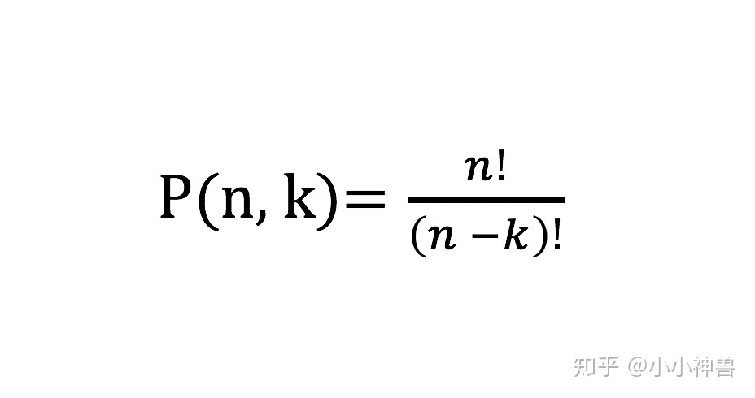
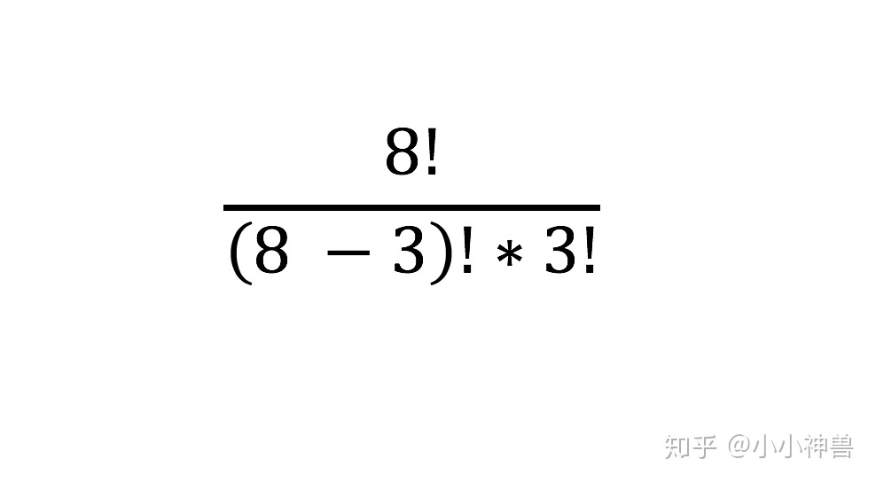
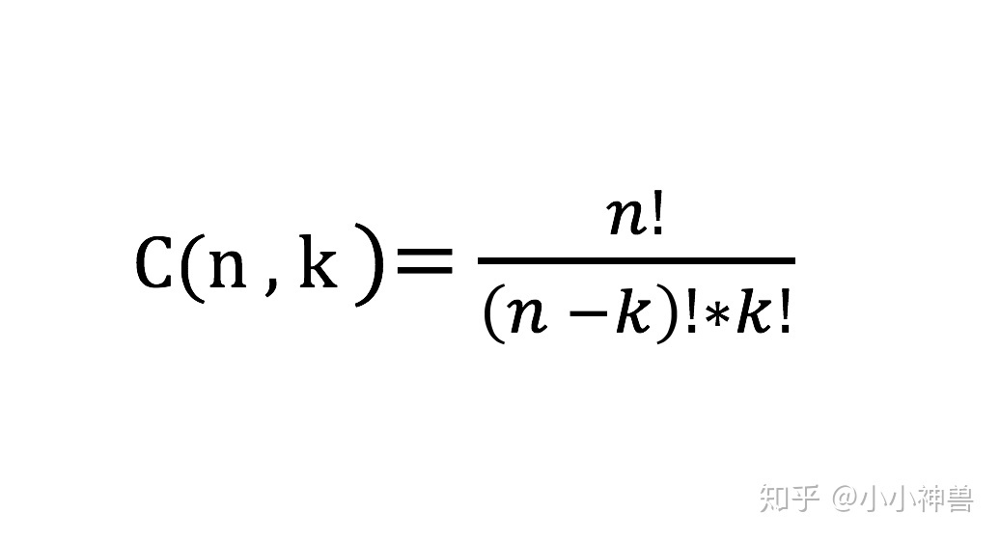

# 基本数据结构


```java

```


# 包装类

## Character

```java
int i = Character.getNumericValue(char c);

Long.MIN_VALUE // Long包装类的最小值
Long.MAX_VALUE
```


## 数据类型转换

### char 转 int

```java
char ch = '9';
int num = Integer.parseInt(String.valueOf(ch))
int num = (int)ch - (int)('0'); 
```


# 输入输出

## 基本语法

```java
// input
Scanner sc = new Scanner (System.in);

int n = sc.nextInt(); //读一个整数
String s = sc.next(); //读一个字符串
double t = sc.nextDouble(); //读一个浮点数
String s = sc.nextLine();   //读一整行

//判断是否有下一个输入可以用sc.hasNext()或sc.hasNextInt()或sc.hasNextDouble()或sc.hasNextLine()


// output
System.out.print(); 
System.out.println(); 
System.out.format();
System.out.printf(); 

System.out.format("%.2f", (a / (1.0*b))). Println();

```


## 例子

### 输入

- Input 输入数据有多组，每组占一行，每行由一个整数组成

```java
Sample Input:
56
67
100
123
    
import java.util.Scanner;
public class Main {
	public static void main(String[] args) {
		Scanner sc = new Scanner(System.in);
		while(sc.hasNext()){ //判断是否结束
			int score = sc.nextInt();//读入整数

		}
	}
}
```

- 输入数据有多组，每组占2行，第一行为一个整数N，指示第二行包含N个浮点数

```java
Sample Input:
4
56.9 67.7 90.5 12.8
5
56.9 67.7 90.5 12.8
    
import java.util.Scanner;
public class Main {
	public static void main(String[] args) {
		Scanner sc = new Scanner(System.in);
		while(sc.hasNext()){
			int n = sc.nextInt();
    		for(int i=0;i<n;i++){
    			double a = sc.nextDouble();
    		}
    	}
    }
}
```

- 输入数据有多行，第一行是一个整数n，表示测试实例的个数；后面跟着n行，每行包括一个由字母和数字组成的**字符串**

```java
Sample Input:
2
asdfasdf123123asdfasdf
asdf111111111asdfasdfasdf
    
import java.util.Scanner;
public class Main {
	public static void main(String[] args) {
		Scanner sc = new Scanner(System.in);
		int n = sc.nextInt();
		for(int i=0;i<n;i++){
			String str = sc.next();
		}
	}
}
// 或使用以下方法

import java.util.Scanner;
public class Main {
	public static void main(String[] args) {
		Scanner sc = new Scanner(System.in);
		int n = Integer.parseInt(sc.nextLine());
		for(int i=0;i<n;i++){
			String str = sc.nextLine();
		}
	}
}
```

### 输出


# Java快捷转换

## 高精度

BigInteger和BigDecimal可以说是acmer选择java的首要原因。
函数：add, subtract, divide, mod, compareTo等，其中加减乘除模都要求是BigInteger(BigDecimal)和BigInteger(BigDecimal)之间的运算，所以需要把int(double)类型转换为BigInteger(BigDecimal)，用函数BigInteger.valueOf().

import java.io.BufferedInputStream;
import java.math.BigInteger;
import java.util.Scanner;
public class Main {
public static void main(String[] args) {
Scanner cin = new Scanner (new BufferedInputStream(System.in));
int a = 123, b = 456, c = 7890;
BigInteger x, y, z, ans;
x = BigInteger.valueOf(a);
y = BigInteger.valueOf(b);
z = BigInteger.valueOf(c);
ans = x.add(y); System.out.println(ans);
ans = z.divide(y); System.out.println(ans);
ans = x.mod(z); System.out.println(ans);
if (ans.compareTo(x) == 0) System.out.println("1");
}
}


## 进制转换

```java
String str = Integer.toString(num, base); 	// 转成base进制的string(base <= 35)
int num = Integer.parseInt(str, base); 		// 把str当做base进制，转成10进制的int
```


# String

> 双引号""，即是字符串String

```java
String str = "Hellow java";

str.length();   //值为 11
str.charAt(4);  //结果为 'o'
str.indexOf('j');//结果为7, 返回字符串中第一次出现的位置
```


## 判断

 ```java
String str = "StringDemo.java";
String s = "StringDemo.java";

str.contains("Demo");	//结果为true
str.isEmpty();			//结果为true
str.startWith("String");//结果为true
str.endWith(".java");	//结果为true
str.equals(s);			//判断两个字符串的内容是否相同,区分大小写,结果为true
str.equalsIgnoreCase("STRINGdEmo.JAVA");	//忽略大小写,结果为true
s1.compareTo(s2);		//结果为1 S1>S2字典序比较
 ```


## 转换

>`String`  可以与 `char[]` 互相转换
>
>`String`可以与`int`互相转换

```java
char[] arr = {'a','b','c','d','e','f','g','h'};

String s = new String(arr);			//结果为：s = "abcdefgh"
String s = new String(arr, 1, 3);	//结果为：s = "bcd"
char[] ch = s.toCharArray();		//字符串转化成数组

String.valueOf(3);			//"3",将int转换成String
3 + "";                     //"3",将int转换String
String.valueOf(arr); 		// arr只能是基本类型char的数组
```


## 修改

```java
String s = "     Hello Java    ";

str.replace("Java","World");	//结果为：s1 = "     Hello World    "
str.replace('a','n');			//结果为：s1 = "     Hello Jnvn    "
str.toUpperCase();				//结果为："     HELLO JAVA    "
str.toLowerCase();				//结果为："     hello java    "
str.trim();						//结果为："Hello Java"，去除两端空格
```


## 截取

```java
String str = "zhangsan,wangwu,lisi,xiaohei";
String[] s = str.split(",");	//结果为：s = {"zhangsan","wangwu","lisi","xiaohei"}

String s = "adflkwefnkl";
s.substring(2);      //截取
s.substring(2,4);  
```


## StringBuilder

>比 **StringBuffer** 要快
>
>**StringBuilder** 线程不安全， **StringBuffer**线程安全

```java
StringBuilder strB = new StringBuilder();
strB.append("ch");      // 添加到尾端
strB.insert(2, "LS");   //在指定位置之前插入字符(串) 

strB.toString();
strB.setCharAt(2, 'd'); //将第 i 个代码单元设置为 c

strB.delete(2, 4);      //删除起始位置（含）到结尾位置（不含）之间的字符串
strB.deleteCharAt(0);

strB.reverse();
```


## StringBuffer


# 数组类容器

## 数组

### 排序

```java
int[] nums = {1, 2, 3};
int[] nums = new int[100];

int nums[][] = {{1, 2}, {2, 3}};
int nums[][] = new int[5][6];

public static int[] sum(int[] nums){
    // 数组作为方法的返回类型
}
```


### Arrays

```java
import java.util.Arrays;

int[] nums = {1, 2, 3};

Arrays.sort(nums); 
Arrays.sort(nums, 0, 4);
Arrays.fill(nums, 1);  //为数组元素填充相同的值
Arrays.toString(nums); //字符串形式打印

Arrays.asList(1, 2, 3);//返回ArrayList容器
Arrays.asList(new Character[10]); //数组转List 数组类型必须是包装类
```


## List

```java
size()
add(E element)
get(int index)
remove(int index)
set(int index, E element) //替换
```


### ArrayList

> 数组实现

```java
import java.util.ArrayList;	

ArrayList<Character> arraylist= new ArrayList<Character>();

```


### LinkedList

> 双向链表实现

```java

```


## Vector

```java
Vector v = new Vector(4);
v.add("test");

System.out.print(v.get(i));

```


# Map

```java
put(K key, V value)
remove(K key)              // 返回被删除value值
get(K key)            
containsKey(K key)  
keySet()                   // 返回存有key的Set集合
```


## Pair

```java
import javafx.util.Pair;

Pair<Integer, String> pair = new Pair<>(1, "One");
pair.getKey();
pair.getValue();
```


## HashMap

```java
import java.util.HashMap;

HashMap<String, String> map = new HashMap<>();
map.put("K", "V");

//如果key存在，返回key对应的value；否则，返回默认值new ArrayList<String>()
List<String> list = map.getOrDefault(key, new ArrayList<String>());
```


## LinkedHashMap

```java
LinkedHashMap<Integer, String> map = new LinkedHashMap<>();
map.put(1, "A");

map.keySet().toArray();
```


## Hashtable


# 算法工具类

## `Arrays`


## `Math`


## `Random`


# 滑动窗口

可用LinkedHashMap实现


# 排列组合

## 排列

**如果我们现在有 n 个运动员，要按顺序地颁发 k 个奖牌，有多少不同的颁奖方式**

每个奖牌都不同（存在顺序）：

8个运动员，发3个奖牌，方案数：**8 \* 7 \* 6 种**

8个运动员，发8个奖牌，方案数：**8 \* 7 \* 6 \* 5 \* 4 \* 3 \* 2 \* 1 种**


**如果要想在 n 个物品中，按顺序的选择 k 个物品，那么选择的方式总共有这么多种：**




## 组合

> n个物品中选取k个，没有顺序之分

**在 8 个人当中选 3 个人颁发一样的可乐瓶，有多少种颁发方法**

**我们只需要把「上一步排列获得的结果」除以「不同颁发顺序的总数」，得到的就是可乐瓶颁发方法的总数，不同颁发顺序的总数有 3！种**




**如果要想在 n 个物品中，选择 k 个物品出来，选择的顺序无所谓，那么选择的方式总共有这么多种**：



# 字符串匹配

## KMP

```java

```

