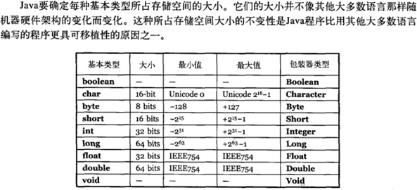
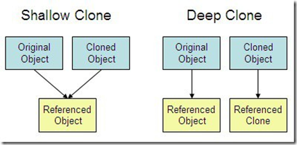
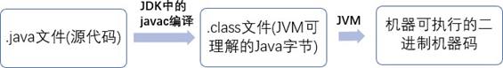

# 基础问题

## 基本类型

字符常量是单引号引起的⼀个字符; 字符串常量是双引号引起的若⼲个字符。含义上: 字符常量相当于⼀个整型值( ASCII 值),可以参加表达式运算;  字符串常量代表⼀个地址值(该字符串在内存中存放位置)

## C语言结束字符        

**在** **C** **语⾔中，字符串或字符数组最后都会有⼀个额外的字符****‘\0’来表示结束。但是，Java** **语⾔中没有结束符这⼀概念。** 这是⼀个值得深度思考的问题，具体原因推荐看这篇⽂章： https://blog.csdn.net/sszgg2006/article/details/49148189

## final关键字

final 关键字主要⽤在三个地⽅：变量、⽅法、类。

1. 对于⼀个 final 变量，如果是基本数据类型的变量，则其数值⼀旦在初始化之后便不能更改； 如果是引⽤类型的变量，则在对其初始化之后便不能再让其指向另⼀个对象。
2. 当⽤ final 修饰⼀个类时，表明这个类不能被继承。final 类中的所有成员⽅法都会被隐式地指定为 final ⽅法。
3. 使⽤ final ⽅法的原因有两个。第⼀个原因是把⽅法锁定，以防任何继承类修改它的含义；第⼆个原因是效率。（现在的 Java 版本已经不需要使⽤ final⽅法进⾏这些优化了）类中所有的private ⽅法都隐式地指定为 final。

## String、StringBuffer、StringBuilder

在 Java 9 之后，String 类的实现改⽤ byte 数组存储字符串 private final byte[] value          

StringBuilder  与 StringBuffer  都继承⾃ AbstractStringBuilder  类，使用字符数组保存字符串 char[] value 但是没有⽤ final 关键字修饰，所以这两种对象都是可变的。

- 线程安全性

String 中的对象是不可变的，也就可以理解为常量，线程安全。AbstractStringBuilder 是StringBuilder 与 StringBuffer 的公共⽗类，定义了⼀些字符串的基本操作，如 expandCapacity、append、insert、indexOf  等公共⽅法。

StringBuffer对⽅法加了同步锁或者对调⽤的⽅法加了同步锁，所以是线程安全的。StringBuilder并没有对⽅法进⾏加同步锁，所以是⾮线程安全的。

- 性能

**每次对 String 类型进⾏改变的时候，都会⽣成⼀个新的 String 对象**，然后将指针指向新的 String 对象。StringBuffer 每次都会对 StringBuffer 对象本身进⾏操作，⽽不是⽣成新的对象并改变对象引⽤。相同情况下使⽤ StringBuilder 相⽐使⽤ StringBuffer 仅能获得 10%~15% 左右的性能提升， 但却要冒多线程不安全的⻛险。

对于三者使⽤的总结：

1. 操作少量的数据: 适⽤ String

2. 单线程操作字符串缓冲区下操作⼤量数据: 适⽤ StringBuilder

3. 多线程操作字符串缓冲区下操作⼤量数据: 适⽤ StringBuffer

## == 与 equals(重要)

 **==** : 它的作⽤是判断两个对象的地址是不是相等。即，判断两个对象是不是同⼀个对象(基本数据类型⽐较的是值，引⽤数据类型⽐较的是内存地址)。

**equals()** : **比较两个对象的值是否相等**。但它⼀般有两种使⽤情况：

​        情况 1：类没有覆盖 equals() ⽅法。则通过 equals() ⽐较该类的两个对象时，等价于通过“==”⽐较这两个对象。

​        情况 2：类覆盖了 equals() ⽅法。⼀般，我们都覆盖 equals() ⽅法来⽐较两个对象的内容是否相等；若它们的内容相等，则返回 true (即，认为这两个对象相等)。

String 中的 equals ⽅法是被重写过的，因为 object 的 equals ⽅法是⽐较的对象的内存地址，⽽ String 的 equals ⽅法⽐较的是对象的值。

当创建 String 类型的对象时，虚拟机会在常量池中查找有没有已经存在的值和要创建的值相同的对象，如果有就把它赋给当前引⽤。如果没有就在常量池中重新创建⼀个 String 对象。

## 深拷贝、浅拷贝

1. **浅拷⻉**：对基本数据类型进⾏值传递，对引⽤数据类型进⾏引⽤传递般的拷⻉，此为浅拷⻉。

2. **深拷⻉**：对基本数据类型进⾏值传递，对引⽤数据类型，**创建⼀个新的对象，并复制其内容**，此为深拷⻉。

# JVM

> Java 虚拟机（JVM）是运⾏ Java 字节码的虚拟机。

## 编译流程

​		我们需要格外注意的是 <.class>机器码这⼀步。JVM 类加载器⾸先加载字节码⽂件，然后通过解释器逐⾏解释执⾏，这种⽅式的执⾏速度会相对⽐较慢。⽽且，有些⽅法和代码块是经常需要被调⽤的(也就是所谓的热点代码)，所以后⾯引进了 JIT 编译器，⽽ JIT 属于运⾏时编译。**当 JIT 编译器完成第⼀次编译后，其会将字节码对应的机器码保存下来，下次可以直接使⽤**。⽽我们知道，机器码的运⾏效率肯定是⾼于 Java 解释器的。这也解释了我们为什么经常会说 Java 是编译与解释共存的语⾔。

​		HotSpot 采⽤了惰性评估(Lazy  Evaluation)的做法，根据⼆⼋定律，消耗⼤部分系统资源的只有那⼀⼩部分的代码（热点代码），⽽这也就是 JIT 所需要编译的部分。JVM 会根据代码每次被执⾏的情况收集信息并相应地做出⼀些优化，因此执⾏的次数越多，它的速度就越快。JDK 9 引⼊了⼀种新的编译模式 AOT(Ahead of Time Compilation)，它是直接将字节码编译成机器码，这样就避免了JIT 预热等各⽅⾯的开销。JDK ⽀持分层编译和 AOT 协作使⽤。但是，AOT 编译器的编译质量是肯定⽐不上 JIT 编译器的。

## JDK and JRE

> JDK 是 Java Development Kit，它是功能⻬全的 Java SDK（Software Development Kit）。它拥有 JRE 所拥有的⼀切，还有编译器（javac）和⼯具（如 javadoc 和 jdb）。它能够创建和编译程序。
>
> JRE 是 Java 运⾏时环境。它是运⾏已编译 Java 程序所需的所有内容的集合，包括 Java 虚拟机（JVM），Java 类库，java 命令和其他的⼀些基础构件。但是，它不能⽤于创建新程序。

## 什么是字节码?字节码的好处是什么?

**可移植性**        

​		在 Java 中，JVM 可以理解的代码就叫做字节码（即扩展名为class的⽂件），它不⾯向任何特定的处理器，只⾯向虚拟机。Java 语⾔通过字节码的⽅式，在⼀定程度上解决了传统解释型语⾔执⾏效率低的问题，同时⼜保留了解释型语⾔可移植的特点。所以 Java 程序运⾏时⽐较⾼效，⽽且，由于字节码并不针对⼀种特定的机器，因此，Java 程序⽆须重新编译便可在多种不同操作系统的计算机上运⾏。

# 面向对象

## 三大特性: 封装 继承 多态

- 封装：属性私有化，只提供⼀些可以被外界访问属性的⽅法
- 继承：子类可以沿用父类的方法，或扩展自己的方法，但不能选择性地继承⽗类。通过继承能够复⽤以前的代码。
- 多态：⼀个引⽤变量到底会指向哪个类的实例对象，该引⽤变量发出 的⽅法调⽤到底是哪个类中实现的⽅法，必须在由程序运⾏期间才能决定。
  - 指向子类的父类引用由于向上转型了，它只能访问父类中拥有的方法和属性，而对于子类中存在而父类中不存在的方法，该引用是不能使用的，尽管是重载该方法。若子类重写了父类中的某些方法，在调用该些方法的时候，必定是使用子类中定义的这些方法
  - 在 Java 中有两种形式可以实现多态：继承（多个⼦类对同⼀⽅法的重写）和接口（实现接口并覆盖接口中同⼀⽅法）。

## 重载与重写

> 重载：**是同⼀个类中多个同名⽅法根据不同的传参来执⾏不同的逻辑处理**
>
> 重写：当**⼦类继承⾃⽗类的相同⽅法**，输⼊数据⼀样，但要做出有别于⽗类的响应时，你就要重写⽗类⽅法，重写就是⼦类对⽗类⽅法的重新改造，外部样⼦不能改变，内部逻辑可以改变

- 重写

  重写发⽣在运⾏期，是⼦类对⽗类的允许访问的⽅法的实现过程进⾏重新编写。

1. 返回值类型、⽅法名、参数列表必须相同，抛出的异常范围⼩于等于⽗类，访问修饰符范围⼤于 等于⽗类。
2. 如果⽗类⽅法访问修饰符为private/final/static则⼦类就不能重写该⽅法，但是被 static修饰的⽅法能够被再次声明。

| **区别点** | **重载⽅法** | **重写⽅法** |
| ---------- | ------------ | ------------ |
| 发⽣范围   | 同⼀个类 | ⼦类 中                                        |
| 参数列表   | 必须修改 | ⼀定不能修改                                   |
| 返回类型   | 可修改   | ⼀定不能修改                                   |
| 异常       | 可修改   | 可以减少或删除，⼀定不能抛出新的或者更⼴的异常 |
| 访问修饰符 | 可修改   | ⼀定不能做更严格的限制（可以降低限制）         |
| 发⽣阶段   | 编译期   | 运⾏期                                         |

## 构造方法

1. 名字与类名相同。
2. 没有返回值，但不能⽤ void 声明构造函数。
3. ⽣成类的对象时⾃动执⾏，⽆需调⽤。
4. 构造⽅法⽆法被重写，但可以被重载

### 为什么一定要有无参构造？

​            Java 程序**在执⾏⼦类的构造⽅法之前，如果没有⽤ super() 来调⽤⽗类特定的构造⽅法，则会调⽤⽗类中“没有参数的构造⽅法”。**因此，如果⽗类中只定义了有参数的构造⽅法，⽽在⼦类的构造⽅法中⼜没有⽤ super() 来调⽤⽗类中特定的构造⽅法，则编译时将发⽣错误，因为 Java 程序在⽗类中找不到没有参数的构造⽅法可供执⾏。解决办法是在⽗类⾥加上⼀个不做事且没有参数的构造⽅法。

## static

静态⽅法可以不通过对象进⾏调⽤，因此在静态⽅法⾥，不能调⽤其他⾮静态变量，也不可以访问⾮静态变量成员。

- 静态⽅法和实例⽅法有何不同

1. 在外部调⽤静态⽅法时，可以使⽤"类名.⽅法名"的⽅式，也可以使⽤"对象名.⽅法名"的⽅式。⽽实例⽅法只有后⾯这种⽅式。也就是说，调⽤静态⽅法可以⽆需创建对象。

2. 静态⽅法在访问本类的成员时，只允许访问静态成员（即静态成员变量和静态⽅法），⽽不允许访问实例成员变量和实例⽅法；实例⽅法则⽆此限制。

## 包装类

**装箱**：基本类型⽤它们对应的引⽤类型包装起来； 

**拆箱**：包装类型转换为基本数据类型；

更多内容⻅：[深⼊剖析Java中的装箱和拆箱](https://www.cnblogs.com/dolphin0520/p/3780005.html)

## 抽象类

## 接口

### 接⼝和抽象类的区别是什么？

1. 接⼝的⽅法默认是 public，所有⽅法在接⼝中不能有实现(Java 8 开始接⽅法可以有默认实现），⽽抽象类可以有⾮抽象的⽅法。

2. 接⼝中除了 static、final 变量，不能有其他变量，⽽抽象类中则不⼀定。

3. ⼀个类可以实现多个接⼝，但只能实现⼀个抽象类。接⼝⾃⼰本身可以通过 extends 关键字扩展多个接⼝。

4. 接⼝⽅法默认修饰符是  public，抽象⽅法可以有  public、protected  和  default  这些修饰符（抽象⽅法就是为了被重写所以不能使⽤ private 关键字修饰！）

  备注：

1. 在 JDK8 中，接⼝也可以定义静态⽅法，可以直接⽤接⼝名调⽤。实现类和实现是不可以调

⽤的。如果同时实现两个接⼝，接⼝中定义了⼀样的默认⽅法，则必须重写，不然会报错。

(详⻅ issue:https://github.com/Snailclimb/JavaGuide/issues/146。

2. jdk9 的接⼝被允许定义私有⽅法 。

总结⼀下 jdk7~jdk9 Java 中接⼝概念的变化（[相关阅读](https://www.geeksforgeeks.org/private-methods-java-9-interfaces/)）：

1. 在 jdk 7 或更早版本中，接⼝⾥⾯只能有常量变量和抽象⽅法。这些接⼝⽅法必须由选择实现接⼝的类实现。

2. jdk8 的时候接⼝可以有默认⽅法和静态⽅法功能。

3. Jdk 9 在接⼝中引⼊了私有⽅法和私有静态⽅法。

## 面向过程

Java 是半编译语⾔，最终的执⾏代码并不是可以直接被 CPU 执⾏的⼆进制机械码。

⾯向过程语⾔⼤多都是直接编译成机械码在电脑上执⾏。

# 集合

  
 

## List

> 对付顺序，List接⼝存储⼀组不唯⼀（可以有多个元素引⽤相同的对象），有序的对象

### ArrayList 

Object数组

### LinkedList 

双向链表(JDK1.6之前为循环链表，JDK1.7取消了循环)

### Vector

Object数组

## Set

> 不允许重复的集合，不会有多个元素引⽤相同的对象。

**HashSet（⽆序，唯⼀）** 基于 HashMap 实现的，底层采⽤ HashMap 来保存元素**LinkedHashSet：** LinkedHashSet 继承于 HashSet，并且其内部是通过 LinkedHashMap 来实现的。有点类似于我们之前说的LinkedHashMap 其内部是基于 HashMap 实现几乎⼀样

**TreeSet**（有序，唯⼀）：红⿊树(⾃平衡的排序⼆叉树)

## Map

> ⽤Key来搜索，使⽤键值对存储。Map会维护与Key有关联的值。两个Key可以引⽤相同的对象，但Key不能重复，典型的Key是String类型，但也可以是任何对象。

  
 

- hashCode（）

**HashMap** JDK1.8之前HashMap由数组+链表组成的，数组是HashMap的主体，链表则是主要为了解决哈希冲突⽽存在的（“拉链法”解决冲突）。JDK1.8以后在解决哈希冲突时有了较⼤的变化， 当链表⻓度⼤于阈值（默认为8）时，将链表转化为红⿊树，以减少搜索时间

**LinkedHashMap**： LinkedHashMap 继承⾃ HashMap，所以它的底层仍然是基于拉链式散列结构即由数组和链表或红⿊树组成。另外，LinkedHashMap 在上⾯结构的基础上，增加了⼀条双向链表，使得上⾯的结构可以保持键值对的插⼊顺序。同时通过对链表进⾏相应的操作，实现了访问顺序相关逻辑。详细可以查看：[《LinkedHashMap 源码详细分析（JDK1.8）》](https://www.imooc.com/article/22931)

**Hashtable**： 数组+链表组成的，数组是 HashMap 的主体，链表则是主要为了解决哈希冲突⽽存在的

**TreeMap**： 红⿊树（⾃平衡的排序⼆叉树）

# 多线程

## 程序、进程、线程

**程序**是含有指令和数据的⽂件，被存储在磁盘或其他的数据存储设备中，也就是说程序是静态的代码。

**线程**与进程相似，但线程是⼀个⽐进程更⼩的执⾏单位。⼀个进程在其执⾏的过程中可以产⽣多个线程。与进程不同的是同类的多个线程共享同⼀块内存空间和⼀组系统资源，所以系统在产⽣⼀个线程， 或是在各个线程之间作切换⼯作时，负担要⽐进程⼩得多，也正因为如此，线程也被称为轻量级进程。

**进程**是程序的⼀次执⾏过程，是系统运⾏程序的基本单位，因此进程是动态的。系统运⾏⼀个程序即是⼀个进程从创建，运⾏到消亡的过程。简单来说，⼀个进程就是⼀个执⾏中的程序，它在计算机中⼀个指令接着⼀个指令地执⾏着，同时，每个进程还占有某些系统资源如 CPU 时间，内存空间，⽂件，输⼊输出设备的使⽤权等等。

线程和进程最⼤的不同在于基本上各进程是独⽴的，⽽各线程则不⼀定，因为 同⼀进程中的线程极有可能会相互影响。从另⼀⻆度来说，进程属于操作系统的范畴，主要是同⼀段时间内，可以同时执⾏⼀个以上的程序，⽽线程则是在同⼀程序内⼏乎同时执⾏⼀个以上的程序段。

## 线程基本状态

## 线程安全

>**线程安全**就是多线程访问时，采用了加锁机制，当A线程访问该类的数据a时，，其他线程不能进行访问，直A该线程**读/写**完，其他线程才可使用数据a。防止出现数据不一致或者数据污染，多个线程的调度顺序的改变不会影响最终结果
>
>**线程不安全**就是不提供数据访问保护，有可能出现多个线程先后更改数据造成所得到的数据是脏数据

- 多线程：一个进程运行时产生了多个线程
- 并行与并发：
  - 并行：多个cpu同时执行同一段代码，是真正的同时。
  - 并发：通过cpu调度算法，让用户看上去同时执行，实际上从cpu操作层面不是真正的同时。并发往往在场景中有公用的资源，那么针对这个公用的资源往往产生瓶颈，我们会用TPS或者QPS来反应这个系统的处理能力。

# 异常处理

# IO

