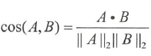
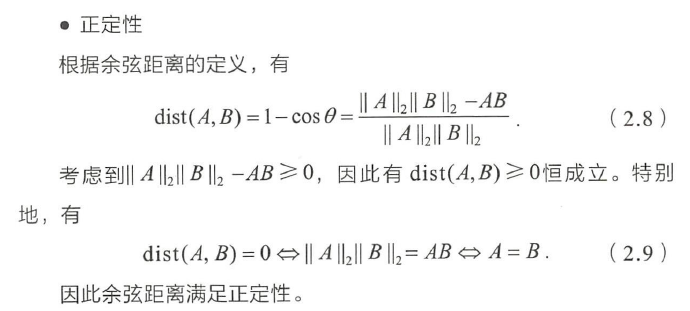
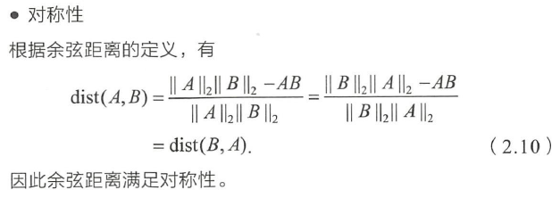
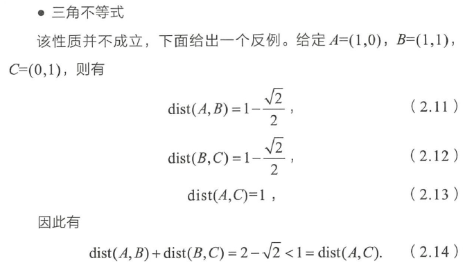

[toc]

## 深度学习

### pytorch
##### 计算图
pytorch采用动态图，运算与搭建同时进行

TensorFlow采用静态图，先搭建图，后运算

a， b， c  类比输入

为了节约内存，所以每次一轮迭代完之后计算图就被在内存释放

### mini-batch

- batchGD一个batch指的是整个训练集，每次迭代更新过整个训练集
  - 梯度下降方向始终向着损失函数减小的方向(蓝色)
- 随机梯度下降，每经过一个样本就梯度下降更新一次参数（紫色）
  - 速度快
  - 失去向量化加速

- mini-batch 将大训练集划分为n个小训练集（绿色）
  - 进行梯度下降，每训一个小训练集更新一次参数
  - 经过n次更新才过完整个大训练集

- mini-batch引出了每次梯度下降方向不同的问题

  

### 优化方法总结

1. 梯度下降 Gradient Descent

- 随机梯度下降 Stochastic Gradient Descent
	每读入一个数据，便立刻计算cost fuction的梯度来更新参数
	
- 批量梯度下降 Batch Gradient Descent
	用整个训练集的数据计算梯度，对模型参数进行更新
	cost fuction若为凸函数，能够保证收敛到全局最优值；若为非凸函数，能够收敛到局部最优值
	训练速度慢

- 小批量梯度下降 Mini-batch Gradient Descent
	每次从所有训练数据中取一个子集（mini-batch） 用于计算梯度
	调整学习率

2. Momentum
	调整梯度，增加历史梯度的影响
    GD方法的一个缺点是其更新方向完全依赖于当前batch计算出的梯度，十分不稳定。
    更新的时候在一定程度上保留之前更新的方向，同时利用之前的梯度方向和当前batch计算得到的梯度方向加权得到最终的更新方向。

3. Adagrad
自动调整学习率
学习率 / 梯度累加 ，随着训练过程，学习率越来越小
梯度越大，学习率越小，两者相互制衡
在训练中自动的对learning rate进行调整

4. RMSProp
Adagrad的改进
p \* 当前梯度 +（1 - p）历史梯度
（学习率 / 梯度累加） 时，可调整当前梯度和历史梯度的占比

5. Adam
Adam(Adaptive Moment Estimation)是另一种自适应学习率的方法
结合Momentum，Adagrad 调整梯度，增加历史梯度的影响，自动调整学习率

### 梯度消失与梯度爆炸

> 模型训着训着某些梯度会变为0，或变得特别大

1. 梯度消失：在深层网络中激活函数sigmoid(x)中的最小值和最大值的梯度都趋近于0。神经网络的反向传播逐层将偏导累乘，当网络层数非常深的时候，最后一层产生的偏导就因为累乘了很多趋近0的偏导而越来越小，最终变为0，从而导致层数比较浅的权重w，b没有得到更新。

由于反向传播，靠近输入层的参数学习的很慢， 靠近输出的参数学习的很好

- 解决方法：
	
	- 基本思想是每次训练一层神经元，训练时将上一层的输出作为输入，而本层隐节点的输出作为下一层隐节点的输入
	- 使用relu(x)这样的激活函数，因为他的导函数的值可以稳定在1，累乘后不会让梯度消失
	
	

2. 梯度爆炸：梯度更新，偏导数大于1，累乘后梯度更新的值过大

- 解决方法：
	- 设置一个梯度剪切阈值，然后更新梯度的时候，如果梯度超过这个阈值，那么就将其强制限制在这个范围之内
	- 合理的初始化模型参数1/N*随机数 N为神经元个数

### 激活函数总结
1. sigmoid

   

   

   缺点：梯度消失，输出值的中心值不是0

2. tanh

%3D2%20%5Coperatorname%7Bsigmoid%7D(2%20x)-1&preview=true)

它其实是一个简单放大的sigmoid神经元，解决了zero-centered的输出问题

缺点：梯度消失

3. relu

%3D%5Cmax%20(0%2C%20x)%0A&preview=true)

解决了gradient vanishing问题；导数值大，加快收敛；提供神经网络的稀疏表达能力，负半区神经元不进入训练

缺点：部分神经元不可逆转地死亡

### 损失函数
- 分类问题：
最后一层value -> sigmod -> softmax -> logloss
cross entropy 计算 loss，则依旧是一个凸优化问题
使用MSE作为损失函数，就变成一个非凸优化问题

### dropout
隐层神经元以概率 p 被随机丢弃，达到对于每个mini-batch都是在训练不同网络的效果，防止过拟合。测试时，每个神经元乘概率 p

### early stop

训练集+验证集

模型在训练集上训练，观察模型在验证集上的表现

如果一直迭代，训练集上的偏差会越来越小，验证集上的偏差会先下降后上升

early stop 找到验证集偏差最低的点停止迭代

### Normalizing

- 输入

  - 均值归一化 + 方差归一化

    加快模型训练速度

### attention
- Soft Attention是所有的数据都会注意，都会计算出相应的注意力权值，不会设置筛选条件。
- Hard Attention会在生成注意力权重后筛选掉一部分不符合条件的注意力，让它的注意力权值为0，即可以理解为不再注意这些不符合条件的部分。

## 机器学习

### 基础问答

**1、数据量比较大的时候，svm和lr哪个更快？**
数据量很大的时候经常用lr当baseline，为什么lr比svm快？

首先要明白的是，这两个模型从理论上看训练速度都非常快才对，只是快的原因不一样，实际是这样吗？
svm寻找分类最大间隔，通过引入原函数的对偶形式，将原问题的 w,b 转化为对偶因子 α 的求解。从形式上看，α为0对应了非支持向量，那么样本不起作用，α＞0，才对应了支持向量，又由于支持向量是很稀疏的，那么要优化的α很少才对，因为svm只考虑边界点，那么就一点点乘子的优化看起来应该是训练速度很快？但实际上，在初始状态，学习器是不知道那些样本是支持向量的。smo 算法每次选一对乘子优化，固定其他乘子，是一个二次规划问题，选择乘子也是启发式算法，这一步也导致了整个凸优化的svm寻解过程了变成了近凸优化，在乘子的选择上由于初始不知道那些是支持向量，所以乘子不好选择（启发式方法选的是违背kkt条件最大的一对点），实际上你还得去训练那些非支持向量的数据，速度提不起来。最重要的是，虽然，smo算法挺不错，但是这一步怎么并行啊，每次固定了其他乘子优化一对乘子，那就不能并行了呀，整个流程成了一个串行操作，这和gbdt的串行没有区别，xgb的并行不也老老实实一棵树一棵树的训练（类别n>2的gbdt分类可以并行做到n棵树n棵树的训练）。 
而且，svm用都用了，不给整个核函数吗？这又是一步较为耗时的操作。 

lr只有一个线性组合和sigmoid，梯度下降时，每个样本训练复杂度就和样本特征维数有关
最为关键的是，lr 可以做到样本的并行和 梯度下降的并行（batch内的并行）

**2、线性回归和逻辑回归的损失函数?** 

问逻辑回归的损失函数，我就答极大似然函数或者logloss。然后面试官问：还有呢？我说没了。

  线性回归用平方损失，逻辑回归用logloss损失，but why?为什么线性回归不用logloss损失，逻辑回归不用平方损失呢？ 

 最大的原因可能是凸性的要求，对于线性回归，使用平方损失，那么整个过程是一个凸优化的过程。而逻辑回归，使用logloss是凸函数，使用平方损失则不是凸函数了，非凸函数容易收敛到局部最优解，证明方法同样可以通过hessian矩阵来。 

 另外，对线性回归，使用平方损失，那么整个过程等效于参数在正态分布下的极大似然估计。（又多了一点好处，有兴趣的可以看一看线性回归，岭回归，LASSO对应的参数分布假设，算了过几天查查资料推一下吧）。。而且，线性回归在平方损失约束下，都不需要求导，直接使用矩阵的广义逆带进去，求的就是最小二乘解，也就是全局最优解。非常有意思，在平方损失约束下，线性回归求解简单，一步到位，而且还具有物理意义。 

 那么逻辑回归这个分类模型呢，他用logloss的原因是不是也是类似呢。是的，logloss在逻辑回归里，也是最大似然估计的形式，也是凸优化过程。

 交叉熵p(x)log(1/q(x)) 提一个负号，p(x)是y，q(x)是预测的y，即f(x)，这不就是logloss损失ylog(f(x))。f是对x线性组合后的sigmoid函数。那么用logloss就是在优化交叉熵，so 那又如何？ 

 相对熵，又叫KL散度，形式是p(x)log(p(x)/q(x))。展开后是p(x)log(p(x))-p(x)log(q(x))，相对熵的作用就是用来衡量两个分布的差异性，即p(x)==q(x)，相对熵为0最小。在机器学习里，我们首先特征工程，实际上是一个假设空间，我们认为假设空间存在一组解，利用这组解得到最真实的预测情况。首先，这个假设空间的最优解是个固定的分布，优化的过程就是去逼近这个分布，换句话说，p(x)在作为y的真实分布，这里是定分布，而q(x)是我们学习器学出来的，是我们的猜测分布。由于我们要对交叉熵，也就是logloss求导，他等价与对相对熵求导，因为p(x)log(p(x))求导的时候为0没了，剩下的右边就是相对熵。所以我们优化交叉熵就是在优化相对熵，成了。 

 那么优化相对熵有啥好处，p(x)是真实y分布，q(x)是猜测的分布，我们优化相对熵就是在让两个分布一致，即f(x)作为预测结果更加接近真实的y，物理意义成了。

**3、逻辑回归是分类还是回归？** 

 逻辑回归是广义线性回归，所以是回归，用来处理分类任务。逻辑回归还叫对数几率回归，but why？ 

 在学习这玩意的时候，我们往往会说，一个线性组合，套个sigmoid，就是lr。没错，为什么套sigmiod啊？因为sigmoid光滑，因为sigmoid有概率意义，因为sigmoid+logloss凸优化啊。原本神经递质的神经元是01函数，这个函数不太行咱们用sigmoid替代他，所以就行线性回归+sigmoid。说的倒也对，不过光滑的激活函数很多，未必不存在具有更好性质的激活函数呀。 

  先回答为啥lr是对数几率回归吧。 

  https://www.zhihu.com/question/41647192 

  这就是prml以贝叶斯角度对sigmoid的推导。注意到最大熵模型在sigmoid和logss损失下等价性。 

  另外，sigmoid对应了条件先验概率p(y|x)伯努利分布(就是两点分布)，softmax就是sigmiod在多分类形式下的表示(对应的是多项分布不是多重二项分布，多重二项分布是二次分布的实验做多次的结果，多项分布是二重分布扩展到***的结果)。 

  https://www.jianshu.com/p/8904549e66c5 

  但sigmoid是不是LR的最好形式？不一定，但是sigmoid是推导出来的，而不是说因为sigmoid本身的性质(光滑处处可导单调)而选择的。

**7、从gbdt到xgb到lgb
** gbdt是梯度提升树，思想来自boost提升思想，构造相关的低方差基学习器去拟合偏差。残差树是通过真实值到预测值的残差作为下一棵树拟合方向，模型是加性模型，根据每一步的残差拟合一棵树，最后把所有的树求和即可

 gbdt用cart回归树去拟合

  xgb对gbdt作了一些改进，加了线性回归分类器而不是只有cart回归树，但默认参数还是cart回归。为了能加快并行，xgb对特征进行了预排序，存成了block结构，这种结构具体我不太清楚，只知道排序好存起来就可以直接快速获得切分点增益了，而且可以用启发式贪心算法，找一些百分位作为切分点，这里有两处并行的操作，第一步是遍历节点，树的一层节点可以并行做，因为xgb是按层不加区分的去切分每一个结点，每个结点都会尝试分类，所以构建的是一个非常茂盛的树，既然每个结点都要尝试分裂，就可以对每个结点并行去切分。结点的切分要选择一个特征的一个分裂点切分，这一步可以在特征维度上并行。由于gbdt类基模型相关性，做不把串行树做到并行的，所以并行主要在结点分裂和特征分裂上。不过为了防止过拟合，当分裂的增益小于阈值时，就不分裂了，算是预剪枝了。 

  另外xgb在损失函数作了二阶展开，而不是gbdt的一阶梯度，在损失函数上+了L1和L2正则。另外对缺失值处理时，往常的做法是人工手动填充一个值，因为分裂无外乎放左子树和右子树，所以在xgb这里会试着帮你把缺失值放左边和右边试一试，如果训练数据没有缺失值，测试集有，这种gap是直接默认把缺失值放在了右边。 

  lgb应该是现在比赛里表现最好的模型之一了，他主要是训练速度比xgb快太多了，而且lgb可以直接把类别特征通过pandas定义成 category，这样就不需要人工onehot了，当然实战两种方法都要试试选个效果更好的。

lgb把特征用直方图去预处理，速度比预训练快很多，因为直方图切成左右结点特别好切，一道竖线就成了两个直方图了，找几个百分位试试切割效果就可以切了，速度非常快，虽然理论上会损失精度，但是特征的值分成桶直方图统计进行粗粗的特征切割据说有正则化效果（玄学），学习性能不会损失太多。另外一个和xgb很大的不同在于，甚至和大多数gdbt分裂方式都不同的一点，lgb按最优叶子结点分裂，分裂的树又瘦又长，注意boost算法要求基模型学习能力不要太强，所以lgb参数里有树深的限制，不能设的太深。实战中lgb性能和xgb确实差不太多，但是训练速度差太多了，lgb训练快，更容易调参。 

这里分享一个经验， xgb 和 lgb 都有 bagging 策略，有特征采样，样本采样这些参数，一般特征采样选个合适的不仅训练速度快而且性能也会提高。但是如果是在造特征的这个阶段，采样频率要设为1，不然采样没采到可能就错过了一个不错的特征了。而且作特征处理的话，强特弱特都重要，因为比到最后大家成绩都差不多了，在有几个强特基础上，弱特多了模型一样效果好

##### 数据问题

##### 评判标准

###### 交叉熵（Cross Entropy）
>一般用来求目标与预测值之间的差距

1. 信息量
    越不可能的事件发生了，我们获取到的信息量就越大
    $I(x)=−log(p(x))$
    对数均为自然对数, 自然对数是以常数e为底数的对数

2. 熵
    熵用来表示所有信息量的期望（样本平均信息量）
    $H(X)=−∑p(xi)log(p(xi))$

3. 相对熵（KL散度）
    同一个随机变量 x 有两个单独的概率分布 P(x) 和 Q(x), 可以使用 KL 散度来衡量这两个分布的差异
    DKL的值越小，表示q分布和p分布越接近

  

4. 交叉熵

   

在机器学习中，我们需要评估label和predicts之间的差距，使用KL散度刚刚好，即DKL(y||y^)，由于KL散度中的前一部分−H(y)不变，故在优化过程中，只需要关注交叉熵就可以了。所以一般在机器学习中直接用用交叉熵做loss，评估模型

##### 方差与偏差

模型误差 = 偏差 + 方差 + 固定误差 

机器学习可行的两个条件，第一个条件填充假设空间，当我们特征构造好之后，特征的取值空间构成了一个空间。一般维度越高，这个假设空间越复杂，维度越低，假设空间越简单，模型需要我们训练数据能够反映出真实分布，当样本很少的时候，训练数据太少，填充不了假设空间，导致我们的训练E(in)和真实E(in)相差比较多，那么我们的学习效果一定不会好，测试数据和训练数据产生了很大的间隔，当我们训练数据足够多的时候，再加新的数据，你都能从样本集和里找到一个差不多的，这时候训练数据就可用了，所以当训练数据数量趋于无穷的时候，我们的训练集足够反映真实的分布，所以机器学习的可行第一个条件就是训练数据够多

第二个条件则是我们的学习器优化到一个最优解

1. 方差
    方差：模型预测值的离散程度（波动程度），方差越大，数据的分布越分散，波动越明显
    复杂的模型更有可能拟合func，但是会造成预测值得方差增大（类比线性回归）

- 高方差，低偏差的复杂模型容易造成过拟合（overfitting）
    - 模型太贴合训练数据了，导致其泛化能力差，若遇到测试集，则准确度下降的厉害 

- 简单模型有可能欠拟合（underfitting）高方差，高偏差
  训练数据适中，模型复杂度不够的时候，我们的训练误差比较高，因为模型学习不了完整的分布，那么此时就是欠拟合

2. 偏差
偏差：预测值与真实值的差距，模型训练集的准确度（复杂模型有利于偏差减小）

##### 正则项
- L1
w趋近于0，并会等于0

- L2
w趋近于0，不等于0

- 神经网络
正则项使得w控制在较小范围，激活函数取值也就较小，激活函数表现得较为线性，网络也就变得更加简单

##### 距离计算方法
1. 欧式距离

2. 曼哈顿距离

3. 余弦距离

- 余弦相似度 
    即两个向量夹角的余弦，关注的是**向量之间的角度关系**

  cosθ=向量a.向量b/|向量a|×|向量b|

- 余弦距离

		`余弦距离 = 1 - cos（A，B）` 变现了向量之间的角度关系

4. 切比雪夫距离

5. 向量点积

向量点积：反映着两个向量的“相似度”，两个向量越“相似”，它们的点积越大

### PCA原理

PCA ： principal component analysis ( 主成分分析)

求解过程： 降到N维

1. 对特征减去其均值后，求协方差矩阵 

2. 求特征值，特征向量，并从大到小排序

3. 取前N个特征向量，组成矩阵A (特征向量表示方差最大的方向)

4. X_ = A * X

	PCA是一种线性降维方法，通过线性投影将高维数据映射到低维数据中，所期望的是在**方差最大的方向上投影**，使新特征间的相关性较小。
	
	方差最大；垂直投影
	
	- 方差是用来度量单个随机变量的离散程度
	- 协方差则一般用来刻画两个随机变量的相似程度
	- 协方差矩阵，对角线上的元素为各个随机变量的方差，非对角线上的元素为两两随机变量之间的协方差，根据协方差的定义，我们可以认定：协方差矩阵为对称矩阵
	- 相关系数，X、Y的协方差除以X的标准差和Y的标准差

### 线性回归

最小化平方损失函数：

### k - means

### KNN

### 树模型

##### 决策树

##### ID3

信息增益 = 原数据集的熵总和 - 按特征A划分数据集后的熵总和

信息增益，针对的是数据集中标签的分布

- 缺点：

1. 无法处理连续特征

2. 信息增益偏向于取值较多的特征

   

##### C4.5

- 信息增益比：

不同于 H( D | A )，数据集划分不是标签值，而是特征A的取值：

可以抵消一些由于特征取值过多而造成信息增益过大

- 解决缺失值问题：

第一步，计算所有特征的信息增益或者信息增益率的时候，假设数据集一共10000个样本，特征A中缺失了5000个，则无视缺失值，在剩下的5000个特征中计算信息增益（或者信息增益率），最后乘以0.5，思想就是缺失值多的特征通过这种降低权重的方式来体现信息的缺失；

第二部，如果运气不好，正好这个A特征乘0.5之后得到的信息增益或者增益率还是最大的，那么就像西瓜书中提到的那样，存在缺失值的样板按照比例进入分裂之后的新的分支，假设根据特征A分裂得到两个新的分支，一个分支有2000个样本，一个分支有3000个样本，则按照比例2000个缺失值和3000个缺失值样本分别进入两个分支。

- 缺点：

1. 只能用于分类

##### CART

二叉树，遍历所有特征的特征值

- 基尼指数： 越小纯度越高

回归：

c1，c2是所在节点的y均值

二元分类，找到最佳分割点，减低混乱度，使得分裂后的数据集内部的 y 值和均值差的平方的和最小

预剪枝：在训练中进行剪枝，限制分裂后的误差，分裂后的节点样本数

后剪枝：在测试集上，从下往上不断剪枝，计算模型的损失

**模型树:**

对每个分裂点做线性回归，计算平方损失，作为评判分裂点好坏的标准

每个叶子节点包含一个线性方程，将回归分为多个线段

### LR

##### 最大似然估计
通过已知的结果反推导致最大结果的参数，极大似然估计是概率论在统计学中的应用，它提供了通过一种给定数据来评估模型参数的方法，即 “ 模型已确定，参数未确定 ” ，通过若干次实验观察，利用调整实验的参数使得样本正确分类的概率最大，称为极大似然估计

##### LR实现多分类
方式一:修改逻辑回归的损失函数，softmax分类模型会有相同于类别数的输出，输出的值为对于样本属于各个类别的概率，最后对于样本进行预测的类型为概率值最高的那个类别。

损失函数：最大化正确类别的概率

方式二:根据每个类别都建立一个二分类器

### SVM

### 集成学习

##### bagging 和 boosting 的区别

1. Bagging：对训练集抽样组成每个基模型所需要的子训练集，然后对所有基模型预测的结果进行投票产生最终的预测结果。
   Boosting中基模型按次序进行训练，每个基模型的训练集基于上一个基模型的训练结果，最后将多个基分类器组合。

2. Bagging的各个目标函数可以并行生成，Boosting的各目标函数只能顺序生成。

3. 样例权重：Bagging的各个训练集样例没有权重，而Boosting是有权重的。
   目标函数权重：Bagging：目标函数的权重相等。Boosting：每个弱分类器都有相应的权重，对于分类误差小的分类器会有更大的权重。
   
4. Bagging中的基模型为强模型(强模型拥有低偏差高方差)。
   Boosting中的基模型为弱模型。

5. bagging 是减少方差 ，而 boosting 是减少偏差
   bagging 随机采样训练集并对多个基模型取平均可以降低方差；boosting随着迭代不断进行，模型的 bias 会不断降低

##### bagging
- Bootstrap方法
从一个数据集中有放回的抽取，Bagging算法基于bootstrap

bagging，比如随机森林，强调每个基模型是高精度树，每棵树深度10层以上甚至不剪枝，保证拟合的准确，此时属于上述第二种情况，优化比较困难，不容易收敛到最好的解，那么RF通过构造数据的多样性，通过数据集的不同、特征的不同，让每棵树学到不同的东西，多样性增多，好而不同。训练集就好比图书馆，RF就好比一群专家，有的专家看图书馆里第一层的书，有的看第二层的书，有的研究数学，有的研究英语，但每个人都是专家，对自己那一亩三分地掌握的很好，最后有人问问题的时候，每个人都回答的自己那一块掌握的内容(过拟合)，但是一群专家的讨论后可能就会得到很不错的结果。

另外在RF中，每个基模型都是独立的，所以特别容易并行化，分类树就投票，回归树就平均

##### boosting

弱模型集成，每个学习器方差比较小，此时处于容易欠拟合状态，那么就一步步拟合出方法，每造一棵树，模型复杂度提高一点，偏差降低一点，最终达到偏差和方差的权衡

##### stacking

stacking比赛的大杀器，把所有模型的训练集的输出当成输入再送进去训练

https://zhuanlan.zhihu.com/p/26890738

###### AdaBoost

###### GBDT
1. 回归树
由多个 CART 回归树组成，拟合MSE
单颗树的分裂选择还是基尼系数，二分

2. 分类树 
    由多个 CART 回归树组成，拟合负梯度

  回归树各个节点的基模型可用线性回归

###### XGBoost
https://www.jianshu.com/p/ac1c12f3fba1

- 并行

  xgb按层不加区分的去分裂每一个结点，可并行地进行分裂；结点分裂要选择一个特征的一个分裂点切分，这一步可以在特征维度上并行

为了防止过拟合，当分裂的增益小于阈值时，则不分裂了，可算是预剪枝

- 缺失值处理

  分裂无外乎左子树和右子树，xgb会试着帮你把缺失值放左边和右边试一试，选择信息增益最大的放法

  如果训练数据没有缺失值，测试集有，直接默认把缺失值放在了右边

###### LightGBM
- Lightgbm可以直接支持category特征的处理
（one-hot的步骤，如果类别过多，如商品ID，在one-hot处理后数据会变得过于稀疏，大大增加了训练集的大小，浪费计算资源）
LGB则会采用一种直方图式的方法去处理，max bin的默认值是256，对于category类型的feature，则是每一种类别为一个bin，且当取值的个数大于max bin数时，会忽略那些很少出现的category值
在求split时，对于category类型的feature，算的是"按是否属于某个category值划分"的gain

###### GBDT 和 xgboost 的区别

- 分裂准则

  在xgboost里，分裂准则是直接与损失函数挂钩的

![Gain=\frac{1}{2}[\frac{G_L^2}{H_L+\lambda}+\frac{G_R^2}{H_R+\lambda}-\frac{(G_L+G_R)^2}{H_L+H_R+\lambda}]-\gamma \tag{2}](https://math.jianshu.com/math?formula=Gain%3D%5Cfrac%7B1%7D%7B2%7D%5B%5Cfrac%7BG_L%5E2%7D%7BH_L%2B%5Clambda%7D%2B%5Cfrac%7BG_R%5E2%7D%7BH_R%2B%5Clambda%7D-%5Cfrac%7B(G_L%2BG_R)%5E2%7D%7BH_L%2BH_R%2B%5Clambda%7D%5D-%5Cgamma%20%5Ctag%7B2%7D)

- 二阶泰勒展开

  GBDT 只用到一阶导数信息，xgboost 则对损失函数进行了二阶泰勒展开，同时用到了一阶和二阶导数信息，xgboost支持自定义损失函数，只要一阶和二阶可导

  - 为什么要二阶展开？

  仅仅用一阶导数的问题是，除非 )  是强凸函数 (convex)，否则我们无法保证找到的是全局最优

  1. GBDT 用 Stochastic Gradient Descent 随机梯度下降

     迭代建树拟合%7D))，因为是负梯度所以前面要加负号，  代表学习率。
       %7D%20%3D%20x%5E%7B(i)%7D%20-%20c%20%5Cnabla%20f(x%5E%7B(i)%7D))

  ​			b. XGBoost 用拟牛顿法进行梯度更新

    					%7D%7Bf%27%27(x)%7D)

- 损失函数+正则项

  正则项里包含了叶子节点个数，每个叶子节点上输出的score

  GBDT 一般无正则项

- Shrinkage（缩减）

  每次得到叶子结点的值后需要乘上学习率eta，如0.1，以减少过拟合的风险

###### xgboost 和 lightGBM 的区别

训练速度比 xgb 快

- 直方图加速

  虽然理论上会损失精度，但特征值分桶具有正则化的效果

- 按最优叶子节点分裂

  lgb按最优叶子结点分裂，分裂的树容易深度过长，注意boost算法要求基模型学习能力不要太强，所以lgb参数里有树深的限制

- 采样

  xgb 和 lgb 都有 bagging 策略，有特征采样，样本采样

  

## 面试

1. 你三年的职业规划是什么？
在这三年中，在努力中提高自己的专业能力，争取成为领域专家。

2. 你和周围的人比你的优势在哪？
更喜欢刨根问底，搞清问题本质，发散思维，喜欢创新

3. 

