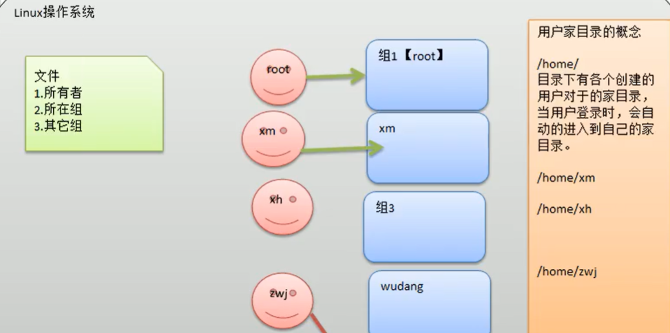
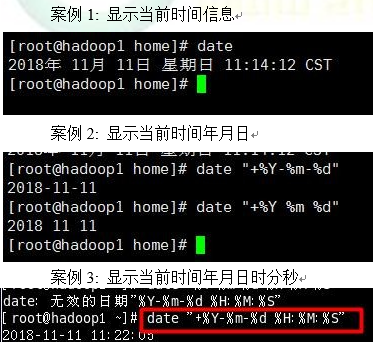
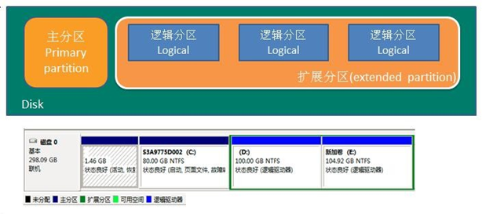
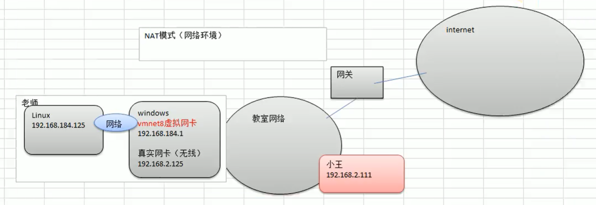

[toc]

# OS

# Linux

---

p54

---

## 设备信息
```shell
lscpu       # cpu信息
man lscpu   # 指令解释: man 指令

df -h       # 查看硬盘使用情况
```

## 基本命令

```shell
shutdown -h now  表示立即关机
shutdown -r now  立即重启
halt    关机
reboot  重启
sync    把内存数据保存到磁盘上

logout  注销

service network restart # 重启网络服务
vim /etc/sysconfig/network-scripts/ifcfg-eth0 # 更改ip
vim /etc/sysconfig/network # 更改主机名
vim /etc/udev/rules.d/70-persistent-net.rules 
vim /etc/hosts

wget https://cdn.mysql.com/archives/mysql-5.5/MySQL-server-5.5.48-1.linux2.6.x86_64.rpm # 下载包
```

## 用户管理




```shell
# 添加用户
useradd 用户名

# 指定密码
passwd 用户名

# 删除用户但保留home目录
userdel 用户名

# 删除用户和home目录
userdel -r xm

# 查询用户信息
id 用户名

# 切换用户
su - 用户名 # 切换
exit      # 返回原用户

whoami    # 当前用户

# 添加组
groupadd 组名
groupdel 组名 # 删除

useradd -g 用户组名 用户名
usermod -g 用户组名 用户名 # 修改用户所属组
```
### 用户所属
```shell
ls -ahl # 查看文件所有者

chown 用户名 文件名 # 修改文件所有者，文件所有组不改变

chgrp 组名 文件名   # 修改文件所在组

usremod -g 组名 用户名 # 改变用户所在组
```

### 权限管理


0-9 位说明

1)第 0 位确定文件类型(d, - , l , c , b)

2)第 1-3 位确定所有者（该文件的所有者）拥有该文件的权限    ---User

3)第 4-6 位确定所属组（同用户组的）拥有该文件的权限    ---Group

4)第 7-9 位确定其他用户拥有该文件的权限    ---Other


```shell
# chmod 修改文件目录权限
u:所有者	g:所有组	o:其他人	a:所有人(u、g、o 的总和)
chmod u=rwx,g=rx,o=x	# 文件目录名
chmod o+w	# 文件目录名
chmod a-x	# 文件目录名

chown newowner file	# 改变文件的所有者
chown newowner:newgroup	file	# 改变用户的所有者和所有组
chown -R newowner /home/yuty/ # 递归改变目录下的所有文件

# 修改文件所在组
chgrp newgroup file
chgrp -R newgroup /home/yuty/
```


## 环境配置

```shell
vim /etc/profile
source /etc/profile
```

## 文件目录类指令

```shell
pwd   # 当前路径
echo ~ # 当前用户的主目录

ls    # ll详细信息 ls -a || ls -l
ls /home
ls -lh # 存储空间

cd .. # 回到上一级
cd ~
'     # 进入quote，再按 ' 退出

mkdir 路径 + 目录名
mkdir -p 多级目录

rmdir # 删除目录
rm -rf /home/dog # 删除目录内的文件

# 删除
rm filename   # 删除文件
rm -f hello.txt  # 强制删除
rm -rf dog/ # 删除整个目录

touch hello.txt 创建空文件

cp hello.txt abc/ # 拷贝文件到目录abc
cp -r test1/ test2/ # 把test1目录下的所有内容拷贝到test2中
\cp -r test1/ test2/ # 强制覆盖
 
# move
mv /mnt/hgfs/centoshare/hadoop-2.7.2.tar.gz  /opt/ # 移动到opt目录下
mv filename1 ../code/filename2
mv	oldNameFile newNameFile	    # 都在相同目录 功能描述：重命名
mv /temp/movefile /targetFolder  # 功能描述：移动文件
# filename1 是要转移的文件名
# filename2 转移后的文件名,可与filename1同名
 
cat -n /etc/profile | more # 只读文件
-n # 显示行号
| more # 分页显示
 
more /etc/profile # 分页读文件

less /etc/profile

# > 覆盖 和 >> 追加
ls -l > hello.txt # 将ls -l 显示内容写入hello.txt
ls -l >> hello.txt # 追加到hello.txt文件中
cat /etc/profile > hello.txt
echo "helloworld" >> hello.txt

cal # 日历

echo hello world # 在屏幕输出一行文本
echo $PATH # 输出环境变量

head hello.txt # 显示前10行
head-n 5 hello.txt
tail hello.txt # 后10行
tail -f hello.txt # 实时监控显示文件变化

ln -s /root linktoroot # 创建root目录的一个快捷方式

history # 显示历史指令
history 10
-------------------------------------------
----------------------------------------------

type echo  # type命令用来判断命令的来源
echo is a shell builtin

sz filename    # 下载filename到本地

ipython 	# 进入ipython
quit    	# 退出
```

## 时间日期





## 搜索查找


```shell
# find
find /home -name hello.txt
find /home -user root # 按文件所属用户查找
find / -size +20M
find / -size -20M # 小于20M文件

# locate

# grep
cat hello.txt | grep yes # 在文件hello.txt中查找 yes 

```


## 定时任务


.png)


```shell
# crontab
crontable -e
*/1 * * * * ls -l /etc >> /tmp/to.txt

# 案例 2：每隔 1 分钟， 将当前日期和日历都追加到 /home/mycal文件中
/home/mytask2.sh # 1. 先编写一个文件

# 2. 写入文件
date >> /tmp/mycal 
cal >> /tmp/mycal

# 3. 给 mytask1.sh 一个可以执行权限
chmod 744 /home/mytask2.sh

crontab -e # 4. 写入定时任务
*/1 * * * * /home/mytask2.sh


conrtab –r # 终止任务调度
crontab –l # 列出当前有那些任务调度

service crond restart  # 重启任务调度
```

## 磁盘管理




- mbr 分区：
1. 最多支持四个主分区
2. 系统只能安装在主分区
3. 扩展分区要占一个主分区

- gtp 分区：
1. 支持无限多个主分区（但操作系统可能限制，比如 windows 下最多 128 个分区）
2. 最大支持 18EB 的大容量（1EB=1024 PB，1PB=1024 TB&nbsp; ）
3. windows7 64 位以后支持 gtp
4. MBR 最大只支持 2TB，但拥有最好的兼容性


```shell
lsblk  # 磁盘情况
lsblk -f

# 查询系统整体磁盘使用情况
df -l
df -lh

# 查询指定目录的磁盘占用情况
du -h    /目录  # 默认为当前目录
-s              # 指定目录占用大小汇总
-h              # 带计量单位
-a              # 含文件
--max-depth=1  # 子目录深度
-c              # 列出明细的同时，增加汇总值

# 查询  /opt 目录的磁盘占用情况，深度为 1
du -ach --max-depth=1 /opt

fdisk /dev/sdb  # 分区
mkf -t ext4 /dev/sdb1# 格式化

# 挂载: 将一个分区与一个目录联系起来，
# mount 设备名称 挂载目录
mount /dev/sdb1 /newdisk

# umount 设备名称 或者 挂载目录
umount /dev/sdb1 或者 umount /newdisk

```


.png)

## 进程管理


### 查看进程
```shell
# ps 
# 指令说明System V 展示风格
"""
USER：用户名称
PID：进程号
%CPU：进程占用 CPU 的百分比
%MEM：进程占用物理内存的百分比
TT：终端名称,缩写 .
STAT：进程状态，其中 S-睡眠，s-表示该进程是会话的先导进程，N-表示进程拥有比普通优先级更低的优先级，R-正在运行，D-短期等待，Z-僵死进程，T-被跟踪或者被停止等等
STARTED：进程的启动时间
TIME：CPU 时间，即进程使用 CPU 的总时间
COMMAND：启动进程所用的命令和参数，如果过长会被截断显示
"""

ps -aux | more         # 显示系统执行的进程
ps -aux | grep sshd   # 查看包含sshd进程
ps -ef | more   # 显示父进程


# 查看进程树 pstree
pstree -p # 显示进程的 PID
pstree -u # 显示进程的所属用户


```
### 杀死进程
```shell
kill [选项] 进程号 # 通过进程号杀死进程   -9 表示强迫进程立即停止
kill 3980

killall 进程名称   #通过进程名称杀死进程，也支持通配符
```

## 服务管理
服务(service) 本质就是进程，但是是运行在后台的，通常都会监听某个端口，等待其它程序的请求，比如(mysql , sshd 防火墙等)，因此我们又称为守护进程。
在 CentOS7.0 后 不再使用 service ,而是 systemctl


```shell
# 查看服务名
setup
ls -l /etc/init.d/      # 查看服务

# service
service 服务名 [start | stop | restart | reload | status]

service iptables status
service iptables stop
service iptables start

telnet ip地址 端口号
```

### 运行级别
- Linux 系统有 7 种运行级别(runlevel)：常用的是级别 3 和 5
运行级别 0：系统停机状态，系统默认运行级别不能设为 0，否则不能正常启动
运行级别 1：单用户工作状态，root 权限，用于系统维护，禁止远程登陆
运行级别 2：多用户状态(没有 NFS)，不支持网络
运行级别 3：完全的多用户状态(有 NFS)，登陆后进入控制台命令行模式
运行级别 4：系统未使用，保留
运行级别 5：X11 控制台，登陆后进入图形 GUI 模式
运行级别 6：系统正常关闭并重启，默认运行级别不能设为 6，否则不能正常启动

开机的流程说明：


``` shell
# chkconfig 指令
# 给每个服务的各个运行级别设置自启动/关闭
chkconfig --list
chkconfig --list | grep xxx # 过滤
chkconfig iptables -- list

chkconfig --level 5 iptables off

reboot  # 重启后生效
```


### 动态监控
top 在执行一段时间可以更新正在运行的的进程


.png)

```shell
top
k：然后输入“k”回车，再输入要结束的进程 ID 号

top -d 10 # 系统状态更新的时间 每隔 10 秒自动更新

VIRT：virtual memory usage 虚拟内存
RES：resident memory usage 常驻内存
SHR：shared memory 共享内存

q – 退出 top
```

### 系统网络情况

```shell
netstat -anp
-an    # 按一定顺序排列输出
-p     # 显示哪个进程在调用

netstat -anp | more
netstat -anp | grep xxx

```


## RPM & YUM

### RPM
RPM 是 RedHat Package Manager（RedHat 软件包管理工具）的缩写
一种用于互联网下载包的打包及安装工具


```shell
rpm -qa               # 查询所安装的所有 rpm 软件包
rpm –qa | grep xxx # 查询是否安装了xxx
rpm -qa | more     # 分页显示

rpm -qi  软件包名   # 查询软件包信息

rpm -ql  软件包名   # 查询软件包中包含的文件

rpm -qf 文件全路径名  # 查询目录所属的软件包
rpm -qf /etc/passwd 

# 卸载rpm包
rpm -e 软件包名
rpm -e foo
rpm -e --nodeps foo # 强制删除

# 安装rpm包
rpm -ivh 软件包全路径名称
i=install    # 安 装
v=verbose # 提 示
h=hash     # 进度条

```

### yum
yum 是一个 Shell 前端软件包管理器。基于 RPM 包管理，能够从指定的服务器自动下载 
RPM 包并且安装，可以自动处理依赖性关系，并且一次安装所有依赖的软件包

```shell
# 查询 yum 服务器是否有需要安装的软件
yum list | grep xxx # 软件列表

yum install firefox

```


### 快捷键

```shell
Ctrl + L：清除屏幕并将当前行移到页面顶部
Ctrl + C：中止当前正在执行的命令

Ctrl + U：从光标位置删除到行首
Ctrl + K：从光标位置删除到行尾
```


### 扩展

```shell
# 2. ? 字符代表文件路径里面的任意单个字符，不包括空字符
#    * 字符代表文件路径里面的任意数量的任意字符，包括零个字符

$ ls *.txt     # 存在文件 a.txt、b.txt 和 ab.txt
a.txt b.txt ab.txt

$ ls ?.txt     # 存在文件 a.txt 和 b.txt
a.txt b.txt

## 转义字符

```


## 压缩

```shell
# gzip gunzip
gzip name # 压缩 删除原文件
gunzip name.gz # 解压缩

# zip unzip
zip new_name_filename need_zip_filename     # 压缩文件need_zip_filename
zip -r mypackage.zip /home/       # 压缩 home 目录下所有文件
unzip -d /opt/tmp mypackage.zip   # 解压到指定路径

# tar
tar -zcvf 压缩后的文件名 待压缩文件1 待压缩文件2
tar -zcvf 压缩后的文件名 /home/ # 压缩home目录下的所有文件

tar -zxvf 待解压文件
tar -zxvf 待解压文件 -C /opt/module/
```

### screen
```shell
screen -S name 			# 新建一个叫name的session(会话)
screen -ls     			# 列出当前所有的session
screen -r name 			# 回到name这个session
screen -d name 			# 远程detach(分离）某个session
screen -d -r name_ 	    # 结束当前session并回到 name_ 这个session
screen -S name -X quit  # kill叫name的session
# 进入某个session后,先按键 ctrl+a, 再按 d 即可挂起(Detached)
```

## vim
```shell
# 正常模式 - 插入模式 - 命令行模式

vim filename.py		# 进入vim

# 正常模式
dd 删除当前行
yy 复制当前行
p  粘贴

i    			    # 进入插入模式

Esc		 	# 回到命令行模式
Esc :wq 	# 保存并退出
	:q! 	# 不保存并强制退出
	:q  	# 不保存文件,退出
```


### top
>VIRT：virtual memory usage 虚拟内存
>RES：resident memory usage 常驻内存
>SHR：shared memory 共享内存
q – 退出 top


### tips
```shell
cat bigname | split -b 2G - smallname. # smallname.aa / ab / ac
# 在windows本地对下载的2G文件重命名为1.zip.001，1.zip.002，1.zip.003 ……
# 打开cmd进入到存放文件目录中输入：
copy /b 1.zip.001+1.zip.002+1.zip.003 1.zip
# 当前目录生成1.zip，为最后的待解压文件
# 文件之间用加号+连接不能有空格, 另一种写法： copy /b 1.* 1.zip
```

## 网络结构 （VM虚拟机）





## 目录结构
```shell
cd change directory


```


## 运行级别


```shell
init [0123456]
```

## 帮助指令

```shell
# man
man 指令
man ls

# help
help 指令
help cd
```

# Shell


```shell
#!/bin/bash 
# 脚本以此开头 使用 bash 解析

chmod 744 myShell.sh # 给可执行权限
./myShell.sh
/root/shell/myShell.sh

sh myShell.sh
```

## Shell 变量

1. Linux Shell 中的变量分为，系统变量和用户自定义变量。

系统变量：\$HOME、\$PWD、\$SHELL、\$USER

2. 显示当前 shell 中所有变量：set

3. 撤销变量：unset 变量

4. 声明静态变量：readonly 变量，注意：不能 unset


5. 将命令的返回值赋给变量（重点）

1） A=\`ls -la\` 反引号，运行里面的命令，并把结果返回给变量 A

2） A=$(ls -la) 等价于反引号


### 设置环境变量

```shell
export 变量名=变量值   # 将 shell 变量输出为环境变量
source 配置文件       # 让修改后的配置信息立即生效
echo $变量名          # 查询环境变量的值

vim /etc/profile # 设置完变量后export

source /etc/profile
echo $TOMCAT_HOME
```

### 位置参数变量


\$n （功能描述：n 为数字，\$0 代表命令本身，\$1-\$9 代表第一到第九个参数，十以上的参数，十以上的参数需要用大括号包含，如\${10}）
\$* （功能描述：这个变量代表命令行中所有的参数，\$*把所有的参数看成一个整体）
\$@（功能描述：这个变量也代表命令行中所有的参数，不过\$@把每个参数区分对待）
\$#（功能描述：这个变量代表命令行中所有参数的个数）

### 预定义变量
$$    （功能描述：当前进程的进程号（PID））
$!	（功能描述：后台运行的最后一个进程的进程号（PID））
$？  （功能描述：最后一次执行的命令的返回状态。如果这个变量的值为 0，证明上一个命令正确执行；如果这个变量的值为非 0，则证明上一个命令执行不正确了。）


# 计算机操作系统理论

### 概论

##### 基本特征
1. 并发
宏观上在一段时间内能同时运行多个程序
通过引入进程和线程，使得程序能够并发运行

2. 共享
系统中的资源可以被多个并发进程共同使用
有两种共享方式：互斥共享和同时共享。
互斥共享的资源称为临界资源，例如打印机，在同一时刻只允许一个进程访问，需要用同步机制来实现互斥访问

3. 虚拟
虚拟技术把一个物理实体转换为多个逻辑实体
两种虚拟技术：时（时间）分复用技术和空（空间）分复用技术
- 多个进程能在同一个处理器上并发执行，让每个进程轮流占用处理器，每次只执行一小个时间片并快速切换
- 虚拟内存使用了空分复用技术，它将物理内存抽象为地址空间，地址空间的页并不需要全部在物理内存中，当使用到一个没有在物理内存的页时，执行页面置换算法，将该页置换到内存中

4. 同步与异步
同步：下一步需要等待上一步的结果，上一步结束，下一步才能开始
异步：下一步无需等待上一步的结果，只需上一步有结果时接受即可

##### 基本功能
1. 进程管理
进程控制、进程同步、进程通信、死锁处理、处理机调度等

2. 内存管理
内存分配、地址映射、内存保护与共享、虚拟内存等

3. 文件管理
文件存储空间的管理、目录管理、文件读写管理和保护等

4. 设备管理
完成用户的 I/O 请求，方便用户使用各种设备，并提高设备的利用率
主要包括缓冲管理、设备分配、设备处理、虛拟设备等

##### 系统调⽤
系统调用：操作系统对应用程序提供的服务调用请求接口
目的：应用程序通过系统调用请求获得操作系统内核的服务，可保证系统稳定性和安全性(避免用户非法操作)


### 进程管理
##### 进程与线程
- 进程
进程是资源分配的基本单位
进程控制块 (Process Control Block,  PCB) 描述进程的基本信息和运行状态，所谓的创建进程和撤销进程，都是指对 PCB 的操作
需要同步和互斥手段保证数据一致

- 线程
线程是独立调度单位
一个进程中可以有多个线程，它们共享进程资源（地址空间）
线程间可以通过直接读写同一进程中的数据(全局变量)进行通信

##### 进程调度算法
进程状态切换：
- 就绪状态（ready）：进程获得了除CPU外的一切资源，等待被调度进入运行状态
- 运行状态（running）：进程在CPU上运行
- 阻塞状态（waiting）：等待资源
阻塞只能到就绪，阻塞不能直接转运行

进程调度算法：
**1.1 先来先服务 first-come first-serverd（FCFS）** 
按照请求的顺序进行调度

**1.2 短作业优先 shortest job first（SJF）** 
非抢占式的调度算法，按估计运行时间最短的顺序进行调度，长作业有可能会饿死

**1.3 最短剩余时间优先 shortest remaining time next（SRTN）** 
最短作业优先的抢占式版本（新来的进程会抢占CPU），按剩余运行时间的从小到大的顺序进行调度
当一个新的进程到达时，如果新的进程需要的时间更少，则挂起当前进程，运行新的进程

**2.1 时间片轮转** 
将所有就绪进程按 FCFS （先来先服务）的原则排成一个队列，每次每个队首进程可以执行一个时间片，执行完后队首放入队尾
时间片轮转算法的效率和时间片的大小有很大关系：
- 如果时间片太小，切换得太频繁会费时
- 而如果时间片过长，那么实时性就不能得到保证

**2.2 优先级调度** 
为每个进程分配一个优先级，按优先级进行调度
为了防止低优先级的进程永远等不到调度，可以随着时间的推移增加等待进程的优先级

**2.3 多级反馈队列** 
一个进程需要执行 100 个时间片，如果采用时间片轮转调度算法，那么需要交换 100 次，耗时过大
多级队列是为这种耗时大的进程考虑，它设置了多个队列，每个队列对应的时间片大小都不同，例如 1, 2, 4, 8, ... 
进程在第一个队列没执行完，就会被移到下一级队列，下级队列的时间片大小大于上级队列


##### 进程同步（线程同步）
- 进程同步：控制多个进程按一定顺序执行，避免资源访问冲突

1. 信号量

2. 互斥量

3. 管程


进程同步也是进程之间直接的制约关系，是为完成某种任务而建立的两个或多个线程，这个线程需要在某些位置上协调他们的工作次序而等待、传递信息所产生的制约关系，进程间的直接制约关系来源于他们之间的合作

比如说进程A需要从缓冲区读取进程B产生的信息，当缓冲区为空时，进程B因为读取不到信息而被阻塞。而当进程A产生信息放入缓冲区时，进程B才会被唤醒


**进程互斥**

  进程互斥是进程之间的间接制约关系。当一个进程进入临界区使用临界资源时，另一个进程必须等待。只有当使用临界资源的进程退出临界区后，这个进程才会解除阻塞状态

比如进程B需要访问打印机，但此时进程A占有了打印机，进程B会被阻塞，直到进程A释放了打印机资源,进程B才可以继续执行


- 互斥量(Mutex)
synchronized 关键词 和 各种 Lock

- 信号量(Semphares)
设置资源允许的数量，同⼀时刻多个线程可以访问同⼀资源

- 管程/事件(Event) :Wait/Notify
通过通知操作的⽅式来保持多线程同步

- 采用面向对象方法，简化了线程间的同步控制
- 任一时刻最多只有一个线程执行管程代码
- 正在管程中的线程可临时放弃管程的互斥访问，等待事件出现时恢复（这是最大的特点）

一次仅允许一个进程使用的资源称为临界资源
许多物理设备都属于临界资源，如输入机、打印机、磁带机等


##### 进程通信
- 进程通信：进程间传输信息
每个进程各自有不同的用户地址空间，任何一个进程的全局变量在另一个进程中都看不到，所以进程之间要交换数据必须通过内核，在内核中开辟一块缓冲区，进程1把数据从用户空间拷到内核缓冲区，进程2再从内核缓冲区把数据读走，内核提供的这种机制称为进程间通信

各进程拥有独立的内存地址空间，为了保证安全，一个进程不能直接访问其它进程的地址空间

1. 管道
设置一个特殊的共享内核缓冲区(管道，读写方式类似队列)

只能用于父子进程或者兄弟进程之间(具有亲缘关系的进程)

管道是半双工的，数据只能向一个方向流动；需要双方通信时，需要建立起两个管道

数据的读出和写入：一个进程向管道中写的内容被管道另一端的进程读出。写入的内容每次都添加在管道缓冲区的末尾，并且每次都是从缓冲区的头部读出数据

- 匿名管道和有名管道总结：
 无名管道：只存在于内存中的文件；命名管道：存在于实际的磁盘介质或者文件系统
（1）管道是特殊类型的文件，在满足先入先出的原则条件下可以进行读写，但不能进行定位读写
（2）匿名管道是单向的，只能在有亲缘关系的进程间通信；有名管道以磁盘文件的方式存在，可以实现本机任意两个进程通信
（3）无名管道阻塞问题：无名管道无需显示打开，创建时直接返回文件描述符，在读写时需要确定对方的存在，否则将退出。如果当前进程向无名管道的一端写数据，必须确定另一端有某一进程。如果写入无名管道的数据超过其最大值，写操作将阻塞，如果管道中没有数据，读操作将阻塞，如果管道发现另一端断开，将自动退出
（4）有名管道阻塞问题：有名管道在打开时需要确实对方的存在，否则将阻塞。即以读方式打开某管道，在此之前必须一个进程以写方式打开管道，否则阻塞。此外，可以以读写（O_RDWR）模式打开有名管道，即当前进程读，当前进程写，不会阻塞


2. 消息队列
消息队列存放在内核中，只有在内核重启(即，操作系统重启)或者显示地删除一个消息队列时，该消息队列才会被真正的删除

与管道不同的是，消息队列在某个进程往一个队列写入消息之前，并不需要另外某个进程在该队列上等待消息的到达

消息队列允许一个或多个进程向它写入与读取消息

管道和消息队列的通信数据都是先进先出的原则


3. 共享内存
设置一块可直接访问的内存共享空间，互斥访问共享空间（PV操作）

进程就可以直接读写这一块内存而不需要进行数据的拷贝，从而大大提高效率

由于多个进程共享一段内存，因此需要依靠某种同步机制（如信号量）来达到进程间的同步及互斥


4. 套接字
    套接字是一种通信机制，凭借这种机制，客户/服务器（即要进行通信的进程）系统的开发工作既可以在本地单机上进行，也可以跨网络进行。也就是说它可以让不在同一台计算机但通过网络连接计算机上的进程进行通信

  

套接字是支持TCP/IP的网络通信的基本操作单元，可以看做是不同主机之间的进程进行双向通信的端点，简单的说就是通信的两方的一种约定，用套接字中的相关函数来完成通信过程


5. 信号量
信号量是一个计数器，用于多进程对共享数据的访问，信号量的意图在于进程间同步

（1）创建一个信号量：这要求调用者指定初始值，对于二值信号量来说，它通常是1，也可是0
（2）等待一个信号量：该操作会测试这个信号量的值，如果小于0，就阻塞，也称为P操作
（3）挂出一个信号量：该操作将信号量的值加1，也称为V操作


### 死锁
- 什么是死锁
多个进程因竞争资源而等待对方手里的资源，互相等待，都无法向前推进

- 死锁的条件
1. 互斥
一个资源每次只能被一个进程使用

2. 不可剥夺
进程已获得的资源，在末使用完之前，不能被其他进程强行剥夺

3. 请求和保持
一个进程因请求资源而阻塞时，该进程对已获得的资源保持不放

4. 循环等待链
若干进程之间形成一种头尾相接的循环等待资源关系


- 如何解决死锁
1. 预防死锁
破坏死锁的四大条件之一

2. 避免死锁
允许前三个必要条件，破坏第四个条件
安全序列来检测死锁、银行家算法

如果一个进程的请求会导致死锁，则不启动该进程
如果一个进程增加的资源请求会导致死锁，则不允许此分配(银行家算法)

3. 死锁的检测及解除
资源请求分配图、死锁定理(资源剥夺、撤销进程等)


### 内存管理
1. 内存空间的分配与回收
操作系统完成存储空间的分配与回收

2. 内存空间的扩充
利用虚拟存储技术技术，从逻辑上扩充内存

3. 地址转换
将逻辑地址转换为物理地址

**高速缓存**（英语：**cache**）简称**缓存**，原始意义是指访问速度比一般[随机存取存储器](https://zh.wikipedia.org/wiki/隨機存取記憶體)（RAM）快的一种RAM，通常它不像系统主存那样使用[DRAM](https://zh.wikipedia.org/wiki/DRAM)技术，而使用昂贵但较快速的[SRAM](https://zh.wikipedia.org/wiki/静态随机存取存储器)技术

快表是一种特殊的高速缓冲存储器（Cache），内容是页表中的一部分或全部内容

在操作系统中引入快表是为了加快地址映射速度

##### 分页
虚拟内存采用的是分页技术，将地址空间划分成固定大小的页，每一页再与内存进行映射

页不需要映射到连续的物理内存

内存管理单元（MMU）管理着逻辑地址空间和物理内存的转换，其中的页表（Page table）存储着 页（程序地址空间） 和 页框（物理内存空间） 的映射表


- 页面置换算法
页面置换算法的主要目标是使页面置换频率最低
页的物理存储位置在内存与磁盘中交换的过程

1. 最佳
> OPT, Optimal replacement algorithm

是一种理论上的算法：
所选择的被换出的页面是最长时间不再被访问的，通常可以保证获得最低的缺页率


2. 最近最久未使用
> LRU, Least Recently Used
> 将最近最久未使用的页面换出

无法知道将来要使用的页面情况，但可以知道过去使用页面的情况
实现 LRU，需要在内存中维护一个所有页面的链表（限定长度）
当一个页面被访问时，将这个页面移到链表表头（如在链表中出现过，如果不在链表中直接添加为头结点），超出长度删除链表尾节点


3. 最近未使用
> NRU, Not Recently Used

每个页面都有两个状态位：R 与 M，页面被访问时设置页面的 R=1，当页面被修改时设置 M=1
R 位会定时被清零。可以将页面分成以下四类：
- R=0，M=0
- R=0，M=1
- R=1，M=0
- R=1，M=1

NRU 算法随机地换出
NRU 优先换出已经被修改的脏页面（R=0，M=1），而不是被频繁访问的干净页面（R=1，M=0）。

4. 先进先出
> FIFO,  First In First Out

选择换出的是最先进入的页面

5. 第二次机会算法
FIFO 算法可能会把经常使用的页面置换出去，为了避免这一问题，对该算法做一个简单的修改：
当页面被访问 (读或写) 时设置该页面的 R 位为 1。
需要替换的时候，检查最老页面的 R 位。如果 R 位是 0，那么这个页面既老又没有被使用，可以立刻置换掉；
如果是 1，就将 R 位清 0，并把该页面放到链表的尾端，修改它的装入时间使它就像刚装入的一样，然后继续从链表的头部开始搜索。


6. 时钟
> Clock

第二次机会算法需要在链表中移动页面，降低了效率
时钟算法使用环形链表将页面连接起来，再使用一个指针指向最老的页面

- 单级页表存在的问题：
  - 页表必须连续存放，因此当页表很大时，需要占用很多个连续的页
  - 没有必要让整个页表常驻内存，因为进程在一段时间内可能只需要访问某几个特定的页面
- 建立多级页表的目的在于建立索引，以便不用浪费主存空间去存储无用的页表项，也不用盲目顺序式查找页表项


##### 分段
虚拟内存采用的是分页技术，也就是将地址空间划分成固定大小的页，每一页再与内存进行映射
分段的做法是把将地址空间分成段，一个段构成一个独立的地址空间，每个段的长度可以不同，并且可以动态增长


##### 段页式
程序的地址空间划分成多个拥有独立地址空间的段，每个段上的地址空间划分成大小相同的页
这样既拥有分段系统的共享和保护，又拥有分页系统的虚拟内存功能。

- 区别 ：
1. ⻚的⼤⼩是固定的，由操作系统决定；⽽段的⼤⼩不固定，取决于我们当前运⾏的程序
2. 分⻚仅仅是为了满⾜操作系统内存管理的需求，⽽段是逻辑信息的单位，在程序中可以体现为代码段，数据段，能够更好满⾜⽤户的需要
3. 分页2次、分段2次、段页式3次访存

分页主要用于实现虚拟内存，从而获得更大的地址空间；分段主要是为了使程序和数据可以被划分为逻辑上独立的地址空间并且有助于共享和保护


### 磁盘管理


