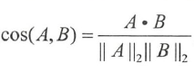
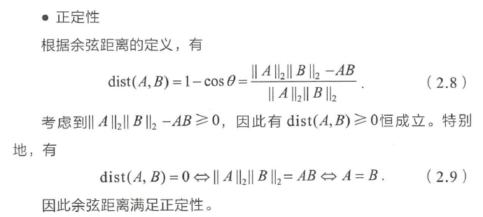
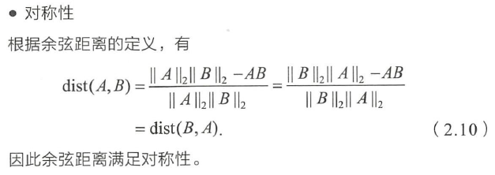
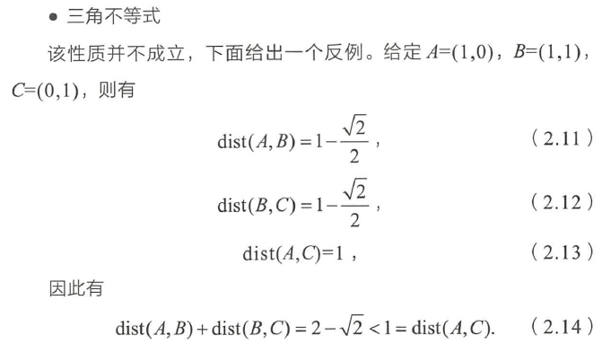

[toc]
# 数学概念

## 概率论

### 方差
1. 标准差
	标准差是方差的算术平方根
### 协方差

>   衡量两个变量的总体误差
>   协方差表示的是两个变量的总体的误差，这与只表示一个变量误差的方差不同。

- 如果两个变量的变化趋势一致，也就是说如果其中一个大于自身的期望值，另外一个也大于自身的期望值，那么两个变量之间的协方差就是正值。 

- 如果两个变量的变化趋势相反，即其中一个大于自身的期望值，另外一个却小于自身的期望值，那么两个变量之间的协方差就是负值。

期望值分别为E[X]与E[Y]的两个实随机变量X与Y之间的协方差Cov(X,Y)定义为：


### 相关系数

>较为常用的是皮尔逊相关系数，研究变量之间线性相关程度的量，一般用字母 r 表示。

- 相关系数是用以反映变量之间相关关系密切程度的统计指标。
- 相关系数按积差方法计算，同样以两变量与各自平均值的离差为基础，通过两个离差相乘来反映两变量之间相关程度。
	- .00-.19 “very weak”
   	- .20-.39 “weak”
   	- .40-.59 “moderate”
    - .60-.79 “strong”
   	- .80-1.0 “very strong” 	


Cov(X,Y)为X与Y的协方差，Var[X]为X的方差，Var[Y]为Y的方差

## 线性代数

### 矩阵分解

## 高等数学
### 二范数
向量范数：向量x的2范数是 x中各个元素平方之和再开根号；


# 特征工程


## 数值特征

### 归一化
1. 线性归一化
    x  -  最小值  /  最大值  -  最小值
2. 零均值归一化(Z-score Normalization)
将原始数映射到均值为0 、标准差为l 的分布上
      x - μ / σ     均值为μ 、标准差为σ


- 在学习速率相同的情况下，X1的更新速度会大于X2， 需要较多的迭代才能找到最优解。
- 如果将X1 和X2 归一化到相同的数值区间后，优化目标的等值图会变成图中的圆形， X1 和X2的更新速度变得更为一致，更快地通过梯度下降找到最优解。

## 类别特征

### 独热编码 (onehot encoding)

### 序号编码（ Ordinal Encoding ）
  高中低    321 保留大小信息

### 二进制编码（ Binary Encoding)
  先用序号编码, 再用二进制表示

### 频数编码（count encoding）
  统计类别出现的次数

### labelcount编码
  根据类别在训练集中的频次排序类别（升序或降序）,用序号表示类别

## 组合特征
  ### 矩阵分解
  用降维的方法来减小两个高维特征组合后的特征维度
  ### 决策树解决特征组合问题


## 图像处理

## 文本处理

### 词袋模型（Bag of Words）
将每篇文章看成一袋子词，并忽略每个i司出现的顺序
将整段文本以词为单位切分开，然后每篇文章可以表示成一个长向量，向量中的每一维代表一个主要词，而该维对应的权重则反映了这个词在原文章中的重要程度

### TF - IDF
>TF-IDF(Term Frequency-Inverse Document Frequency, 词频-逆文件频率).
>TF-IDF是一种统计方法，用以评估一字词对于一个文件集的重要程度或一个语料库中的其中一份文件的重要程度。字词的重要性随着它在文件中出现的次数成正比增加，但同时会随着它在语料库中出现的频率成反比下降。

一个词语在一篇文章中出现次数越多, 同时在所有文档中出现次数越少, 越能够代表该文章.

- 词频 (term frequency, TF) 指的是某一个给定的词语在该文件中出现的次数。这个数字通常会被归一化(一般是需要除以文章总词数), 以防止它偏向长的文件。

  

- 逆向文件频率 (inverse document frequency, IDF) IDF的主要思想是：**如果包含词条t的文档越少, IDF越大，则说明词条具有很好的类别区分能力。**某一特定词语的IDF，可以由总文件数目除以包含该词语之文件的数目，再将得到的商取对数得到。

如果一个单词在非常多的文章里面都出现， 那么它可能是一个比较通用的词汇，对于区分某篇文章特殊语义的贡献较小， 因此对权重做一定惩罚。

某一特定文件内的高词语频率，以及该词语在整个文件集合中的低文件频率，可以产生出高权重的TF-IDF。因此，TF-IDF倾向于过滤掉常见的词语，保留重要的词语。


- N - gram 模型
	- 以将连续出现的n 个词( n <= N ） 组成的词组（ N-gram ）作为一个单独的恃征放到向量表示中去，向成 N - gram 模型

- 词干抽取
	- 同一个词可能有多种词性变化，却有着相似的含义。在实际应用中，一般会对单词进行词干抽取（ Word Stemming ）处理，即将不同词性的单词统一成为同一词干的形式。

### 词嵌入
词嵌入是一类将词向量化的模型的统称， 核心思想是将每个词都向量表示映射成低维空间（通常     K=50 ～ 300 维）上的一个稠密向量（ Dense Vector ）

### 隐狄利克雷模型（ LDA)

### word2vec
>Word2Vec 实际是一种浅层的神经网络模型， 它有两种网络结构，分别是CBOW (Continues Bag of Words ）和 Skip-gram。

- CBOW 的目标是根据上下文出现的词语来预测当前词的生成慨率

- Skip-gram 是根据当前词来预测上下文中各词的生成概率

- Hierarchical Softmax

- Negative Sampling  负采样


sentences它是一个list，size表示输出向量的维度。
window：
min_count：用于字典阶段，词频少于min_count次数的单词会被丢弃掉，默认为5

```python
embedding = Word2Vec.load('../res/w2v_all.model')
embedding_dim = embedding.vector_size #向量长度 


model.save('word2vec.model')

model.wv.save_word2vec_format('word2vec.vector')
model = Word2Vec.load('word2vec.model')

#Compute the Word Mover's Distance between two documents.
#计算两个文档的相似度——词移距离算法
model.wv.wmdistance()
 
# Compute cosine similarity between two sets of words.
# 计算两列单词之间的余弦相似度——也可以用来评估文本之间的相似度
model.wv.n_similarity(ws1, ws2)
 
#Compute cosine similarities between one vector and a set of other vectors.
#计算向量之间的余弦相似度
model.wv.cosine_similarities(vector_1, vectors_all)
 
#Compute cosine similarity between two words.
#计算2个词之间的余弦相似度
model.wv.similarity(w1, w2)
 
#Find the top-N most similar words.
# 找出前N个最相似的词
model.wv.most_similar(positive=None, negative=None, topn=10, restrict_vocab=None, indexer=None)

```


### countvec

```python
from sklearn.feature_extraction.text import CountVectorizer, TfidfVectorizer


```


### Data Preprocess
```
<PAD>  ：無意義，將句子拓展到相同長度
<BOS>  ：Begin of sentence, 開始字元
<EOS>  ：End of sentence, 結尾字元
<UNK>  ：沒有出現在字典裡的詞
```


## 图像样本不足

- 是基于模型的方法，主要是采用降低过拟台风险的措施，包括简化模型（如将非线性模型简化为线性模型）、添加约束项以缩小假设空间（如Ll / L2正则顶）、集成学习、Dropout 超参数等；

- 二是基于数据的方法， 主要通过数据扩充（ Data Augmentation ），即根据一些先验知识，在保
持特定信息的前提下，对原始数据进行适当变换以达到扩充数据集的效果。具体到图像分类任务中 在保持图像类别不变的前提下，可以对训练集中的每幅图像进行以下变换。

( 1 ）一定程度内的随机旋转、平移、缩版、裁剪、填充、左右翻转等，这些变换对应着同一个目标在不同角度的观察结果。
( 2 ）对图像中的像素添加躁声扰动，比如椒盐噪声、高斯自噪声等。
( 3 ）颜色变换。
( 4 ）改变图像的亮度、清晰度、对比度、锐度等。

- 除了直接在图像空间进行变换，还可以先对国像进行特征提取，然后在图像的特征空间内进行变换，利用一些通用的数据扩充或上采样技术，例如SMOTE ( Synthetic Minority Over” sampling Technique )算法。
- 生成式对抗网络模型。
- 迁移学习。对于大部分图像分类任务，并不需要从头开始训练模型，而是借用一个在大规模数据集上预训练好的通用模型，并在针对目标任务的小数据集上进行微调（ fine-tune ）。


# 模型评估

## 准确率（ Accuracy ）
>准确率是指分类正确的样本个数占总样本个数的比例

**存在问题：**当不同类别的样本比例非常不均衡时，占比大的类别往往成为影响准确率的最主要因素
可使用平均准确率（ 每个类别下的样本准确率的算术平均）作为模型评估的指标


## 精确率（ Precision ）和 召回率（ Recall ）

- 精确率是自分类正确的正样本个数 占 分类器判定为正样本的样本个数的比例。
- 召回率是指分类正确的正样本个数  占 真正的正样本个数的比例。

为了提高Precision 值，分类器需要尽量在“更高把握”时才把样本预测为正样本，但此时往往会因为过于保守而漏掉很多“没有把握”的正样本，导致Recall值降低

**P-R (Precision-Recall ）曲线**
P - R 曲线上的一个点代表着，在某一阈值下，模型将大于该阈值的结果判定为正样本，小于i亥闺值的结果判定为负样本，此时返回结果对应的召回率和精确率。


- 只用某个点对应的精确率和召回率是不能全面地衡量模型的性能， 只有通过P - R 曲线的整体表现，才能够对模型进行更为全面的评估。

- F1 score 是精准率和召回率的调和平均值


## 均方根误差(Root Mean Square Error, RMSE)
>回归模型
RMSE 能够很好地反映回归模型预测值与真实值的偏离程度。但在实际问题中，如果存在个别偏离程度非常大的离群点( Outlier ）时，即使离群点数量非常少，也会让RMSE 指标变得很差。


- 第一，如果我们认定这些离群点是“ 噪声点” 的话，就需要在数据预处理的阶段把这些噪声点过滤掉。
- 第二，如果不认为这些离群点是“噪声点”的话，就需要进一步提高模型的预测能力， 将离群点产生的机制建模进去
- 第三，可以找一个更合适的指标采评估该模型。关于评估指标，真实是存在比RMSE 的鲁棒性更好的指标，比如平均绝对百分比误差（ Mean Absolute Percent Error, MAPE ） 。MAPE 相当于把每个点的误差进行了归一化， 降低了个别离群点带来的绝对误差的影响。


## ROC曲线和AUC
>ROC 曲线是Receiver Operating Characteristic Curve 的简称，中文名为“受试者工作特征由线” 
>曲线下的面积（ Aera Under Curve, AUC)，AUC指的是ROC 曲线下的面积大小，该值能够量化地反映基于ROC 曲线衡量出的模型性能。
>ROC 曲线的横坐标为假阳性率（ False Positive Rate, FPR ），纵坐标为真阳性率（ True Positive Rate, TPR ）

P 是真实的正样本的数量， N 是真实的负样本的数量， TP 是P 个正样本中被分类器预测为正样本的个数， FP 是N 个负样本中被分类器预测为正样本的个数。


- 在输出最终的正例、负例之前,我们需要指定一个阈值 ，预测概率大于该阈值的样本会被判为正例，小于阈值的样本则会被判为负例。


- AUC越大， 说明分类器越可能把真正的正样本排在前面， 分类性能越好。

- 相比P -R 曲线， ROC 曲线有一个特点，当正负样本的分布发生变化时， ROC 曲线的形状能够基本保持不变，而P - R 曲线的形状一般会发生较剧烈的变化。

图2.3 是ROC 曲线和P -R 曲线的对比图， 其中图2.3 ( a）和国2.3 ( c ）是ROC 曲线，图2.3 ( b ）和图2.3 ( d ）是P-R 由线，图2.3( c ）和图2.3 ( d ）则是将测试集中的负样本数量增加10 倍后的曲线图。


## 余弦距离
>在机器学习问题中，通常将特征表示为向量的形式，所以在分析两个特征向量之间的
相似性时，常使用余弦相似度来表示。
>余弦相似度的取值范围是［-1, 1]，相同的两个向量之间的相似度为1 。
>如果希望得到类似于距离的表示，将1减去余弦相似度即为余弦距离,取值范围为[ 0,2 ］，相同的两个向量余弦距离为0 。

1. 余弦相似度 
    即两个向量夹角的余弦，关注的是向量之间的角度关系

  cosθ=向量a.向量b/|向量a|×|向量b|




2. 余弦距离

		`余弦距离 = 1 - cos（A，B）`








3. 欧式距离


- 欧氏距离体现数值上的绝对差异，而余弦距离体现方向上的相对差异


## A/B测试
>进行A/B 测试的主要手段是进行用户分桶，即将用户分成实验组和对照组，对实验组的用户施以新模型，对对照组的用户施以旧模型。

在分桶的过程中，要注意样本的独立性和采样方式的无偏性，确保同一个用户每次只能分到同一个桶中，在分桶过程中所选取的user_id 需要是个随机数，这样才能保证桶中的样本是无偏的。

为什么必须进行A/B测试
( 1 ）离线评估无法完全消除模型过拟合的影响，因此，得出的离线评估结果无法完全替代线上评估结果。
( 2 ）离线评估无法完全还原线上的工程环境。一般来讲，离结评估往往不会考虑线上环境的延迟、数据丢失、标签数据缺失等情况。因此，离线评估的结果是理想工程环境下的结果。
( 3 ）线上系统的某些商业指标在离线评估中无法计算。

## 模型验证方法
1. Holdout检验
	简单划分一次训练集和测试集

2. 交叉验证
k-fold 交叉验证·首先将全部样本划分成k 个大小相等的样本子集，依次遍历这k 个子集，每次把当前子集作为验证集，其余所有子集作为训练集，进行模型的训练和评估；
最后把k 次评估指标的平均值作为最终的评估指标。

3. 自助法
自助法是基于自助采样法的检验方法。对于总数为 n 的样本集合进行 n 次有放回的随机抽样，得到大小为 n 的训练集。n 次采样过程中的样本会被重复采样，有的样本没有被抽出过，将这些没有被抽出的样本作为验证集，进行模型验证，这就是自助法的验证过程。
- 当样本数很大时，  大约有36.8% 的样本从未被选择过，可作为验证集。


## 超参数调优
>需要注意的要素：
一是目标函数，即算法需要最大化／最小化的目标
二是搜索范围，一般通过上限和下限来确定
三是算法的其他参数， 如搜索步长。

- 网格搜索
	- 通过查找搜索范围内的所有的点来确定最优值。网格搜索法一般会先使用较广的搜索范围和较大的步长，来寻找全局最优值可能的位置；然后会逐渐缩小搜索范围和步长，来寻找更精确的最优值。
	- 但由于目标函数一般是非凸的， 所以很可能会错过全局最优值


- 随机搜索
	- 随机搜索的思想与网格搜索比较相似， 只是不再测试上界和下界之间的所有值， 而是在搜索范围中随机选取样本点。理论依据是，如果样本点集足够大，那么通过随机采样也能大概率地找到全局最优值。
	- 随机搜索一般会比网格搜索要快一些，但是和网格搜索的快速版一样，它的结果也是没法保证的。


- 贝叶斯优化
	- 学习调参后的分布


## 过拟合与欠拟合


1. 降低过拟合
	- 从数据入手，获得更多的训练数据。使用更多的训练数据是解决过拟台问题最高效的手段，因为更多的样本能够让模型学习到更多更高效的特征，减小噪声的影响。
	- 降低模型复杂度。在数据较少时， 模型过于复杂是产生过拟合的主要因素，适当降低模型的复杂度可以避免模型拟合过多的噪声。
	- 正则化方法
	- 集成学习方法，把多个模型集成在一起，来降低单一模型的过拟合的风险


2. 降低欠拟合
	- 添加新特征。当特征不足或者现有特征与样本标签的相关性不强时， 模型容易出现欠拟合。挖掘“上下文特征”，“ ID 类特征”，“组合特征”等新的特征，往往能够取得更好的效果
	- 增加模型复杂度。
	- 减小正则化系数。

# 经典算法

## 支持向量机
1. 在空间上线性可分的两类点，分别向 SVM 分类的超平面上做投影，这些点在超平面上的投影仍
然是线性可分的 ？
	对于任意线性可分的两组点， 它们在 SVM 分类的超平面上的投影都是线性不可分的。


2. 是否存在一组参数使 SVM 训练误差为 0 ? 
	存在
	
3. 训练误差为0 的 SVM 分类器一定存在么 ？


4. 加入松弛变量的 SVM 的训练误差可以为0 吗 ？


## 逻辑回归


### 使用逻辑回归处理多分类


## 决策树


# 降维
## PCA
>主成分分析（ Principal Components Analysis, PCA ）

1. 最大方差理论
>信号具有较大方差， 噪声具有较小方差，信号与躁声之比称为信噪比。信噪比越大意味着数据的质量越好，反之，信噪比越小意昧着数据的质量越差。
>最大化投影方差，让数据在主轴
上投影的方差最大。


# 前向神经网络
多层感知机
自编码器
限制玻尔兹曼机
卷积神经网络
## 激活函数
梯度消失

过拟合 正则，模型继承

学习率，权重衰减系数，dropout比例

批量归一化


# 循环神经网络


# 生成式对抗网络


# 集成学习


# 基础概念

## logloss
```python
log_loss(y_true, y_pred)
# 越小越好
```
1. Binary Classification

In binary classification (M=2), the formula equals:


2. Multi-class Classification

In multi-class classification (M>2), we take the sum of log loss values for each class prediction in the observation.


## Hyperparameters
In contrast to model **parameters** which are learned during training, model **hyperparameters** are set by the data scientist ahead of training and control implementation aspects of the model. 
## Early stopping
Early stopping means training until the validation error does not decrease for a specified number of iterations.


## 集成学习

## 交叉熵（Cross Entropy）
>一般用来求目标与预测值之间的差距

1. 信息量
越不可能的事件发生了，我们获取到的信息量就越大
$I(x)=−log(p(x))$
对数均为自然对数, 自然对数是以常数e为底数的对数

2. 熵
熵用来表示所有信息量的期望
$H(X)=−∑p(xi)log(p(xi))$

3. 相对熵（KL散度）
同一个随机变量 x 有两个单独的概率分布 P(x) 和 Q(x), 可以使用 KL 散度（Kullback-Leibler (KL) divergence）来衡量这两个分布的差异
$DKL(p||q)=∑p(xi)log(p(xi)q(xi))$
DKL的值越小，表示q分布和p分布越接近

4. 交叉熵
      $$DKL(p||q) = ∑p(xi)log(p(xi)) − ∑p(xi)log(q(xi))$$
                         $$ = −H(p(x)) + [−∑p(xi)log(q(xi))]$$
      
        $$H(p,q)=−∑p(xi)log(q(xi))$$
      在机器学习中，我们需要评估label和predicts之间的差距，使用KL散度刚刚好，即DKL(y||y^)，由于KL散度中的前一部分−H(y)不变，故在优化过程中，只需要关注交叉熵就可以了。所以一般在机器学习中直接用用交叉熵做loss，评估模型


---

# deeplearning

## 感知机算法

## BP神经网络
(Back Propogation)后向传播

## 多层神经网络(DNN)

### 随机梯度下降(SGD) 
1. Learning Rate 的选择
2. 泰勒证明GD


### 激活函数

### 归一化

### 初始化(W, b)
1. 梯度消失和梯度爆炸
2. Batch Normalization

### 目标函数选择
1. softmax
2. 交叉熵
3. 正则项

### 参数更新
>出现的问题

1. AdaGrad
2. RMSProp
3. SGD+Momentum
4. Adam

## 卷积神经网络(CNN)
1. LENET-5


## 神经网络的改进
1. AlexNet
	- 池化
	- 随机丢弃
Dropout说的简单一点就是：我们在前向传播的时候，让某个神经元的激活值以一定的概率p停止工作，这样可以使模型泛化性更强，因为它不会太依赖某些局部的特征，如图1所示。


2. VGGNet
	- 连续多次卷积
3. GoogLeNet
	- 多个小卷积代替大卷积
4. ResNet


## RNN
Vanilla RNN matrix + ReLU

## LSTM
1. 如何解决梯度消失问题


# 广告

## 倒排索引
当用户在主页上搜索关键词“华为手机”时，假设只存在正向索引（forward index），那么就需要扫描索引库中的所有文档，找出所有包含关键词“华为手机”的文档，再根据打分模型进行打分，排出名次后呈现给用户。因为互联网上收录在搜索引擎中的文档的数目是个天文数字，这样的索引结构根本无法满足实时返回排名结果的要求。

所以，搜索引擎会将正向索引重新构建为倒排索引，即把文件ID对应到关键词的映射转换为关键词到文件ID的映射，每个关键词都对应着一系列的文件，这些文件中都出现这个关键词。
得到倒排索引的结构如下：
“关键词1”：“文档1”的ID，“文档2”的ID，…………。
“关键词2”：带有此关键词的文档ID列表。
从词的关键字，去找文档。


# NLP

## 概念
1. 词典
>统计语料库中所有的单词, 每个单词的出现次数


建立词典 vocabulary

## Word Embedding

### one hot

### bag of words (BoW)


### TF- IDF

## Word2Vec

## Seq2Seq
>[1] Cho et al., 2014, learning phase representations using RNN Encoder-decoder for statistical machine translation.
>[2] Sutskever et al, 2014, Sequence to sequence learning with neural networks.

把一个语言序列翻译成另一种语言序列，整个处理过程是通过使用深度神经网络( LSTM (长短记忆网络)，或者RNN (递归神经网络)
 

- 接收输入序列"A B C EOS ( EOS=End of Sentence，句末标记)", 在这个过程中每一个时间点接收一个词或者字，并在读取的EOS时终止接受输入，最后输出一个向量作为输入序列的语义表示向量W，这一过程也被称为编码(Encoder)过程


- 第二个神经网络接收到第一个神经网络产生的输出向量后输出相应的输出语义向量，并且在这个时候每一个时刻输出词的概率都与前一个时刻的输出有关系，模型会将这些序列一次映射为"W X Y Z EOS"，这一过程也被称为解码 (Decoder)过程


## attention
https://www.cnblogs.com/strangewx/p/10316413.html


## BERT


## 语言模型
语言模型就是用来计算一个句子的概率的模型，也就是判断一句话是否是人话的概率


1. 參数空间过大：条件概率P(wn|w1,w2,..,wn-1)的可能性太多，无法估算
2. 数据稀疏严重：对于非常多词对的组合，在语料库中都没有出现，依据最大似然估计得到的概率将会是0。

马尔科夫假设：随意一个词出现的概率只与它前面出现的有限的一个或者几个词有关。

- 如果一个词的出现与它周围的词是独立的，那么我们就称之为unigram也就是一元语言模型

  

- 如果一个词的出现仅依赖于它前面出现的一个词，那么我们就称之为bigram

  

- 假设一个词的出现仅依赖于它前面出现的两个词，那么我们就称之为trigram

  

- 一般来说，N元模型就是假设当前词的出现概率只与它前面的N-1个词有关

在实践中用的最多的就是bigram和trigram了，高于四元的用的非常少，由于训练它须要更庞大的语料，并且数据稀疏严重，时间复杂度高，精度却提高的不多。

## spacy

```python
from spacy.lang.en import English  # Import the English language class
nlp = English()                    # Create the nlp object

# Created by processing a string of text with the nlp object
doc = nlp("Let's get going. Pick up the pace. Finish up now.")

# 德语版本
from spacy.lang.de import German
nlp = German()
doc = nlp("Liebe Grüße!")

slice = doc[2: 6]
print(slice.text) # 字符串分词内容
```

### Statistics models
- to predict linguistic attributes in context
    - Part-of-speech tags
    - Syntactic dependencies
    - Named entities


- nsubj	--nominal subject       名词性主语
- dobj	--direct object	          直接宾语
- det      --determiner	            指代词

在spaCy中，返回字符串的属性通常以下划线结尾——没有下划线的属性返回整数ID值。
1. `token` 
`token.pos_`   		单词的词性 动词 \ 名词 \ 形容词
`token.dep_`         	       语法成分
`token.head.text`           相关联的词
`token.label_`      单词属性
`token.text`	分词文本

```python
token.pos_  
	'PUNCT'  'punctuation'  标点
'PROPN' 'proper noun' 专有名词
ADP  'adposition' 介词
SYM symbol  符号
NUM  number 数字

ADJ: adjective                 形容词
ADP: adposition                介词
ADV: adverb                    副词
AUX: auxiliary verb            助动词
CONJ: coordinating conjunction 并列连接词
DET: determiner                限定词
INTJ: interjection            感叹词
NOUN: noun                     名词
NUM: numeral                   数字
PART: particle                 
PRON: pronoun                  代词
PROPN: proper noun             专有名词
PUNCT: punctuation             标点
SCONJ: subordinating conjunction
SYM: symbol                    符号
VERB: verb                     动词
X: other                       其他

```
2. `doc`
The` doc.ents` property lets you access the named entities predicted by the model, It returns an iterator of Span objects

```python
import spacy
nlp = spacy.load("en_core_web_sm") # 加载预训练模型
doc = nlp("She ate the pizza")
for token in doc:
    print(token.text, token.pos_, token.dep_, token.head.text)
'''
She PRON nsubj ate
ate VERB ROOT ate
the DET det pizza
pizza NOUN dobj ate
'''

# Named entities are "real world objects" 
doc = nlp("Apple is looking at buying U.K. startup for $1 billion")
for ent in doc.ents:
    print(ent.text, ent.label_)  # Print the entity text and its label
'''
Apple ORG 
U.K. GPE
$1 billion MONEY
"Apple" as an organization, "U.K." as a geopolitical entity and "$1 billion" as money.
'''

spacy.explain("GPE")
```

3. `span`


### matcher
>类似正则表达式, 用来在文本中匹配所需要的词语
>
>Match patterns are lists of dictionaries. Each dictionary describes one token. The keys are the names of token attributes, mapped to their expected values.
```python
[{"TEXT": "iPhone"}, {"TEXT": "X"}]
[{"LOWER": "iphone"}, {"LOWER": "x"}]
[{"LEMMA": "buy"}, {"POS": "NOUN"}]

import spacy
from spacy.matcher import Matcher

# Load a model and create the nlp object
nlp = spacy.load("en_core_web_sm")

# Initialize the matcher with the shared vocab
matcher = Matcher(nlp.vocab)

# Add the pattern to the matcher
pattern = [{"TEXT": "iPhone"}, {"TEXT": "X"}]
matcher.add("IPHONE_PATTERN", None, pattern)

# Process some text
doc = nlp("Upcoming iPhone X release date leaked")

# Call the matcher on the doc
matches = matcher(doc)

# Iterate over the matches
for match_id, start, end in matches:
    # Get the matched span
    matched_span = doc[start:end]
    print(matched_span.text)

```

### 相似度比较
en_core_web_md      -----(medium model)
en_core_web_lg        -----(large model)
en_core_web_sm      -----(small model)

词向量的比较，默认余弦相似度
句子中默认词向量求平均


### pipe
```python
BAD:
docs = [nlp(text) for text in LOTS_OF_TEXTS]
GOOD:
docs = list(nlp.pipe(LOTS_OF_TEXTS))


# --------->>selective processing<<-------------
# only tokenize the text using nlp.make_doc
doc = nlp.make_doc(text)
print([token.text for token in doc])

# Disable the tagger and parser
with nlp.disable_pipes("tagger", "parser"):
    # Process the text
    doc = nlp(text)
```

## faiss


# CV


# python
```python
- python
在终端输入python后，就能进入解释器
`>>>`是提示符（prompt），告诉你可以输入指令
如果想要退出，可以输入 exit() 或者按 Ctrl + D
运行python程序,输入一个终端 python + 文件名.py

- ipython
b?            # 返回基本信息 / b?? #返回源代码
np.*load*?    # 显示Numpy顶级命名空间中含有“load”的所有函数

%run test.py  # 假设为当前路径
%timeit np.dot(a, a) 
%matplotlib inline # 直接在jupyter中画图
任何代码在执行时，只要按下“Ctrl + C”，就会应发一个KeyboardInterrupt
绝大部分情况下都将立即停止执行

# shift + tab 反向缩进
# 选中 tab 多行缩进

isinstance(a, (int, float)) # 判断a是否是int, float类型

exit # 退出

jupyter-lab --port 8889
```
## 第三方库安装
```shell
pip install Package_name
pip show --files Package_name      # 查看pip uninstall SomePackage的详细信息
pip list --outdated                # 检查哪些包需要更新
pip install --upgrade Package_name # 升级包
pip uninstall Package_name         # 卸载包
pip install model_name==0.1.20
pip list 					     # 查看所有包
# 安装路径'\Install\python3.7\Lib'下，点击site-packages

!pip install Package_name          # jupyter内使用
numpy.__version__
```

## 版本控制
### conda
```shell
conda create -n env_name python=3.7
conda env remove -n env_name
conda activate env_name
conda deactivate
conda env list

conda list
conda list -n env_name
conda search numpy  # 查找package信息

conda install package_name
conda remove -n env_name numpy   # 删除package
conda update -n env_name numpy   # 更新package
conda update -n base conda       # 更新conda，保持conda最新

所有包：conda update --all
安装包：conda install package
更新包：conda update package
查询某个conda指令使用-h后缀，如 conda update -h

conda clean -p      //删除没有用的包
pip --no-cache-dir install 
sudachipy
sudachidict_core
```

### virtualenv
```shell
virtualenv --no-site-packages venv
virtualenv --python=python2.7 --no-site-packages venv
source venv/bin/activate
deactivate 
rm -rf venv

pip list
```
## 多线程
```python


```


## GPU
```python
lspci | grep -i nvidia  # 查看GPU版本

```

## 模块化

- `__pycache__文件夹`
python解释器会将 *.py 脚本文件进行编译，并将编译结果保存到__pycache__目录中。下次再执行工程时，若解释器发现这个 *.py 脚本没有修改过，就会跳过编译这一步，直接运行以前生成的保存在 __pycache__文件夹里的 *.pyc 文件。这样工程较大时就可以大大缩短项目运行前的准备时间。

- `if __name__ == '__main__':`
当文件被执行时，`__name__`的值就是`'__main__'`

- `import`
```
from . import XXX


```

## 转义字符
在windows系统当中读取文件路径可以使用\,但是在python字符串中\有转义的含义，如\t可代表TAB，\n代表换行，所以我们需要采取一些方式**使得\不被解读为转义字符**。
目前有3个解决方案:
```
1、在路径前面加r，即保持字符原始值的意思。
sys.path.append(r'c:\Users\mshacxiang\VScode_project\web_ddt')

2、替换为双反斜杠
sys.path.append('c:\\Users\\mshacxiang\\VScode_project\\web_ddt')

3、替换为正斜杠
sys.path.append('c:/Users/mshacxiang/VScode_project/web_ddt')
```

## map
```python
# 将function应用于iterable的每一个元素，结果以列表的形式返回
# 用于series的map方法接受一个函数，或是一个字典，包含着映射关系即可

map(func, iterable) # 函数名, 可以迭代的对象，例如列表，元组，字符串
data.map(func)          # 将func应用到data中
```

## lambda
```python
# 需要有传入参数
g = lambda x, y, z : (x + y) ** z
print g(1,2,2)

map(lambda x: x * x, [y for y in range(10)])
```

## enumerate
```python
>>>seasons = ['Spring', 'Summer', 'Fall', 'Winter']
>>> list(enumerate(seasons))
[(0, 'Spring'), (1, 'Summer'), (2, 'Fall'), (3, 'Winter')]

>>> list(enumerate(seasons, start=1))       # 下标从 1 开始
[(1, 'Spring'), (2, 'Summer'), (3, 'Fall'), (4, 'Winter')]
```

## flatten()函数用法

>flatten只能适用于numpy对象，即array或者mat，普通的list列表不适用！
```python
>>> from numpy import *
>>> a=array([[1,2],[3,4],[5,6]])
>>> a
array([[1, 2],
    [3, 4],
    [5, 6]])
>>> a.flatten() #默认按行的方向降维
array([1, 2, 3, 4, 5, 6])
>>> a.flatten('F') #按列降维
array([1, 3, 5, 2, 4, 6]) 
>>> a.flatten('A') #按行降维
array([1, 2, 3, 4, 5, 6])
```


# pyspark

```python
***Dataframe***
df = hc.sql('')
df.show()
df.columns
df.printSchema()
df.collect()
df.toPandas()
df.count()
-------------------

-------------------
sc = SparkContext(conf=)
hc = HiveContext(sc)
df.registerTempTable('t')
hc.sql('''drop table if exists dbname''')
hc.sql('''create table dbname as select * from t''')
--------------------
#建立新列
df.withColumn('new_col',fn.monotonically_increasing_id())

df.where('col_name == 2')

df.select('col_name1', 'col_name2')

df.select([c for c in df.columns if c != 'col_name'])

df.drop('col_name')
df.drop(df.col_name)

cond = [df.name == df3.name, df.age == df3.age] 
df.join(df3, cond, 'outer')
-------------------------
import pyspark.sql.functions as fn
pd.agg(fn.count('col_name').alias('new_name'),
	   fn.countDistinct('col_name').alias('distin_name')).show()
-----------------------------
df.groupby('col_name').count().show()
df.agg(min(col('col_name'))).show()
-------------------
*时间( )

#提取年月日xxxx-xx-xx
df.select(to_date(df.col_time).alias(col_name))

df.withColumn('new_col',to_date(df.col_time)) # 返回添加new_col后的全量df

df.select(
	year('col_time').alias('new_name'),
	month('col_time').alias('new_name'),
	day('col_time').alias('new_name')
)
-----------------------
df.agg(*[
	(1 - (fn.count(c)/fn.count('*'))).alias(c+'_missing')
	for c in df.columns
])#缺失值比例
------------------------
df.filter((df['col_name1'] < 200) & (df['col_name2'] > 200))
df.filter("col_name1 < 500").select(['col_name1','col_name2'])
```


# numpy

```python
np.delete(arr, [need_delet_idx], 0) #  0行  1列


```


# pandas

```python
import pandas as pd 
from pandas import Series, DataFrame
data = pd.DataFrame()

pd.set_option('display.max_rows',20)
pd.set_option('display.max_columns',20)
pd.options.display.max_columns = None
```

## Series
```python
s = pd.Series([4, 7, -5, 3], index=) 
# pd.Series([4, 7, -5, 3], index=['d', 'b', 'a', 'c'])

s = pd.Series(dict, index=)
pd.isnull(s) # pd.notnull(s)
s.name
s.index  # s.index.name 
df.reindex(['index的重新排列组合'], fill_value='missing') # 无法对应的缺失填补
s.values
s[0]        # s['index_name'] 行位置索引 行标签索引均可
s[s > 2]    # s[np.abs(s) > 3]
s.unique()  # 去重
s[s.isin(['a', 'b', 'c'])] 
# s.isin(['a', 'b', 'c']) / True False # 筛选包含['a', 'b', 'c']的行
```


## 列名
```python
X_.add_suffix('_suffix')
# 删除列
del df['col_name']
df = df.drop(columns=['col_name1', 'col_name2'])

# 列改名
df.rename(columns={'col_name1':'new_name', 'col_name2': 'new_name'}, inplace=True)

# 新建列
df['col_name'] = df.col_name1 * df.col_name2
```


## 分割训练 / 测试 
```python
question_ids_train = set(pd.Series(question_ids).sample(frac=0.8))
question_ids_valid = set(question_ids).difference(question_ids_train)
X_train = X[X.question_id.isin(question_ids_train)]
X_valid = X[X.question_id.isin(question_ids_valid)]

```

## pandas简化内存
```

```

## groupby
```python
df = df.groupby(['col_name'])
res = df.get_group('col_value')
```

## 聚合
nunique、mean、max、min、std、count


## 压缩矩阵

```python
>>> indptr = np.array([0, 2, 3, 6])
>>> indices = np.array([0, 2, 2, 0, 1, 2])
>>> data = np.array([1, 2, 3, 4, 5, 6])
>>> csr_matrix((data, indices, indptr), shape=(3, 3)).toarray()
array([[1, 0, 2],
       [0, 0, 3],
       [4, 5, 6]])
```
（1）data表示数据，为[1, 2, 3, 4, 5, 6]
（2）shape表示矩阵的形状
（3）indices表示对应data中的数据，在压缩后矩阵中各行的下标，如：数据1在某行的0位置处，数据2在某行的2位置处，数据6在某行的2位置处。
（4）indptr表示压缩后矩阵中每一行所拥有数据的个数，如：[0 2 3 6]表示从第0行开始数据的个数，0表示默认起始点，0之后有几个数字就表示有几行，第一个数字2表示第一行有2 - 0 = 2个数字，因而数字1，2都第0行，第二行有3 - 2 = 1个数字，因而数字3在第1行，以此类推。


# sklearn

## metrics
`metrics.roc_auc_score(y_test, y_pro) 
`metrics.accuracy_score(y_test, y_pre) 


# lightGBM

## 参数
- 'objective': 'binary', #定义的目标函数  'objective': 'multiclass',
- 'num_class': 11, # 多分类类别数, 0,1,2, ...
- "lambda_l1": 0.1,             #l1正则
- 'lambda_l2': 0.001,     	#l2正则
- "nthread": -1,              	#线程数量，-1表示全部线程，线程越多，运行的速度越快 
- 'metric': {'binary_logloss',  'auc'},                    #评价函数选择
- 'device': 'gpu' 	             #如果安装的事gpu版本的lightgbm,可以加快运算
- "random_state": 2019, #随机数种子，可以防止每次运行的结果不一致
- "feature_fraction": 0.9,  #提取的特征比率
- "bagging_fraction": 0.8, #不进行重采样的情况下随机选择部分数据
- max_depth     #树的最大深度 当模型过拟合时,可以考虑首先降低 max_depth
- "bagging_freq": 1, #bagging 的频率, 0 意味着禁用 bagging. k 意味着每 k 次迭代执行bagging
- early_stopping_round, 默认为0, type=int, 如果一个验证集的度量在 early_stopping_round 数量次的循环中没有提升, 将停止训练
- verbose_eval：迭代多少次打印


```python

params = {'num_leaves': 60, #结果对最终效果影响较大，越大值越好，太大会出现过拟合
          'min_data_in_leaf': 30,
          'objective': 'binary', #定义的目标函数
          'max_depth': -1,
          'learning_rate': 0.03,
          "min_sum_hessian_in_leaf": 6,
          "boosting": "gbdt",
          "feature_fraction": 0.9,  #提取的特征比率
          "bagging_freq": 1,
          "bagging_fraction": 0.8,
          "bagging_seed": 11,
          "lambda_l1": 0.1,             #l1正则
          # 'lambda_l2': 0.001,     #l2正则
          "verbosity": -1,
          "nthread": -1,                #线程数量，-1表示全部线程，线程越多，运行的速度越快
          'metric': {'binary_logloss', 'auc'},  ##评价函数选择
          "random_state": 2019, #随机数种子，可以防止每次运行的结果不一致
          # 'device': 'gpu' ##如果安装的事gpu版本的lightgbm,可以加快运算
          }

                  
                  

```

    params = {'num_leaves': 60, #结果对最终效果影响较大，越大值越好，太大会出现过拟合
          'min_data_in_leaf': 30,
          'objective': 'binary', #定义的目标函数
         # 'max_depth': -1,
          'learning_rate': 0.03,
          #"min_sum_hessian_in_leaf": 6,
          "boosting": "gbdt",
          "feature_fraction": 0.9,  #提取的特征比率
          #"bagging_freq": 1,
          #"bagging_fraction": 0.8,
          #"bagging_seed": 11,
          "lambda_l1": 0.1,         #l1正则
          # 'lambda_l2': 0.001,     #l2正则
          #"verbosity": -1,
          "nthread": -1,      #线程数量，-1表示全部线程，线程越多，运行的速度越快
          'metric': {'binary_logloss', 'auc'},  ##评价函数选择
          "random_state": 2020, #随机数种子，可以防止每次运行的结果不一致
          #'device': 'gpu' ##如果安装的事gpu版本的lightgbm,可以加快运算


## metric


# XGboost


# kears


## np_utils
>处理标签为onehot
```python
    from keras.utils import np_utils
    N_CLASSES = 3
    label = [0,0,0,1,1,1,2,2,2]
    train_label = np_utils.to_categorical(label, N_CLASSES)
    array([[1., 0., 0.],
           [1., 0., 0.],
           [1., 0., 0.],
           [0., 1., 0.],
           [0., 1., 0.],
           [0., 1., 0.],
           [0., 0., 1.],
           [0., 0., 1.],
           [0., 0., 1.]], dtype=float32)

```

## 参数

models.Sequential，用来一层一层一层的去建立神经层；
layers.Dense 意思是这个神经层是全连接层。
layers.Activation 激励函数。
optimizers.RMSprop 优化器采用 RMSprop，加速神经网络训练方法


# pytorch

> forward pass -> compute loss -> back to compute gradients -> update weight


## tensor
```python
torch.tensor([5.5, 3, 6, 9]) # 从数据直接直接构建tensor
torch.empty(5, 3)      # 构造一个未初始化的5x3矩阵
torch.rand(5, 3)       # 构建一个随机初始化的矩阵
torch.ones(5, 3)
torch.zeros(5, 3, dtype=torch.long)  # 构建一个全部为0，类型为long(int)的矩阵
torch.randn_like(x, dtype=torch.float) # override dtype! result has the same size
x = x.new_ones(5, 3, dtype=torch.double)  # new size and new tensor

x.size() 得到tensor的形状

torch.add(x, y) # x + y
torch.add(x, y, out=result) # result = torch.empty(5, 3)
y.add_(x) # 会改变y
# 任何in-place的运算都会以``_``结尾。 举例来说：``x.copy_(y)``, ``x.t_()``, 会改变 ``x``

x.view(16) # reshape tensor x
x.view(-1, 8)

x.item() # 只有一个元素的tensor 返回数值

# >>>>>-----和numpy的转换-----<<<<<<
a = torch.ones(5)
b = a.numpy()
b = torch.from_numpy(a)
```

## 矩阵运算
```python
x.data # tensor
x.data.norm() # 求张量x的第二范式

x.dot(y) # x, y 矩阵相乘
torch.pow(x, 2) # 矩阵每个元素平方
torch.sum(x)
```

## CUDA

```python
# run this cell only if CUDA is available
# We will use ``torch.device`` objects to move tensors in and out of GPU
if torch.cuda.is_available():
    device = torch.device("cuda")          # a CUDA device object
    y = torch.ones_like(x, device=device)  # directly create a tensor on GPU
    x = x.to(device)              # or just use strings ``.to("cuda")``
    z = x + y
    print(z.to("cpu", torch.double))  
    # ``.to`` can also change dtype together!

```
## autograd
求导，只能是【标量】对标量，或者【标量】对向量/矩阵求导！
```python
# Create tensors.
x = torch.tensor(1., requires_grad=True)
w = torch.tensor(2., requires_grad=True)
b = torch.tensor(3., requires_grad=True)

# Build a computational graph.
y = w * x + b    # y = 2 * x + 3

# Compute gradients.
y.backward()

# Print out the gradients.
print(x.grad)    # x.grad = 2 
print(w.grad)    # w.grad = 1 
print(b.grad)    # b.grad = 1 

```


## torch
1. ```torch.multinomial(input, num_samples,replacement=False, out=None) -> LongTensor```
>对input的每一行做 n_samples 次取值，输出的张量是每一次取值时input张量对应行的下标。
输入是一个input张量，一个取样数量，和一个布尔值replacement

- input张量可以看成一个权重张量，每一个元素代表其在该行中的权重。如果有元素为0，那么在其他不为0的元素被取干净之前，这个元素是不会被取到的。
- n_samples是每一行的取值次数
- replacement指的是取样时是否是有放回的取样，True是有放回，False无放回。

2. `torch.unsqueeze() and torch.squeeze()` 
torch.unsqueeze(2) 第二个维度加一 , 第二维度行变列. (128,100) -> (128,100,1)
torch.unsqueeze() 增加一维
torch.squeeze() 压扁,减少一维

## torch.nn
1. `torch.nn.Embedding(num_embeddings, embedding_dim, padding_idx=None, max_norm=None, norm_type=2.0, scale_grad_by_freq=False, sparse=False, _weight=None)`


2. ` torch.nn.functional`
>import torch.nn.functional as F

3. `nn.Dropout(p=0.5, inplace=False)`
```python
# 一个矩阵, 每行一半变为0
res = torch.nn.Dropout(p=0.5, inplace=False)

drop = nn.Dropout(p=0.2)
input = torch.randn(20, 16)
output = drop(input)
```
4. `nn.Conv2d()`
`m = nn.Conv2d(16, 33, 3, stride=1)`

- in_channels (int) – Number of channels in the input image

- out_channels (int) – Number of channels produced by the convolution

- kernel_size (int or tuple) – Size of the convolving kernel

- padding (int or tuple, optional) – Zero-padding added to both sides of the input. Default: 0


## `import torch.nn.functional as F`


##  torchtext

```python
import torchtext
from torchtext.vocab import Vectors

# TorchText给我们增加了两个特殊的token，<unk>表示未知的单词，<pad>表示padding
TEXT = torchtext.data.Field(lower=True)
TEXT.vocab.itos[:10]       # 字典中的单词list
TEXT.vocab.stoi['<pad>']   # 字典单词对应的idx (word2idx) -> dict
```

## base模版

- nn

```python
import torch
# N is batch size; D_in is input dimension;
# H is hidden dimension; D_out is output dimension.
N, D_in, H, D_out = 64, 1000, 100, 10

# Create random Tensors to hold inputs and outputs
x = torch.randn(N, D_in)
y = torch.randn(N, D_out)

model = torch.nn.Sequential(
    torch.nn.Linear(D_in, H),
    torch.nn.ReLU(),
    torch.nn.Linear(H, D_out),
)

# The nn package also contains definitions of popular loss functions; in this case we will use Mean Squared Error (MSE) as our loss function.
loss_fn = torch.nn.MSELoss(reduction='sum')

learning_rate = 1e-4
optimizer = torch.optim.Adam(model.parameters(), lr=learning_rate)

for t in range(500):
    # Forward pass: compute predicted y by passing x to the model. 
    # a Tensor of output data.
    y_pred = model(x)

    # Compute and print loss.
    loss = loss_fn(y_pred, y)
    print(t, loss.item())

    # Zero the gradients before running the backward pass.
    optimizer.zero_grad() # model.zero_grad() 

    # Backward pass: compute gradient of the loss with respect to all the learnable parameters of the model. 
    loss.backward()

    # Update the weights using gradient descent. Each parameter is a Tensor, so we can access its gradients like we did before.
    optimizer.step()
    #with torch.no_grad():
    #    for param in model.parameters():
    #        param -= learning_rate * param.grad
```


- nn.Module

```python
import torch

class TwoLayerNet(torch.nn.Module):
    def __init__(self, D_in, H, D_out):
        """
        In the constructor we instantiate two nn.Linear modules and assign them as member variables.
        """
        super(TwoLayerNet, self).__init__()
        self.linear1 = torch.nn.Linear(D_in, H)
        self.linear2 = torch.nn.Linear(H, D_out)

    def forward(self, x):
        """
        In the forward function we accept a Tensor of input data and we must return a Tensor of output data.
        """
        h_relu = self.linear1(x).clamp(min=0)
        y_pred = self.linear2(h_relu)
        return y_pred

N, D_in, H, D_out = 64, 1000, 100, 10

x = torch.randn(N, D_in)
y = torch.randn(N, D_out)

model = TwoLayerNet(D_in, H, D_out)

criterion = torch.nn.MSELoss(reduction='sum')
optimizer = torch.optim.SGD(model.parameters(), lr=1e-4)

for t in range(500):
    y_pred = model(x)

    loss = criterion(y_pred, y)
    print(t, loss.item())

    optimizer.zero_grad()
    
    loss.backward()
    optimizer.step()
```


# tensorflow


```python


```


```python


```


```python


```


```python


```


