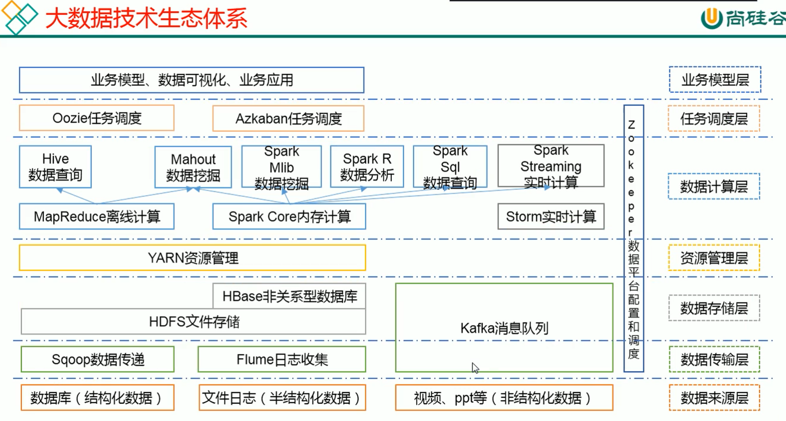
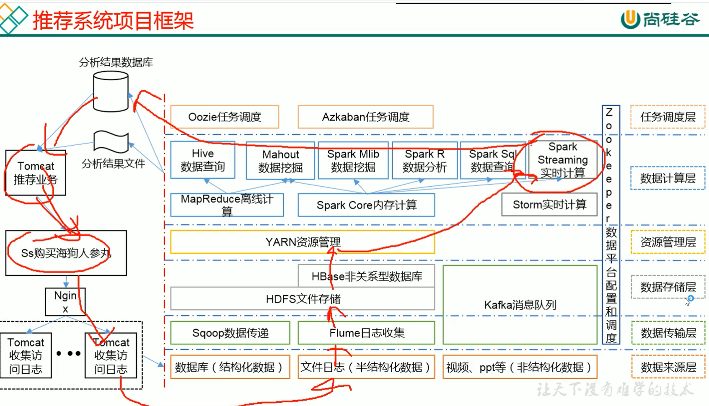
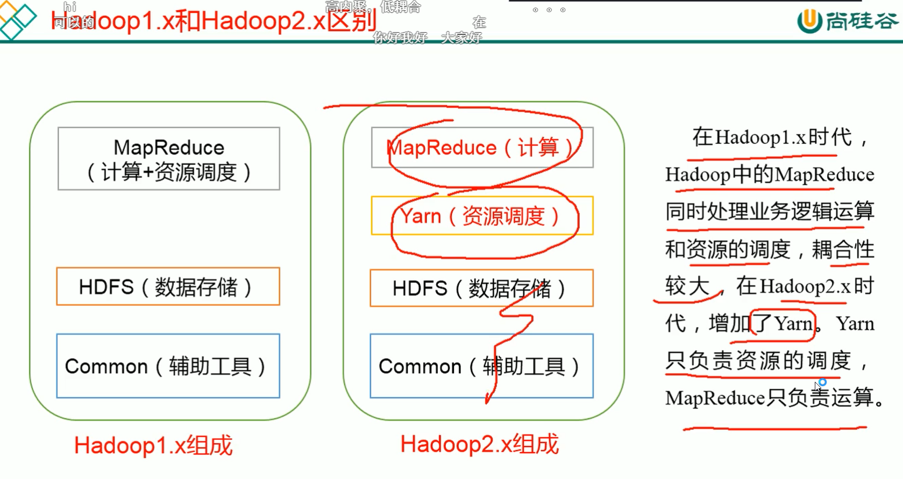
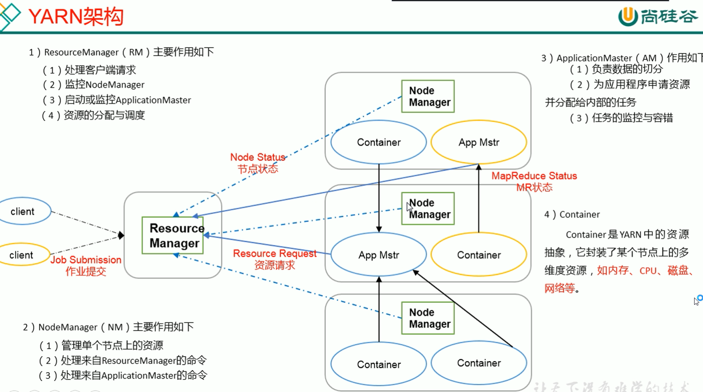

# Hadoop

---

p25

---

- 分布式存储
- 分析计算

1. 高可靠：数据拥有多个备份
2. 高扩展：可以随时往集群中加入新的服务器
3. 高效性：MapReduce并行，加速任务处理
4. 高容错性：将失败的任务重新分配

## 目录结构

（1）bin目录：存放对Hadoop相关服务（HDFS,YARN）进行操作的脚本

（2）etc目录：Hadoop的配置文件目录，存放Hadoop的配置文件

（3）lib目录：存放Hadoop的本地库（对数据进行压缩解压缩功能）

（4）sbin目录：存放启动或停止Hadoop相关服务的脚本

（5）share目录：存放Hadoop的依赖jar包、文档、和官方案例

## HDFS

## YARN架构

## MapReduce

# hive

