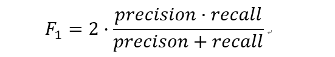

**自我介绍：**

我叫俞铁阳， 现就读于浙江大学，曾经在实验室合作企业第三方支付公司连连实习过一段时间，我的实习经历包括项目经历都围绕着欺诈检测和征信，这也是实验室的主要课题。我觉得好的模型能帮助人更好的制定策略，我本身对欺诈检测，风险评估特别感兴趣，蚂蚁一直是行业的领军人物，平时项目中也经常参考蚂蚁发表的论文和相关的的解决方案。向量检索和图网络的建立

# 优化方法

## 梯度下降

梯度下降法（Gradient descent）

梯度下降法向负梯度方向迭代，得到函数的局部极小值。

梯度上升法向梯度正方向进行搜索，接近函数的局部极大值点。

- **Batch Gradient Descent**

遍历整个数据集，算一次损失函数，然后对各个参数的梯度和更新梯度

- **Stochastic Gradient Descent**

每一个数据就算一下损失函数，然后求梯度更新参数

- **Mini-batch Gradient Descent**

把数据分成若干个批，按批来更新参数，这样一批中的一组数据共同决定了本次梯度的方向，下降起来就不容易跑偏，减少了随机性。批的样本数与整个数据集相比小了很多，计算量也不是很大。是sgd与bgd的折中。

- **Momentum**

SGD方法的一个缺点是其更新方向完全依赖于当前batch计算出的梯度，因而十分不稳定。Momentum算法借用了物理中的动量概念，更新的时候在一定程度上保留之前更新的方向，同时利用当前batch的梯度微调最终的更新方向。这样一来，可以在一定程度上增加稳定性，从而学习地更快，并且还有一定摆脱局部最优的能力。

- **Adagrad**

**在训练中自动的对learning rate进行调整，训练越往后学习率α越小。**分母是加之前所有的梯度平方。

- **RMSprop**

一种自适应学习率方法。Adagrad会累加之前所有的梯度平方，而RMSprop仅仅是计算对应的平均值，因此可缓解Adagrad算法学习率下降较快的问题。

- **Adam**

**Momentum+RMSProp的结合**

梯度方向修正+自适应学习率

最常用

## 最小二乘法

使用每个样本误差平方的平均值作为代价函数

解法就是求各个参数偏导为0，求解极小值

## 牛顿法&拟牛顿法

通过泰勒展开求解，使`f(X)=0`，迭代求解x的值

拟牛顿法：对海塞矩阵做近似，减小计算量

## 极大似然函数

**就是利用已知的样本结果信息，反推最具有可能（最大概率）导致这些样本结果出现的模型参数值！**

**极大似然估计提供了一种给定观察数据来评估模型参数的方法，即：“模型已定，参数未知”。**

## 损失函数

### 交叉熵

**为什么用交叉熵而不是均方差呢？**

https://zhuanlan.zhihu.com/p/70804197

**均方差**对参数的偏导的结果都**乘了sigmoid的导数** ，而之前看图发现sigmoid导数在其变量值很大或很小时趋近于0，所以偏导数很有可能接近于0。

由参数更新公式：**参数=参数-学习率×损失函数对参数的偏导**

可知，偏导很小时，参数更新速度会变得很慢，而当偏导接近于0时，参数几乎就不更新了。

反观**交叉熵**对参数的偏导就**没有sigmoid导数**，所以不存在这个问题。**这就是选择交叉熵而不选择均方差的原因。**

**解释更清晰：**https://www.jianshu.com/p/6a7d3f26f003

### 平方差

# 逻辑回归

**逻辑回归假设数据服从伯努利分布,通过极大化似然函数的方法，运用梯度下降来求解参数，来达到将数据二分类的目的。**

逻辑回归的**第一个**基本假设是**假设数据服从伯努利分布。**伯努利分布有一个简单的例子是抛硬币，抛中为正面的概率是p,抛中为负面的概率是1−p.在逻辑回归这个模型里面是假设 hθ(x) 为样本为正的概率，1−hθ(x)为样本为负的概率。那么整个模型可以描述为：						

​                                       

**sigmoid函数：**

**逻辑回归损失函数：**

**极大似然估计: ** 调整参数使得正确分类的总概率最大

## 逻辑回归多分类问题：

改造损失函数softmax

# XGboost

> 对GBDT进行了一系列优化：二阶泰勒展开、目标函数加入正则项、支持并行、默认缺失值处理

## GBDT

回归树的组合，**拟合负梯度**，使损失函数最小

## 超参数

max_depth：每棵子树的最大深度，check from range(3,10,2)

min_child_weight：子节点的权重阈值（节点中样本过少停止分裂），check from range(1,6,2)

scale_pos_weight：增大了少数样本的权重（解决样本不平衡）

**gamma**：min_split_loss，最小划分损失，check from 0.1 to 0.5，指的是，对于一个叶子节点，当对它采取划分之后，损失函数的降低值的阈值。如果大于该阈值，则该叶子节点值得继续划分；如果小于该阈值，则该叶子节点不值得继续划分

subsample：对训练样本的采样比例，check from 0.6 to 0.9

colsample_bytree：是对特征的采样比例，check from 0.6 to 0.9

**正则化参数：**

alpha：L1正则化系数，try 1e-5, 1e-2, 0.1, 1, 100

lambda：L2正则化系数，try 1e-5, 1e-2, 0.1, 1, 100

learning rate = 0.1

## 二阶泰勒展开

1. 任何损失函数只要二阶可导即能复用（**损失函数自定义**，代码复用）
2. 更好地近似损失函数

算法被简化到迭代时只需要求解损失函数的一阶导和二阶导（包括选择分裂子树时）

## 正则项

**损失函数添加正则项**：叶子节点个数+叶子节点权重的L2正则化

## 并行化

​		特征维度的并行。XGBoost预先将每个特征按特征值进行预排序，并存储为块结构，分裂结点时可以采用多线程并行查找每个特征的最佳分割点，极大提升训练速度。

​		采用特征并行的方法利用多个线程分别计算每个特征的最佳分割点，根据每次分裂后产生的增益，最终选择增益最大的那个特征的特征值作为最佳分裂点。

​		直方图近似。

## 抽样

> 防止过拟合

- **列抽样**：训练的时候只用一部分特征（不考虑剩余的block块即可）
- **子采样**：每轮计算可以不使用全部样本，使算法更加保守

## 缺失值

### 缺失值默认处理：

- 在特征k上寻找最佳 split point 时，不会对该列特征 missing 的样本进行遍历，而只对该列特征值为 non-missing 的样本上对应的特征值进行遍历，通过这个技巧来减少了为稀疏离散特征寻找 split point 的时间开销。
- 在逻辑实现上，为了保证完备性，**会将该特征值missing的样本分别分配到左叶子结点和右叶子结点，两种情形都计算一遍后**，选择分裂后增益最大的那个方向（左分支或是右分支），作为预测时特征值缺失样本的默认分支方向。
- 如果在训练中没有缺失值而在**预测中出现缺失**，那么会**自动将缺失值的划分方向放到右子结点**

### 对缺失值不敏感

对存在缺失值的特征，一般的解决方法是：

- 离散型变量：用出现次数最多的特征值填充；
- 连续型变量：用中位数或均值填充；

而树模型对缺失值的敏感度低，大部分时候可以在数据缺失时时使用。原因就是，一棵树中每个结点在分裂时，**寻找的是某个特征的最佳分裂点（特征值），完全可以不考虑存在特征值缺失的样本**，也就是说，如果某些样本缺失的特征值缺失，对寻找最佳分割点的影响不是很大。

## 叶子节点权重

一元二次函数求最值的知识，**当目标函数达到最小值Obj时**，每个叶子结点的权重为wj

## 树的停止生长（剪枝）

- 达到最大深度
- 信息增益小于等于0
- 叶子节点包含的样本数量太少

### 减小过拟合：

- 第一类参数：用于直接控制模型的复杂度。包括`max_depth,min_child_weight,gamma` 等参数

- 第二类参数：进行采样，用于增加随机性，从而使得模型在训练时对于噪音不敏感。包括`subsample,colsample_bytree`

## 特征重要性

- **weight** ：该特征在所有树中被用于**分割样本**的总次数。

- **gain** ：     该特征在其出现过的所有树中产生的**平均增益**。

- **cover** ：   该特征在其出现过的所有树中的平均覆盖范围（分割样本的数量）。

  ​		覆盖范围这里指的是一个特征用作分割点后，其**影响的样本数量**，即有多少样本经过该特征分割到两个子节点。
  
  

## LR相比于GBDT的优势场景

- LR是线性模型，可解释性强，很容易并行化，但学习能力有限，需要大量的人工特征工程；
- GBDT是非线性模型，具有天然的特征组合优势，特征表达能力强，但是树与树之间无法并行训练，而且树模型很容易过拟合；

先看一个例子：

> 假设一个二分类问题，label为0和1，特征有100维，如果有1w个样本，但其中只要10个正样本1，而这些样本的特征 f1的值为全为1，而其余9990条样本的f1特征都为0(在高维稀疏的情况下这种情况很常见)。
>
> 我们都知道在这种情况下，树模型很容易优化出一个使用f1特征作为重要分裂节点的树，因为这个结点直接能够将训练数据划分的很好，但是当测试的时候，却会发现效果很差，因为这个**特征f1刚好与预测标签y拟合到了这个规律**，这也是我们常说的过拟合。

​		那么这种情况下，如果采用LR的话，应该也会出现类似过拟合的情况呀：y = W1*f1 + Wi*fi+….，其中 W1特别大以拟合这10个样本。为什么此时树模型就过拟合的更严重呢？

​		仔细想想发现，因为现在的模型普遍都会带着正则项，而 LR 等线性模型的正则项是对权重的惩罚，也就是 **W1一旦过大，惩罚就会很大**，进一步压缩 W1的值，使他不至于过大。但是，树模型则不一样，树模型的惩罚项通常为叶子节点数和深度等，而我们都知道，对于上面这种 case，树只需要一个节点就可以完美分割9990和10个样本，一个结点，最终产生的惩罚项极其之小。

​		这也就是为什么在高维稀疏特征的时候，线性模型会比非线性模型好的原因了：**带正则化的线性模型比较不容易对稀疏特征过拟合。**

# LightGBM

- 基于Histogram的决策树算法
- 带深度限制的Leaf-wise的叶子生长策略
- 直方图做差加速直接
- 支持类别特征(Categorical Feature)
- Cache命中率优化
- 基于直方图的稀疏特征优化多线程优化

- 更快的训练速度
- 更低的内存消耗
- 更好的准确率
- 分布式支持，可以快速处理海量数据

## 超参数

**max_depth**控制每棵经过训练的树的最大深度

**max_bin**最大直方图分块

**num_iterations**构建的基学习器个数

sample_pos_weight = number of negative samples / number of positive samples

isunbalance自动平衡占主导地位的标签的权重

## 直方图算法

把连续的浮点特征值离散化成k个整数（其实又是分桶的思想，而这些桶称为bin，比如[0,0.1)→0, [0.1,0.3)→1），同时构造一个宽度为k的直方图。

然后根据直方图的离散值，遍历寻找最优的分割点

可以只保存特征离散化后的值，而这个值一般用8位整型存储就足够了，内存消耗可以降低为原来的1/8。然后在计算上的代价也大幅降低，预排序算法每遍历一个特征值就需要计算一次分裂的增益，而直方图算法只需要计算k次（k可以认为是常数），时间复杂度从O(#data*#feature)优化到O(k*#features)。

## 带深度限制的遍历叶子节点分裂策略

xgb按层生长过一次数据可以同时分裂同一层的叶子，容易进行多线程优化，也好控制模型复杂度，不容易过拟合。但实际上Level-wise是一种低效的算法，因为它不加区分的对待同一层的叶子，带来了很多没必要的开销，因为实际上很多叶子的分裂增益较低，没必要进行搜索和分裂。

在Histogram算法之上，LightGBM进行进一步的优化。首先它抛弃了大多数GBDT工具使用的按层生长 (level-wise) 的决策树生长策略，而使用了带有深度限制的按叶子生长 (leaf-wise)算法。

Leaf-wise则是一种更为高效的策略，每次从当前所有叶子中，找到分裂增益最大的一个叶子，然后分裂，如此循环。因此同Level-wise相比，在分裂次数相同的情况下，Leaf-wise可以降低更多的误差，得到更好的精度。Leaf-wise的缺点是可能会长出比较深的决策树，产生过拟合。因此LightGBM在Leaf-wise之上增加了一个最大深度的限制，在保证高效率的同时防止过拟合。

## **直方图差加速**

LightGBM另一个优化是Histogram（直方图）做差加速。一个容易观察到的现象：**一个叶子的直方图可以由它的父亲节点的直方图与它兄弟的直方图做差得到**。通常构造直方图，需要遍历该叶子上的所有数据，但直方图做差仅需遍历直方图的k个桶。

在速度上可以提升一倍。

## **直接支持类别特征**

实际上大多数机器学习工具都无法直接支持类别特征，一般需要把类别特征，转化到多维的0/1特征，降低了空间和时间的效率。而类别特征的使用是在实践中很常用的。基于这个考虑，LightGBM优化了对类别特征的支持，可以直接输入类别特征，不需要额外的0/1展开。并在决策树算法上增加了类别特征的决策规则。在Expo数据集上的实验，相比0/1展开的方法，训练速度可以加速8倍，并且精度一致。据我们所知，LightGBM是第一个直接支持类别特征的GBDT工具。

具体处理细节：https://blog.csdn.net/anshuai_aw1/article/details/83275299

## 对比XGboost

（1）**树生长策略：XGB采用`level-wise`的分裂策略，LGB采用`leaf-wise`的分裂策略**。XGB对每一层所有节点做无差别分裂，但是可能有些节点增益非常小，对结果影响不大，带来不必要的开销。Leaf-wise是在所有叶子节点中选取分裂收益最大的节点进行的，但是很容易出现过拟合问题，所以需要对最大深度做限制 。

（2）**分割点查找算法：XGB使用特征预排序算法，LGB使用基于直方图的切分点算法**，其优势如下：

- 减少内存占用，比如离散为256个bin时，只需要用8位整形就可以保存一个样本被映射为哪个bin(这个bin可以说就是转换后的特征)，对比预排序的exact greedy算法来说（用int_32来存储索引+ 用float_32保存特征值），可以节省7/8的空间。
- LGB还可以使用**直方图做差加速**，一个节点的直方图可以通过父节点的直方图减去兄弟节点的直方图得到，从而加速计算

> 但实际上xgboost的近似直方图算法也类似于lightgbm这里的直方图算法，为什么xgboost的近似算法比lightgbm还是慢很多呢？
>
> xgboost在每一层都动态构建直方图， 因为xgboost的直方图算法不是针对某个特定的feature，而是所有feature共享一个直方图(每个样本的权重是二阶导)，所以每一层都要重新构建直方图，而lightgbm中对每个特征都有一个直方图，所以构建一次直方图就够了。

（3）**LightGBM支持离散变量**：无法直接输入类别型变量，因此需要事先对类别型变量进行编码（例如独热编码），而LightGBM可以直接处理类别型变量。

（4）缓存命中率：XGB使用Block结构的一个缺点是取梯度的时候，是通过索引来获取的，而这些梯度的获取顺序是按照特征的大小顺序的，这将导致非连续的内存访问，可能使得CPU cache缓存命中率低，从而影响算法效率。而LGB是基于直方图分裂特征的，梯度信息都存储在一个个bin中，所以访问梯度是连续的，缓存命中率高。

（5）LightGBM 与 XGboost 的并行策略不同：

- **特征并行** ：LGB特征并行的前提是每个worker留有一份完整的数据集，但是每个worker仅在特征子集上进行最佳切分点的寻找；worker之间需要相互通信，通过比对损失来确定最佳切分点；然后将这个最佳切分点的位置进行全局广播，每个worker进行切分即可。XGB的特征并行与LGB的最大不同在于XGB每个worker节点中仅有部分的列数据，也就是垂直切分，每个worker寻找局部最佳切分点，worker之间相互通信，然后在具有最佳切分点的worker上进行节点分裂，再由这个节点广播一下被切分到左右节点的样本索引号，其他worker才能开始分裂。二者的区别就导致了LGB中worker间通信成本明显降低，只需通信一个特征分裂点即可，而XGB中要广播样本索引。
- **数据并行** ：当数据量很大，特征相对较少时，可采用数据并行策略。LGB中先对数据水平切分，**每个worker上的数据先建立起局部的直方图，然后合并成全局的直方图**，采用直方图相减的方式，先计算样本量少的节点的样本索引，然后直接相减得到另一子节点的样本索引，这个直方图算法使得worker间的通信成本降低一倍，因为只用通信以此样本量少的节点。XGB中的数据并行也是水平切分，然后单个worker建立局部直方图，再合并为全局，不同在于根据全局直方图进行各个worker上的节点分裂时会单独计算子节点的样本索引，因此效率贼慢，每个worker间的通信量也就变得很大。
- **投票并行（LGB）**：当数据量和维度都很大时，选用投票并行，该方法是数据并行的一个改进。数据并行中的合并直方图的代价相对较大，尤其是当特征维度很大时。大致思想是：每个worker首先会找到本地的一些优秀的特征，然后进行全局投票，根据投票结果，选择top的特征进行直方图的合并，再寻求全局的最优分割点。

# FastText

## 超参数

**VOCAB_SIZE**表示词汇表大小，这里简单设置为2000；

**EMBEDDING_DIM**表示经过embedding层输出，每个词被分布式表示的向量的维度，这里设置为100。比如对于“达观”这个词，会被一个长度为100的类似于[ 0.97860014, 5.93589592, 0.22342691, -3.83102846, -0.23053935, …]的实值向量来表示；

**MAX_WORDS**表示一篇文档最多使用的词个数，因为文档可能长短不一（即词数不同），为了能feed到一个固定维度的神经网络，我们需要设置一个最大词数，对于词数少于这个阈值的文档，我们需要用“未知词”去填充。比如可以设置词汇表中索引为0的词为“未知词”，用0去填充少于阈值的部分；

**CLASS_NUM**表示类别数，多分类问题，这里简单设置为 5。

## 层次SoftMax

## n-gram

fastText在输入时，将单词的字符级别的n-gram向量作为额外的特征；在输出时，fastText采用了分层Softmax，大大降低了模型训练时间。这两个知识点在前文中已经讲过，这里不再赘述

会发现它就是一个softmax线性多类别分类器，分类器的输入是一个用来表征当前文档的向量；模型的前半部分，即从输入层输入到隐含层输出部分，主要在做一件事情：生成用来表征文档的向量。那么它是如何做的呢？叠加构成这篇文档的所有词及n-gram的词向量，然后取平均。叠加词向量背后的思想就是传统的词袋法，即将文档看成一个由词构成的集合。

于是fastText的核心思想就是：将整篇文档的词及n-gram向量叠加平均得到文档向量，然后使用文档向量做softmax多分类。这中间涉及到两个技巧：字符级n-gram特征的引入以及分层Softmax分类。

# 图网络

**图节点表征学习**

## DeepWalk

随机游走得到一条路径，放入word2vec模型得到节点表示向量

### 超参数

特征向量的维度：embedding size

游走序列长度

单节点游走

窗口大小

### Word2Vec

#### 超参数

window：窗口大小，8表示每个词考虑前8个词与后8个词

size：特征向量的维度

sg： 用于设置训练算法，默认为0，对应CBOW算法；sg=1则采用skip-gram算法

hs：Hierarchical Softmax

#### CBOW&Skip-gram

CBOW 是用上下文预测中心词

Skip-gram用中心词预测上下文

#### 负采样

#### Hierarchical Softmax

## Node2Vec

> 是deepwalk的一种扩展

### 超参数

## GraphSage

> Graph sample and aggregate

1. 对图中每个顶点邻居进行采样

2. 根据聚合函数聚合邻居顶点蕴含的信息

3. 得到图中各顶点的向量表示供下游任务使用

   ​		学习到了这样的“聚合函数”，而我们本身就已知各个节点的特征和邻居关系，我们就可以很方便地得到一个新节点的表示了。

### 超参数

K =2，代表着每个顶点能够聚合的邻接点的跳数

### 聚合函数

- **mean aggregator**

将目标顶点和邻居顶点的第k层向量拼接起来，然后对向量的每个维度进行求均值的操作，将得到的结果做一次非线性变换产生目标顶点的表示向量

- **Pooling aggregator**

Pooling aggregator 先对目标顶点的邻接点表示向量进行一次非线性变换，之后进行一次pooling操作(maxpooling or meanpooling)，将得到结果与目标顶点的表示向量拼接，最后再经过一次非线性变换得到目标顶点的第k层表示向量。

把各个邻居节点单独经过一个MLP得到一个向量，最后把所有邻居的向量做一个element-wise的max-pooling

### 损失函数

损失函数应该让临近的节点的拥有相似的表示，反之应该表示大不相同

# 模型评估

## F1

> F1 Score，统计学中用来衡量二分类模型精确度的一种指标。它同时兼顾了分类模型的精确率和召回率。F1分数可以看作是模型精确率和召回率的一种加权平均，它的最大值是1，最小值是0。

- 精确率：预测为正类的预测正确的比例
- 召回率：预测为正类并且正确的占真实正样本的比例

* Macro-F1

  **得到每个类别的F1值**，然后取平均值

  容易受到识别性高（高recall、高precision）的类别影响

* Micro-F1

  计算**所有类别的总的Precision和Recall**，再求F1

  容易受到数据极度不平衡的影响

  

从上面二者计算方式上可以看出，macro-F1平等地看待各个类别，它的值会受到稀有类别的影响

https://blog.csdn.net/qq_43190189/article/details/105778058

## ROC曲线

​		最直观的应用就是能反映模型在选取不同阈值的时候其敏感性（sensitivity, FPR）和其精确性（specificity, TPR）的趋势走向

**AUC：**ROC曲线下面积

## L1&L2

- **L1范数:** 各个参数的绝对值之和。 

- **L2范数:** 各个参数平方和的开根号

  L1范数可以使权值稀疏，匀速下降直到为0，方便特征提取。 

  L2范数可以防止过拟合，权值下降到接近0，提升模型的泛化能力。

  

L1和L2的差别，为什么一个让绝对值最小，一个让平方最小，会有那么大的差别呢？

L1和L2，**导数一个是1一个是w**。在靠进零附近，**L1以匀速下降到零**，而L2下降变缓无限接近0。

这说明**L1是将不重要的特征尽快剔除，用于特征选择**；**L2将特征尽量压缩但不至于为零**。

## 方差与偏差

**偏差-方差权衡**：RF不断的降低模型的方差，而GBDT不断的降低模型的偏差

- 方差
  模型预测值的离散程度（波动程度），方差越大。模型越复杂，方差越大。模型太贴合训练数据了，导致其泛化能力差

- 偏差
  预测值与真实值的差距，模型训练集的准确度，复杂模型的偏差减小

  

高方差，低偏差，复杂模型容易造成过拟合（overfitting）

高方差，高偏差，简单模型有可能欠拟合（underfitting）

# VAE

